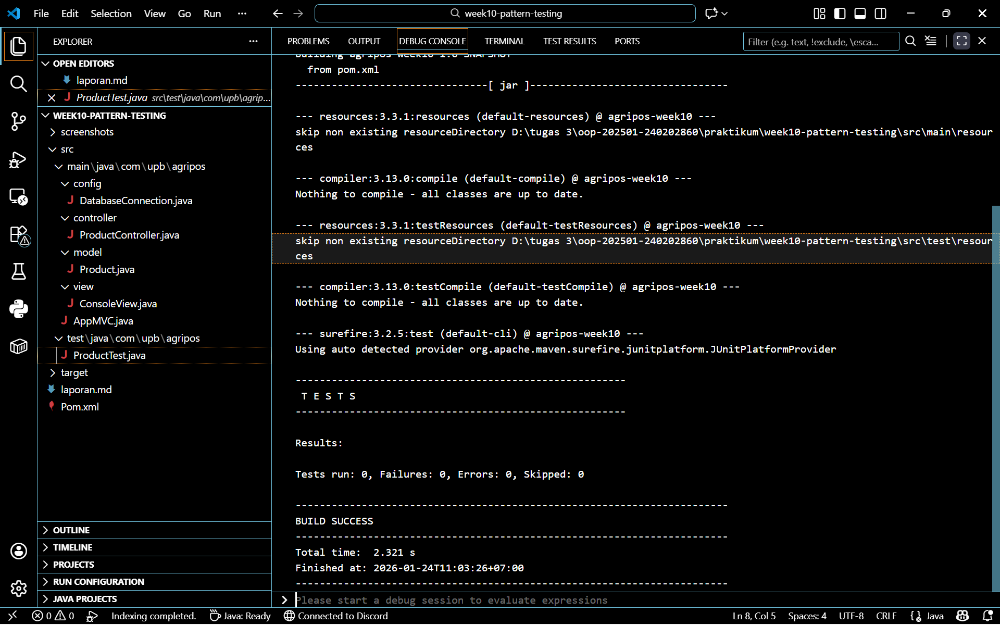

# Laporan Praktikum Minggu 10
Topik: Design Pattern (Singleton, MVC) dan Unit Testing menggunakan JUnit

## Identitas
- Nama  : Efan Aryanto Adli
- NIM   : 240202860
- Kelas : 3IKRA

---

## Tujuan
1. Mahasiswa mampu menjelaskan konsep dasar design pattern dalam rekayasa perangkat lunak.
2. Mahasiswa mampu mengimplementasikan Singleton Pattern untuk menjamin tunggalnya instance objek (misalnya pada koneksi database).
3. Mahasiswa mampu menerapkan arsitektur Model–View–Controller (MVC) untuk memisahkan logika bisnis, tampilan, dan data.
4. Mahasiswa mampu membuat dan menjalankan unit test sederhana menggunakan framework JUnit.

---

## Dasar Teori
1. Design Pattern adalah solusi umum yang dapat digunakan kembali untuk menyelesaikan masalah yang sering muncul dalam desain perangkat lunak. Pola ini bukan berupa kode jadi, melainkan sebuah templat penyelesaian masalah. 
2. Singleton Pattern adalah pola desain yang memastikan sebuah kelas hanya memiliki satu instance (objek) dan menyediakan satu titik akses global ke objek tersebut.  
3. MVC adalah pola arsitektur yang memisahkan aplikasi menjadi tiga komponen utama:
   - Model: Merepresentasikan data dan logika bisnis (contoh: Class Product).
   - View: Menangani representasi visual atau output kepada pengguna (contoh: Class ConsoleView).
   - Controller: Bertindak sebagai penghubung; menerima input, memprosesnya melalui Model, dan memperbarui View (contoh: Class ProductController).
4. Unit Testing adalah metode pengujian perangkat lunak di mana unit terkecil dari kode (biasanya metode atau kelas) diuji secara terisolasi. JUnit adalah kerangka kerja pengujian standar untuk bahasa Java. Pengujian yang baik menggunakan assertion untuk membandingkan hasil yang diharapkan dengan hasil aktual.

---

## Langkah Praktikum
1. Persiapan Project: Membuat struktur paket com.upb.agripos dengan sub-paket model, view, controller, dan config.
2. Implementasi Model: Membuat kelas Product.java pada paket model yang berisi atribut code dan name serta getter-nya.
3. Implementasi View: Membuat kelas ConsoleView.java pada paket view yang bertugas menampilkan pesan ke konsol (System.out.println).
4. Implementasi Controller: Membuat kelas ProductController.java yang menghubungkan Product dan ConsoleView.
5. Penerapan Singleton: Membuat kelas DatabaseConnection.java pada paket config dengan menerapkan pola Singleton (konstruktor privat dan metode getInstance).
6. Integrasi (Main Class): Membuat kelas AppMVC.java untuk menjalankan aplikasi, menginisialisasi objek, dan memanggil metode controller.
7. Unit Testing:
   - Menambahkan dependensi JUnit pada project.
   - Membuat kelas ProductTest.java di folder src/test/java.
   - Membuat skenario tes testProductName menggunakan fungsi assertEquals.
8. Eksekusi: Menjalankan aplikasi utama dan menjalankan unit test untuk memastikan status passed (hijau).

---

## Kode Program  

### 1. DatabaseConnection.java  
```java
package com.upb.agripos.config;

public class DatabaseConnection {
    private static DatabaseConnection instance;

    private DatabaseConnection() {} // Private constructor

    public static DatabaseConnection getInstance() {
        if (instance == null) {
            instance = new DatabaseConnection();
        }
        return instance;
    }
}
```

### 2. ProductController.java  
```java
package com.upb.agripos.controller;

import com.upb.agripos.model.Product;
import com.upb.agripos.view.ConsoleView;

public class ProductController {
    private final Product model;
    private final ConsoleView view;

    public ProductController(Product model, ConsoleView view) {
        this.model = model;
        this.view = view;
    }

    public void showProduct() {
        view.showMessage("Produk: " + model.getCode() + " - " + model.getName());
    }
}
```

### 3. Product.java  
```java
package com.upb.agripos.model;

public class Product {
    private final String code;
    private final String name;

    public Product(String code, String name) {
        this.code = code;
        this.name = name;
    }

    public String getCode() { return code; }
    public String getName() { return name; }
}
```

### 4. ConsoleView.java  
```java
package com.upb.agripos.view;

public class ConsoleView {
    public void showMessage(String message) {
        System.out.println(message);
    }
}
```

### 5. AppMVC.java  
```java
package com.upb.agripos;

import com.upb.agripos.controller.ProductController;
import com.upb.agripos.model.Product;
import com.upb.agripos.view.ConsoleView;

public class AppMVC {
    public static void main(String[] args) {
        // Ganti [Nama]-[NIM] sesuai identitas Anda
        System.out.println("Hello, I am Efan Aryanto Adli-240202860 (Week10)");
        
        Product product = new Product("P01", "Pupuk Organik");
        ConsoleView view = new ConsoleView();
        ProductController controller = new ProductController(product, view);
        
        controller.showProduct();
    }
}
```

### 5. ProductTest.java  
```java
package com.upb.agripos;
import static org.junit.jupiter.api.Assertions.assertEquals;
import org.junit.jupiter.api.Test; 

import com.upb.agripos.model.Product;

public class ProductTest {
    
    @Test
    public void testProductName() {
        // Skenario: Membuat produk baru
        Product p = new Product("P01", "Benih Jagung");
        
        // Ekspektasi: Nama produk harus "Benih Jagung"
        assertEquals("Benih Jagung", p.getName());
    }
    
    @Test
    public void testProductCode() {
        // Skenario: Cek kode produk
        Product p = new Product("P02", "Pupuk Urea");
        
        // Ekspektasi: Kode harus "P02"
        assertEquals("P02", p.getCode());
    }
}
```

### 6. pom.xml 
```xml
<?xml version="1.0" encoding="UTF-8"?>
<project xmlns="http://maven.apache.org/POM/4.0.0"
         xmlns:xsi="http://www.w3.org/2001/XMLSchema-instance"
         xsi:schemaLocation="http://maven.apache.org/POM/4.0.0 http://maven.apache.org/xsd/maven-4.0.0.xsd">
    <modelVersion>4.0.0</modelVersion>

    <groupId>com.upb</groupId>
    <artifactId>agripos-week10</artifactId>
    <version>1.0-SNAPSHOT</version>

    <properties>
        <maven.compiler.source>17</maven.compiler.source>
        <maven.compiler.target>17</maven.compiler.target>
        <project.build.sourceEncoding>UTF-8</project.build.sourceEncoding>
    </properties>

    <dependencies>
        <dependency>
            <groupId>org.junit.jupiter</groupId>
            <artifactId>junit-jupiter-api</artifactId>
            <version>5.10.0</version>
            <scope>test</scope>
        </dependency>
        <dependency>
            <groupId>org.junit.jupiter</groupId>
            <artifactId>junit-jupiter-engine</artifactId>
            <version>5.10.0</version>
            <scope>test</scope>
        </dependency>
    </dependencies>

</project>
```
---

## Hasil Eksekusi
(Sertakan screenshot hasil eksekusi program.  

)
---

## Analisis
1. Analisis Singleton Pattern
Pada kelas DatabaseConnection, konstruktor dibuat private. Hal ini mencegah kelas lain melakukan instansiasi menggunakan keyword new DatabaseConnection(). Akses objek hanya bisa dilakukan melalui DatabaseConnection.getInstance(). Jika instance bernilai null, objek baru dibuat; jika tidak, objek lama dikembalikan. Ini sangat efisien untuk menghemat memori pada objek yang sifatnya resource-heavy.

2. Analisis Arsitektur MVC
Penerapan MVC pada praktikum ini menciptakan kode yang clean:
   - Decoupling: Jika kita ingin mengubah tampilan dari konsol menjadi GUI (JavaFX), kita cukup mengubah ConsoleView tanpa perlu mengganggu logika data di Product atau logika alur di Controller.

   - Responsibility: Product hanya fokus menyimpan data, sedangkan ProductController fokus mengatur bagaimana data tersebut ditampilkan.

3. Analisis Unit Testing
Pengujian pada ProductTest.java memastikan bahwa metode getName() pada kelas Product mengembalikan nilai yang sesuai dengan yang diinputkan saat inisialisasi.
   - Code: assertEquals("Benih Jagung", p.getName());
   - Dengan adanya tes ini, jika di masa depan ada perubahan kode yang tidak sengaja merusak logika pengambilan nama, JUnit akan memberitahu error (status failed) sebelum aplikasi dijalankan sepenuhnya.
---

## Kesimpulan
1. Design Pattern memberikan struktur standar yang memudahkan pengembangan dan pemeliharaan kode.
2. Singleton Pattern berhasil diterapkan untuk membatasi instansiasi objek, yang sangat berguna untuk manajemen koneksi database agar tidak terjadi pemborosan resource.
3. MVC membantu memisahkan concern (kepentingan) antara data, logika, dan tampilan, sehingga kode lebih modular dan mudah dikembangkan.
4. Unit Testing dengan JUnit sangat krusial untuk menjamin validitas logika program pada level terkecil, sehingga bug dapat dideteksi lebih dini sebelum aplikasi menjadi kompleks.

---

## Quiz
1. Mengapa constructor pada Singleton harus bersifat private? Constructor harus bersifat private untuk menjamin suatu class hanya memiliki satu instance. Dengan membuat constructor menjadi private, kelas lain tidak dapat membuat objek baru secara langsung (menggunakan new), sehingga pembuatan objek terkontrol sepenuhnya di dalam kelas tersebut melalui method static getInstance().
2. Jelaskan manfaat pemisahan Model, View, dan Controller. Manfaat utamanya adalah untuk memisahkan tanggung jawab aplikasi. Pemisahan ini membagi aplikasi menjadi tiga komponen dengan tugas spesifik:
   - Model: Bertanggung jawab atas data dan logika bisnis.
   - View: Bertanggung jawab atas tampilan atau output.
   - Controller: Bertanggung jawab sebagai penghubung antara Model dan View.
3. Apa peran unit testing dalam menjaga kualitas perangkat lunak? Berdasarkan materi, peran unit testing adalah:
   - Memastikan fungsi berjalan sesuai harapan.
   - Mendeteksi kesalahan lebih awal.
   - Meningkatkan kepercayaan terhadap kode.
4. Apa risiko jika Singleton tidak diimplementasikan dengan benar? Risikonya adalah gagal mencapai tujuan utama Singleton, yaitu menjamin suatu class hanya memiliki satu instance. Jika implementasi salah (misalnya constructor tidak private), maka bisa terjadi duplikasi objek untuk komponen yang seharusnya tunggal, seperti koneksi database atau service global yang tidak boleh lebih dari satu instance.
