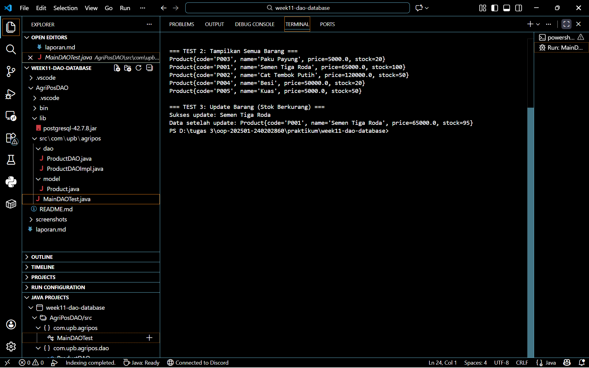

# Laporan Praktikum Minggu 11 
Topik: Data Access Object (DAO) dan CRUD Database dengan JDBC

## Identitas
- Nama  : Efan Aryanto Adli
- NIM   : 240202860
- Kelas : 3IKRA

---

## Tujuan
1. Mahasiswa mampu menjelaskan konsep Data Access Object (DAO) sebagai pola desain dalam pengembangan aplikasi OOP.
2. Mahasiswa mampu menghubungkan aplikasi Java dengan basis data PostgreSQL menggunakan JDBC (Java Database Connectivity).
3. Mahasiswa mampu mengimplementasikan operasi CRUD (Create, Read, Update, Delete) secara lengkap.
4. Mahasiswa mampu mengintegrasikan DAO dengan kelas aplikasi OOP sesuai prinsip desain yang baik (pemisahan logika bisnis dan akses data).

---

## Dasar Teori  
1. DAO adalah pola desain (design pattern) yang memisahkan logika akses data tingkat rendah (seperti SQL) dari logika bisnis tingkat tinggi. Dengan menggunakan DAO, jika terjadi perubahan pada teknologi basis data, kode program utama tidak perlu diubah secara signifikan, cukup memodifikasi implementasi DAO-nya saja. Manfaat utamanya adalah kode menjadi lebih terstruktur, mengurangi coupling, dan memudahkan pengujian.  
2. JDBC adalah API standar Java yang memungkinkan aplikasi Java berinteraksi dengan berbagai jenis basis data relasional. Komponen utama JDBC yang digunakan meliputi:
   - DriverManager: Mengelola driver database.
   - Connection: Mewakili sesi koneksi ke database.
   - PreparedStatement: Digunakan untuk mengeksekusi query SQL dengan parameter yang aman (mencegah SQL Injection).
   - ResultSet: Menampung hasil data yang dikembalikan dari query SELECT.

---

## Langkah Praktikum
1. Persiapan Database:
Membuat database PostgreSQL bernama agripos.
Membuat tabel products menggunakan query SQL berikut:
CREATE TABLE products (
    code VARCHAR(10) PRIMARY KEY,
    name VARCHAR(100),
    price DOUBLE PRECISION,
    stock INT
);
2. Struktur Proyek:
   - Membuat package com.upb.agripos.model dan com.upb.agripos.dao.
3. Pembuatan Model:
   - Membuat kelas Product.java dengan atribut code, name, price, dan stock beserta getter, setter, dan constructor-nya.
4. Pembuatan Interface DAO:
   - Membuat interface ProductDAO.java yang mendefinisikan kontrak metode: insert, findByCode, findAll, update, dan delete.
5. Implementasi DAO:
   - Membuat kelas ProductDAOImpl.java yang mengimplementasikan ProductDAO.
   - Menggunakan PreparedStatement untuk mengeksekusi query SQL INSERT, SELECT, UPDATE, dan DELETE ke database.
6. Integrasi dan Pengujian:
   - Membuat kelas MainDAOTest.java.
   - Melakukan koneksi ke database menggunakan DriverManager.
   - Menjalankan skenario tes: Menambah produk baru, Mengupdate data produk, Mencari produk berdasarkan kode, dan Menghapus produk.

---

## Kode Program
 
### 1. ProductDAO.java  
```java
package com.upb.agripos.dao;

import com.upb.agripos.model.Product;
import java.util.List;

public interface ProductDAO {
    void save(Product product);           // Simpan barang baru
    void update(Product product);         // Update barang
    void delete(String code);             // Hapus barang
    Product getProductByCode(String code);// Cari 1 barang
    List<Product> getAllProducts();       // Ambil semua barang
}
```

### 2. ProductDAOImpl.java  
```java
package com.upb.agripos.dao;

import java.sql.Connection;
import java.sql.DriverManager;
import java.sql.PreparedStatement;
import java.sql.ResultSet;
import java.sql.SQLException;
import java.sql.Statement;
import java.util.ArrayList;
import java.util.List;

import com.upb.agripos.model.Product;

public class ProductDAOImpl implements ProductDAO {
    // KONEKSI DATABASE
    private String url = "jdbc:postgresql://localhost:5432/agripos";
    private String username = "postgres";
    private String password = "271205"; // <--- (UBAH SESUAI PASSWORD ANDA!)

    // Metode untuk buka koneksi
    private Connection getConnection() throws SQLException {
        return DriverManager.getConnection(url, username, password);
    }

    @Override
    public void save(Product product) {
        String sql = "INSERT INTO products (code, name, price, stock) VALUES (?, ?, ?, ?)";
        try (Connection conn = getConnection();
             PreparedStatement pstmt = conn.prepareStatement(sql)) {
            pstmt.setString(1, product.getCode());
            pstmt.setString(2, product.getName());
            pstmt.setDouble(3, product.getPrice());
            pstmt.setInt(4, product.getStock());
            pstmt.executeUpdate();
            System.out.println("Sukses menyimpan: " + product.getName());
        } catch (SQLException e) {
            e.printStackTrace();
        }
    }

    @Override
    public void update(Product product) {
        String sql = "UPDATE products SET name=?, price=?, stock=? WHERE code=?";
        try (Connection conn = getConnection();
             PreparedStatement pstmt = conn.prepareStatement(sql)) {
            pstmt.setString(1, product.getName());
            pstmt.setDouble(2, product.getPrice());
            pstmt.setInt(3, product.getStock());
            pstmt.setString(4, product.getCode());
            pstmt.executeUpdate();
            System.out.println("Sukses update: " + product.getName());
        } catch (SQLException e) {
            e.printStackTrace();
        }
    }

    @Override
    public void delete(String code) {
        String sql = "DELETE FROM products WHERE code=?";
        try (Connection conn = getConnection();
             PreparedStatement pstmt = conn.prepareStatement(sql)) {
            pstmt.setString(1, code);
            pstmt.executeUpdate();
            System.out.println("Sukses menghapus produk kode: " + code);
        } catch (SQLException e) {
            e.printStackTrace();
        }
    }

    @Override
    public Product getProductByCode(String code) {
        String sql = "SELECT * FROM products WHERE code=?";
        Product product = null;
        try (Connection conn = getConnection();
             PreparedStatement pstmt = conn.prepareStatement(sql)) {
            pstmt.setString(1, code);
            ResultSet rs = pstmt.executeQuery();
            if (rs.next()) {
                product = new Product(
                    rs.getString("code"),
                    rs.getString("name"),
                    rs.getDouble("price"),
                    rs.getInt("stock")
                );
            }
        } catch (SQLException e) {
            e.printStackTrace();
        }
        return product;
    }

    @Override
    public List<Product> getAllProducts() {
        String sql = "SELECT * FROM products";
        List<Product> products = new ArrayList<>();
        try (Connection conn = getConnection();
             Statement stmt = conn.createStatement();
             ResultSet rs = stmt.executeQuery(sql)) {
            while (rs.next()) {
                products.add(new Product(
                    rs.getString("code"),
                    rs.getString("name"),
                    rs.getDouble("price"),
                    rs.getInt("stock")
                ));
            }
        } catch (SQLException e) {
            e.printStackTrace();
        }
        return products;
    }
}
```

### 3. Product.java  
```java
package com.upb.agripos.model;

public class Product {
    private String code;
    private String name;
    private double price;
    private int stock;

    // Constructor Kosong (Wajib ada)
    public Product() {}

    // Constructor Lengkap
    public Product(String code, String name, double price, int stock) {
        this.code = code;
        this.name = name;
        this.price = price;
        this.stock = stock;
    }

    // Getter dan Setter
    public String getCode() { return code; }
    public void setCode(String code) { this.code = code; }

    public String getName() { return name; }
    public void setName(String name) { this.name = name; }

    public double getPrice() { return price; }
    public void setPrice(double price) { this.price = price; }

    public int getStock() { return stock; }
    public void setStock(int stock) { this.stock = stock; }

    @Override
    public String toString() {
        return "Product{code='" + code + "', name='" + name + "', price=" + price + ", stock=" + stock + "}";
    }
}
```

### 4. MainDAOTes.java  
```java
package com.upb.agripos;

// --- BAGIAN INI SANGAT PENTING (JANGAN DIHAPUS) ---
import java.util.List;

import com.upb.agripos.dao.ProductDAO;
import com.upb.agripos.dao.ProductDAOImpl;
import com.upb.agripos.model.Product;
// --------------------------------------------------

public class MainDAOTest {
    public static void main(String[] args) {
        ProductDAO dao = new ProductDAOImpl();

        System.out.println("=== PERSIAPAN: Membersihkan Data Lama ===");
        // Menghapus data lama agar tidak error Duplicate saat di-Run berkali-kali
        try {
             dao.delete("P001");
             dao.delete("P002");
        } catch (Exception e) {
            // Abaikan error jika data memang belum ada
        }
        System.out.println("Data lama sudah dibersihkan (jika ada).\n");

        System.out.println("=== TEST 1: Simpan Barang ===");
        Product p1 = new Product("P001", "Semen Tiga Roda", 65000, 100);
        Product p2 = new Product("P002", "Cat Tembok Putih", 120000, 50);
        dao.save(p1);
        dao.save(p2);

        System.out.println("\n=== TEST 2: Tampilkan Semua Barang ===");
        List<Product> list = dao.getAllProducts();
        for (Product p : list) {
            System.out.println(p);
        }

        System.out.println("\n=== TEST 3: Update Barang (Stok Berkurang) ===");
        p1.setStock(95); 
        dao.update(p1);
        
        Product updatedP1 = dao.getProductByCode("P001");
        System.out.println("Data setelah update: " + updatedP1);
    }
}
```
---

## Hasil Eksekusi  

---

## Analisis
- Analisis Pola DAO: Dalam praktikum ini, penggunaan ProductDAO (interface) dan ProductDAOImpl (implementasi) menunjukkan penerapan abstraksi. Kelas MainDAOTest tidak perlu tahu bahwa di balik layar program menggunakan SQL INSERT INTO.... Main program hanya memanggil metode dao.insert(product). Ini membuat kode di MainDAOTest sangat bersih dari sintaks SQL.
- Analisis Penggunaan PreparedStatement: Pada ProductDAOImpl, kita menggunakan PreparedStatement alih-alih Statement biasa. Contoh: String sql = "INSERT INTO products... VALUES (?, ?, ?, ?)"; Penggunaan tanda tanya (?) sebagai placeholder diisi menggunakan metode seperti ps.setString(1, p.getCode())
---

## Kesimpulan
1. Integrasi Java dan Database: JDBC berhasil menghubungkan aplikasi Java dengan PostgreSQL, memungkinkan data disimpan secara permanen (persistent) dan tidak hilang saat aplikasi ditutup.
2. Efektivitas DAO: Pola DAO efektif memisahkan tanggung jawab. Perubahan query SQL hanya perlu dilakukan di satu tempat (ProductDAOImpl), tanpa mengganggu logika bisnis di kelas lain.
3. Keamanan Data: Implementasi menggunakan PreparedStatement adalah praktik terbaik (best practice) untuk menangani input data ke database demi keamanan dan performa.
4. Operasi CRUD: Seluruh operasi dasar manajemen data (Create, Read, Update, Delete) berhasil dijalankan melalui objek Java yang dipetakan ke tabel database.

---

## Quiz
(1. [Tuliskan kembali pertanyaan 1 dari panduan]  
   **Jawaban:** …  

2. [Tuliskan kembali pertanyaan 2 dari panduan]  
   **Jawaban:** …  

3. [Tuliskan kembali pertanyaan 3 dari panduan]  
   **Jawaban:** …  )
