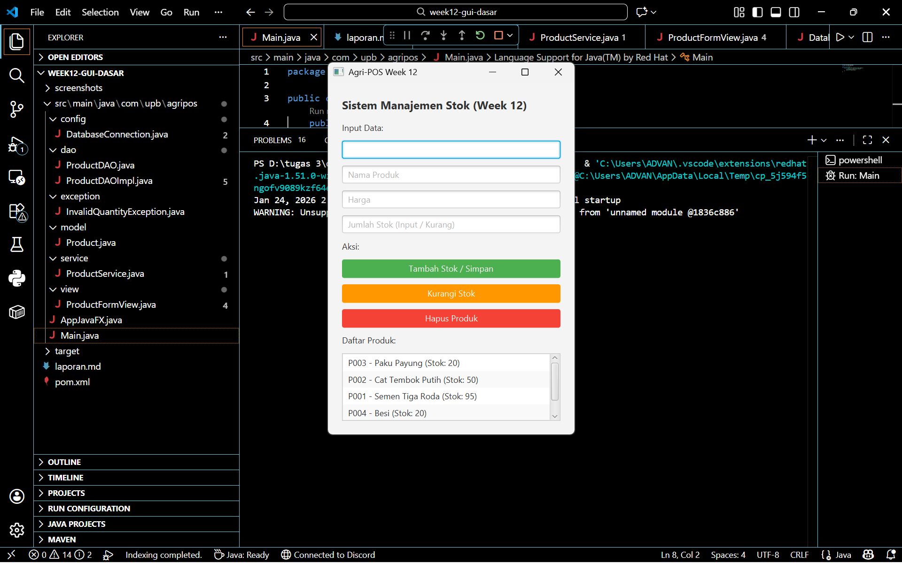

# Laporan Praktikum Minggu 12 
Topik: [Tuliskan judul topik, misalnya "Class dan Object"]

## Identitas
- Nama  : Efan Aryanto Adli
- NIM   : 240202860
- Kelas : 3IKRA

---

## Tujuan
1. Mahasiswa mampu menjelaskan konsep event-driven programming dalam pengembangan aplikasi desktop.
2. Mahasiswa mampu membangun antarmuka grafis (GUI) sederhana menggunakan framework JavaFX.
3. Mahasiswa mampu membuat form input data produk (Kode, Nama, Harga, Stok).
4. Mahasiswa mampu menampilkan daftar produk pada komponen GUI (seperti ListView atau TextArea).
5. Mahasiswa mampu mengintegrasikan GUI dengan modul backend (DAO & Service) yang telah dibuat pada pertemuan sebelumnya.

---

## Dasar Teori  
1. JavaFX adalah platform perangkat lunak untuk membuat dan mengirimkan aplikasi desktop, serta aplikasi internet yang kaya (RIA) yang dapat berjalan di berbagai perangkat. Dalam JavaFX, antarmuka dibangun menggunakan komponen node seperti Stage (window), Scene (konten), dan berbagai kontrol UI (TextField, Button, Label).
2. Pemrograman berbasis kejadian (event-driven) adalah paradigma di mana alur program ditentukan oleh kejadian (events) seperti keluaran sensor, tindakan pengguna (klik mouse, ketik keyboard), atau pesan dari program lain. Pada praktikum ini, event handler digunakan untuk merespons aksi klik tombol "Tambah Produk".
3. Sesuai prinsip SOLID dan desain Bab 6, arsitektur aplikasi dibagi menjadi:
   - View (GUI): Menangani tampilan dan input user.
   - Controller: Menangani logika interaksi UI.
   - Service: Menangani logika bisnis.
   - DAO: Menangani akses database. Penting dicatat bahwa View tidak boleh mengakses DAO secara langsung, melainkan harus melalui Service untuk menjaga prinsip Dependency Inversion.

---

## Langkah Praktikum
1. Persiapan Struktur Direktori: Menyiapkan paket com.upb.agripos yang terdiri dari sub-paket model, dao, service, view, dan controller sesuai instruksi modul.
2. Integrasi Backend (Re-use): Memastikan kelas ProductDAO (JDBC) dan ProductService dari pertemuan 11 sudah tersedia. Logika CRUD tidak dibuat ulang di GUI, melainkan memanggil metode yang sudah ada.
3. Pembuatan View (ProductFormView.java): Membuat kelas yang meng-extend Application atau komponen JavaFX lainnya.
   - Menambahkan 4 TextField untuk input: Kode, Nama, Harga, dan Stok.
   - Menambahkan Button dengan label "Tambah Produk".
   - Menambahkan ListView atau TextArea untuk menampilkan output data.
4. Implementasi Event Handling (ProductController): Menambahkan aksi pada tombol (contoh: btnAdd.setOnAction(...)). Di dalam event ini:
   - Data diambil dari TextField.
   - Objek Product dibuat.
   - Memanggil productService.insert(p) untuk menyimpan ke database.
   - Memperbarui tampilan list di GUI.
5. Running Aplikasi: Membuat kelas AppJavaFX sebagai entry point untuk menjalankan aplikasi JavaFX.

---

## Kode Program
### 1. DatabaseConnection.java  
```java
package com.upb.agripos.config;

import java.sql.Connection;
import java.sql.DriverManager;
import java.sql.SQLException;

public class DatabaseConnection {
    private static DatabaseConnection instance;
    private Connection connection;

    private DatabaseConnection() {
        try {
            // Sesuaikan username & password PostgreSQL Anda di sini
            String url = "jdbc:postgresql://localhost:5432/agripos";
            String user = "postgres";
            String password = "271205"; // <--- Ganti Password Anda

            this.connection = DriverManager.getConnection(url, user, password);
        } catch (SQLException e) {
            e.printStackTrace();
        }
    }

    public static Connection getConnection() {
        try {
            if (instance == null || instance.connection.isClosed()) {
                instance = new DatabaseConnection();
            }
        } catch (SQLException e) {
            e.printStackTrace();
        }
        return instance.connection;
    }
}
```

### 2. ProductDAO.java  
```java
package com.upb.agripos.dao;

import com.upb.agripos.model.Product;
import java.util.List;

public interface ProductDAO {
    void save(Product product);
    void update(Product product);
    void delete(String code);
    Product getProductByCode(String code);
    List<Product> getAllProducts();
}
```

### 3. ProductDAOImpl.java  
```java
package com.upb.agripos.dao;

import com.upb.agripos.config.DatabaseConnection; // Import Singleton
import com.upb.agripos.model.Product;
import java.sql.*;
import java.util.ArrayList;
import java.util.List;

public class ProductDAOImpl implements ProductDAO {

    // Kita gunakan koneksi dari Singleton (Bab 10) agar lebih rapi
    private Connection getConnection() throws SQLException {
        return DatabaseConnection.getConnection();
    }

    @Override
    public void save(Product product) {
        String sql = "INSERT INTO products (code, name, price, stock) VALUES (?, ?, ?, ?)";
        try (Connection conn = getConnection();
             PreparedStatement pstmt = conn.prepareStatement(sql)) {
            pstmt.setString(1, product.getCode());
            pstmt.setString(2, product.getName());
            pstmt.setDouble(3, product.getPrice());
            pstmt.setInt(4, product.getStock());
            pstmt.executeUpdate();
        } catch (SQLException e) {
            e.printStackTrace();
        }
    }

    @Override
    public void update(Product product) {
        String sql = "UPDATE products SET name=?, price=?, stock=? WHERE code=?";
        try (Connection conn = getConnection();
             PreparedStatement pstmt = conn.prepareStatement(sql)) {
            pstmt.setString(1, product.getName());
            pstmt.setDouble(2, product.getPrice());
            pstmt.setInt(3, product.getStock());
            pstmt.setString(4, product.getCode());
            pstmt.executeUpdate();
        } catch (SQLException e) {
            e.printStackTrace();
        }
    }

    @Override
    public void delete(String code) {
        String sql = "DELETE FROM products WHERE code=?";
        try (Connection conn = getConnection();
             PreparedStatement pstmt = conn.prepareStatement(sql)) {
            pstmt.setString(1, code);
            pstmt.executeUpdate();
        } catch (SQLException e) {
            e.printStackTrace();
        }
    }

    @Override
    public Product getProductByCode(String code) {
        String sql = "SELECT * FROM products WHERE code=?";
        try (Connection conn = getConnection();
             PreparedStatement pstmt = conn.prepareStatement(sql)) {
            pstmt.setString(1, code);
            ResultSet rs = pstmt.executeQuery();
            if (rs.next()) {
                return new Product(
                    rs.getString("code"),
                    rs.getString("name"),
                    rs.getDouble("price"),
                    rs.getInt("stock")
                );
            }
        } catch (SQLException e) {
            e.printStackTrace();
        }
        return null;
    }

    @Override
    public List<Product> getAllProducts() {
        String sql = "SELECT * FROM products";
        List<Product> products = new ArrayList<>();
        try (Connection conn = getConnection();
             Statement stmt = conn.createStatement();
             ResultSet rs = stmt.executeQuery(sql)) {
            while (rs.next()) {
                products.add(new Product(
                    rs.getString("code"),
                    rs.getString("name"),
                    rs.getDouble("price"),
                    rs.getInt("stock")
                ));
            }
        } catch (SQLException e) {
            e.printStackTrace();
        }
        return products;
    }
}
```

### 4. InvalidQuantityException.java  
```java
package com.upb.agripos.exception; // Package diperbaiki

public class InvalidQuantityException extends Exception {
    public InvalidQuantityException(String msg) { 
        super(msg); 
    }
}
```

### 5. Product.java  
```java
package com.upb.agripos.model;

public class Product {
    private String code;
    private String name;
    private double price;
    private int stock;

    public Product() {}

    public Product(String code, String name, double price, int stock) {
        this.code = code;
        this.name = name;
        this.price = price;
        this.stock = stock;
    }

    public String getCode() { return code; }
    public void setCode(String code) { this.code = code; }

    public String getName() { return name; }
    public void setName(String name) { this.name = name; }

    public double getPrice() { return price; }
    public void setPrice(double price) { this.price = price; }

    public int getStock() { return stock; }
    public void setStock(int stock) { this.stock = stock; }

    @Override
    public String toString() {
        // Update agar tampilan di List GUI rapi
        return code + " - " + name + " (Stok: " + stock + ")";
    }
}
```

### 6. ProductService.java  
```java
package com.upb.agripos.service;

import java.util.List;

import com.upb.agripos.dao.ProductDAO;
import com.upb.agripos.dao.ProductDAOImpl;
import com.upb.agripos.exception.InvalidQuantityException;
import com.upb.agripos.model.Product;

public class ProductService {
    private ProductDAO dao;

    public ProductService() {
        this.dao = new ProductDAOImpl();
    }

    // === FITUR 1: TAMBAH PRODUK & UPDATE STOK OTOMATIS ===
    public void addProduct(String code, String name, String priceStr, String stockStr) throws Exception {
        // 1. Validasi Input
        if (code == null || code.trim().isEmpty() || name == null || name.trim().isEmpty()) {
            throw new InvalidQuantityException("Kode dan Nama tidak boleh kosong!");
        }
        
        double price;
        int stockInput;
        
        try {
            price = Double.parseDouble(priceStr);
            stockInput = Integer.parseInt(stockStr);
        } catch (NumberFormatException e) {
            throw new InvalidQuantityException("Harga dan Stok harus angka valid!");
        }

        if (price < 0 || stockInput < 0) {
            throw new InvalidQuantityException("Harga dan Stok tidak boleh negatif!");
        }

        // 2. Logika Pintar (Cek Database)
        Product existingProduct = dao.getProductByCode(code);

        if (existingProduct != null) {
            // Jika SUDAH ADA -> Tambah Stok (Update)
            int stokBaru = existingProduct.getStock() + stockInput;
            
            existingProduct.setName(name);
            existingProduct.setPrice(price);
            existingProduct.setStock(stokBaru);
            
            dao.update(existingProduct);
            System.out.println("Update Stok: " + code + " menjadi " + stokBaru);
            
        } else {
            // Jika BELUM ADA -> Buat Baru (Insert)
            Product newProduct = new Product(code, name, price, stockInput);
            dao.save(newProduct);
            System.out.println("Input Baru: " + code);
        }
    }

    // === FITUR 2: KURANGI STOK (INI YANG ANDA CARI) ===
    public void reduceStock(String code, String stockStr) throws Exception {
        if (code == null || code.trim().isEmpty()) {
            throw new InvalidQuantityException("Kode produk harus diisi!");
        }

        int quantityToReduce;
        try {
            quantityToReduce = Integer.parseInt(stockStr);
        } catch (NumberFormatException e) {
            throw new InvalidQuantityException("Jumlah pengurangan harus angka valid!");
        }

        if (quantityToReduce <= 0) {
            throw new InvalidQuantityException("Jumlah pengurangan harus lebih dari 0!");
        }

        Product existingProduct = dao.getProductByCode(code);

        if (existingProduct != null) {
            int currentStock = existingProduct.getStock();

            if (currentStock < quantityToReduce) {
                throw new InvalidQuantityException("Stok tidak cukup! Sisa stok: " + currentStock);
            }

            int newStock = currentStock - quantityToReduce;
            existingProduct.setStock(newStock);
            
            dao.update(existingProduct);
            System.out.println("Stok berkurang. Sisa: " + newStock);
        } else {
            throw new InvalidQuantityException("Produk tidak ditemukan!");
        }
    }

    // === FITUR 3: HAPUS PRODUK ===
    public void deleteProduct(String code) {
        if (code != null && !code.isEmpty()) {
            dao.delete(code);
            System.out.println("Service: Menghapus produk " + code);
        }
    }

    // === FITUR 4: AMBIL SEMUA DATA ===
    public List<Product> getAllProducts() {
        return dao.getAllProducts();
    }
}
```

### 7. ProductFormView.java  
```java
package com.upb.agripos.view;

import com.upb.agripos.exception.InvalidQuantityException;
import com.upb.agripos.model.Product;
import com.upb.agripos.service.ProductService;

import javafx.geometry.Insets;
import javafx.scene.control.Alert;
import javafx.scene.control.Button; // Import baru untuk tata letak tombol
import javafx.scene.control.Label;
import javafx.scene.control.ListView;
import javafx.scene.control.TextField;
import javafx.scene.layout.HBox;
import javafx.scene.layout.VBox;

public class ProductFormView extends VBox {
    private TextField txtCode, txtName, txtPrice, txtStock;
    private Button btnSave;   // Tombol Tambah/Simpan
    private Button btnReduce; // Tombol Kurangi (BARU)
    private Button btnDelete; // Tombol Hapus
    private ListView<Product> listView;
    private ProductService service;

    public ProductFormView() {
        this.service = new ProductService();
        initUI();
        initEventHandler();
        refreshData();
    }

    private void initUI() {
        this.setPadding(new Insets(20));
        this.setSpacing(10);

        Label lblTitle = new Label("Sistem Manajemen Stok (Week 12)");
        lblTitle.setStyle("-fx-font-weight: bold; -fx-font-size: 16px;");

        // Input Fields
        txtCode = new TextField(); txtCode.setPromptText("Kode Produk (Contoh: P001)");
        txtName = new TextField(); txtName.setPromptText("Nama Produk");
        txtPrice = new TextField(); txtPrice.setPromptText("Harga");
        txtStock = new TextField(); txtStock.setPromptText("Jumlah Stok (Input / Kurang)");

        // --- BUTTONS ---
        btnSave = new Button("Tambah Stok / Simpan");
        btnSave.setStyle("-fx-background-color: #4CAF50; -fx-text-fill: white;"); // Hijau
        btnSave.setMaxWidth(Double.MAX_VALUE);

        btnReduce = new Button("Kurangi Stok"); // Tombol Baru
        btnReduce.setStyle("-fx-background-color: #FF9800; -fx-text-fill: white;"); // Oranye
        btnReduce.setMaxWidth(Double.MAX_VALUE);

        btnDelete = new Button("Hapus Produk");
        btnDelete.setStyle("-fx-background-color: #F44336; -fx-text-fill: white;"); // Merah
        btnDelete.setMaxWidth(Double.MAX_VALUE);

        // HBox untuk menjejerkan tombol (Opsional, biar rapi)
        HBox buttonContainer = new HBox(10, btnSave, btnReduce, btnDelete);
        
        listView = new ListView<>();
        
        this.getChildren().addAll(
            lblTitle, 
            new Label("Input Data:"),
            txtCode, txtName, txtPrice, txtStock, 
            new Label("Aksi:"),
            btnSave, btnReduce, btnDelete, // Masukkan semua tombol
            new Label("Daftar Produk:"), 
            listView
        );
    }

    private void initEventHandler() {
        // 1. AKSI TAMBAH / SIMPAN
        btnSave.setOnAction(e -> {
            try {
                service.addProduct(
                    txtCode.getText(),
                    txtName.getText(),
                    txtPrice.getText(),
                    txtStock.getText()
                );
                showAlert(Alert.AlertType.INFORMATION, "Sukses", "Stok Bertambah / Produk Disimpan!");
                clearFields();
                refreshData();
            } catch (InvalidQuantityException ex) {
                showAlert(Alert.AlertType.WARNING, "Peringatan", ex.getMessage());
            } catch (Exception ex) {
                showAlert(Alert.AlertType.ERROR, "Error", ex.getMessage());
            }
        });

        // 2. AKSI KURANGI STOK (BARU)
        btnReduce.setOnAction(e -> {
            try {
                // Panggil method reduceStock yang baru kita buat
                service.reduceStock(txtCode.getText(), txtStock.getText());
                
                showAlert(Alert.AlertType.INFORMATION, "Sukses", "Stok Berhasil Dikurangi!");
                clearFields();
                refreshData();
            } catch (InvalidQuantityException ex) {
                showAlert(Alert.AlertType.WARNING, "Gagal Kurang", ex.getMessage());
            } catch (Exception ex) {
                showAlert(Alert.AlertType.ERROR, "Error", ex.getMessage());
            }
        });

        // 3. AKSI HAPUS
        btnDelete.setOnAction(e -> {
            Product selected = listView.getSelectionModel().getSelectedItem();
            if (selected != null) {
                service.deleteProduct(selected.getCode());
                refreshData();
                clearFields(); // Bersihkan form setelah hapus
                showAlert(Alert.AlertType.INFORMATION, "Terhapus", "Produk berhasil dihapus.");
            } else {
                showAlert(Alert.AlertType.WARNING, "Pilih Produk", "Klik salah satu produk di daftar dulu!");
            }
        });

        // Fitur Klik List -> Isi Form Otomatis
        listView.setOnMouseClicked(e -> {
            Product selected = listView.getSelectionModel().getSelectedItem();
            if (selected != null) {
                txtCode.setText(selected.getCode());
                txtName.setText(selected.getName());
                txtPrice.setText(String.valueOf((long)selected.getPrice()));
                txtStock.setText("1"); // Default angka 1 agar siap ditambah/dikurang
            }
        });
    }

    private void refreshData() {
        try {
            listView.getItems().setAll(service.getAllProducts());
        } catch (Exception e) { e.printStackTrace(); }
    }

    private void clearFields() {
        txtCode.clear(); txtName.clear(); txtPrice.clear(); txtStock.clear();
    }

    private void showAlert(Alert.AlertType type, String title, String msg) {
        Alert alert = new Alert(type);
        alert.setTitle(title);
        alert.setContentText(msg);
        alert.showAndWait();
    }
}
```

### 8. AppJavaFX.java  
```java
package com.upb.agripos;

import com.upb.agripos.view.ProductFormView;
import javafx.application.Application;
import javafx.scene.Scene;
import javafx.stage.Stage;

public class AppJavaFX extends Application {
    @Override
    public void start(Stage stage) {
        ProductFormView root = new ProductFormView();
        Scene scene = new Scene(root, 350, 500);
        stage.setTitle("Agri-POS Week 12");
        stage.setScene(scene);
        stage.show();
    }

    public static void main(String[] args) {
        launch(args);
    }
}
```

### 9. Main.java  
```java
package com.upb.agripos;

public class Main {
    public static void main(String[] args) {
        // Memanggil class utama JavaFX
        AppJavaFX.main(args);
    }
}
```

### 10. pom.xml  
```xml
<?xml version="1.0" encoding="UTF-8"?>
<project xmlns="http://maven.apache.org/POM/4.0.0"
         xmlns:xsi="http://www.w3.org/2001/XMLSchema-instance"
         xsi:schemaLocation="http://maven.apache.org/POM/4.0.0 http://maven.apache.org/xsd/maven-4.0.0.xsd">
    <modelVersion>4.0.0</modelVersion>

    <groupId>com.upb</groupId>
    <artifactId>agripos-week10</artifactId> 
    <version>1.0-SNAPSHOT</version>

    <properties>
        <maven.compiler.source>17</maven.compiler.source>
        <maven.compiler.target>17</maven.compiler.target>
        <project.build.sourceEncoding>UTF-8</project.build.sourceEncoding>
        <javafx.version>21</javafx.version> </properties>

    <dependencies>
        <dependency>
            <groupId>org.junit.jupiter</groupId>
            <artifactId>junit-jupiter-api</artifactId>
            <version>5.10.0</version>
            <scope>test</scope>
        </dependency>
        <dependency>
            <groupId>org.junit.jupiter</groupId>
            <artifactId>junit-jupiter-engine</artifactId>
            <version>5.10.0</version>
            <scope>test</scope>
        </dependency>

        <dependency>
            <groupId>org.postgresql</groupId>
            <artifactId>postgresql</artifactId>
            <version>42.7.2</version>
        </dependency>

        <dependency>
            <groupId>org.openjfx</groupId>
            <artifactId>javafx-controls</artifactId>
            <version>${javafx.version}</version>
        </dependency>
        <dependency>
            <groupId>org.openjfx</groupId>
            <artifactId>javafx-fxml</artifactId>
            <version>${javafx.version}</version>
        </dependency>
    </dependencies>

    <build>
        <plugins>
            <plugin>
                <groupId>org.openjfx</groupId>
                <artifactId>javafx-maven-plugin</artifactId>
                <version>0.0.8</version>
                <configuration>
                    <mainClass>com.upb.agripos.AppJavaFX</mainClass>
                </configuration>
            </plugin>
        </plugins>
    </build>

</project>
```
---

## Hasil Eksekusi
(Sertakan screenshot hasil eksekusi program.  

)
---

## Analisis
- Implementasi Arsitektur
Aplikasi ini berhasil memisahkan concern antara tampilan dan logika data. GUI (View) hanya bertugas menangkap input dan menampilkan output. Ketika tombol "Tambah" ditekan, Controller mengambil alih untuk memanggil Service. Ini memastikan bahwa jika database berubah (misal dari PostgreSQL ke MySQL), kode GUI tidak perlu diubah sama sekali.
---

## Kesimpulan
1. Transformasi ke GUI: Aplikasi Agri-POS berhasil dikonversi dari basis konsol ke basis grafis (GUI) menggunakan JavaFX, memberikan pengalaman pengguna yang lebih baik.
2. Konsistensi Desain: Implementasi kode telah mematuhi rancangan UML pada Bab 6 dan prinsip SOLID, dibuktikan dengan tabel traceability dan pemisahan layer yang tegas.
3. Integrasi Backend: GUI berhasil terhubung dengan database PostgreSQL melalui perantara Service dan DAO, membuktikan bahwa logika backend yang dibuat sebelumnya bersifat reusable (dapat digunakan kembali).
4. Event-Driven: Aplikasi berjalan berdasarkan event (klik tombol), yang merupakan karakteristik utama aplikasi desktop modern.

---

## Quiz
(1. [Tuliskan kembali pertanyaan 1 dari panduan]  
   **Jawaban:** …  

2. [Tuliskan kembali pertanyaan 2 dari panduan]  
   **Jawaban:** …  

3. [Tuliskan kembali pertanyaan 3 dari panduan]  
   **Jawaban:** …  )
