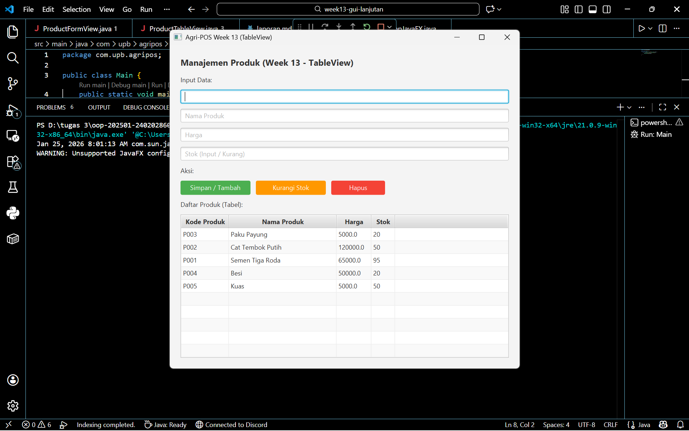

# Laporan Praktikum Minggu 13
Topik: GUI Lanjutan JavaFX (TableView dan Lambda Expression)

## Identitas
- Nama  : Efan Aryanto Adli
- NIM   : 240202860
- Kelas : 3IKRA

---

## Tujuan
1. Mengintegrasikan seluruh konsep OOP (Bab 1–5) ke dalam satu aplikasi utuh bernama "Agri-POS".
2. Mengimplementasikan rancangan UML dan prinsip SOLID (dari Bab 6) menjadi kode program nyata.
3. Menerapkan struktur data Collections untuk fitur keranjang belanja.
4. Menerapkan penanganan kesalahan (Exception Handling) untuk validasi input dan alur error.
5. Mengimplementasikan Design Pattern dan Unit Testing (JUnit) pada logika bisnis.
6. Menghubungkan aplikasi JavaFX dengan database PostgreSQL menggunakan pola DAO (Data Access Object) dan JDBC.

---

## Dasar Teori
1. Arsitektur MVC dan Layered Architecture: plikasi ini dibangun menggunakan variasi pola MVC (Model-View-Controller) yang diperluas dengan Service Layer dan DAO Layer.
2. Dependency Inversion Principle (DIP): Sesuai prinsip SOLID, modul tingkat tinggi (View/Controller) tidak boleh bergantung langsung pada modul tingkat rendah (Database/DAO). Ketergantungan diarahkan melalui abstraksi (Interface) atau melalui Service Layer sebagai perantara.  
3. JDBC dan DAO Pattern: DBC (Java Database Connectivity) adalah standar API untuk menghubungkan Java dengan database relasional. Pola DAO digunakan untuk mengabstraksi detail query SQL, sehingga kode logika bisnis tidak tercampur dengan kode SQL.
4. JUnit Testing: JUnit adalah kerangka kerja pengujian unit untuk Java. Pengujian dilakukan pada komponen terkecil (unit) dari aplikasi, biasanya pada level Service atau logika perhitungan, untuk memastikan kode berjalan sesuai harapan sebelum diintegrasikan ke UI.  

---

## Langkah Praktikum
1. Persiapan Database:
   - Membuat database PostgreSQL.
   - Membuat tabel products dengan kolom code, name, price, dan stock.
2. Struktur Proyek:
   - Menyiapkan struktur paket com.upb.agripos dengan sub-paket: model, dao, service, controller, dan view.
3. Implementasi Model:
   - Membuat kelas Product (enkapsulasi data produk).
   - Membuat kelas CartItem dan Cart (menggunakan List atau Map untuk menyimpan item sementara).
4. Implementasi Data Access (DAO):
   - Membuat interface ProductDAO.
   - Mengimplementasikan JdbcProductDAO yang berisi query INSERT, UPDATE, DELETE, dan SELECT menggunakan PreparedStatement.
5. Implementasi Logika Bisnis (Service):
   - Membuat ProductService untuk memvalidasi input sebelum memanggil DAO.
   - Membuat CartService untuk logika penambahan item ke keranjang dan perhitungan total belanja.
6. Implementasi UI (JavaFX):
   - Membuat PosView menggunakan FXML atau kode JavaFX murni yang berisi TableView untuk produk dan form input.
   - Menghubungkan UI dengan PosController.
7. Testing:
   - Membuat unit test CartServiceTest untuk menguji perhitungan total belanja tanpa melibatkan UI atau Database.

---

## Kode Program
### 1. ProdictDAO.java  
```java
package com.upb.agripos.dao;

import com.upb.agripos.model.Product;
import java.util.List;

public interface ProductDAO {
    void save(Product product);
    void update(Product product);
    void delete(String code);
    Product getProductByCode(String code);
    List<Product> getAllProducts();
}
```

### 2. ProdictDAOImpl.java  
```java
package com.upb.agripos.dao;

import com.upb.agripos.config.DatabaseConnection; // Import Singleton
import com.upb.agripos.model.Product;
import java.sql.*;
import java.util.ArrayList;
import java.util.List;

public class ProductDAOImpl implements ProductDAO {

    // Kita gunakan koneksi dari Singleton (Bab 10) agar lebih rapi
    private Connection getConnection() throws SQLException {
        return DatabaseConnection.getConnection();
    }

    @Override
    public void save(Product product) {
        String sql = "INSERT INTO products (code, name, price, stock) VALUES (?, ?, ?, ?)";
        try (Connection conn = getConnection();
             PreparedStatement pstmt = conn.prepareStatement(sql)) {
            pstmt.setString(1, product.getCode());
            pstmt.setString(2, product.getName());
            pstmt.setDouble(3, product.getPrice());
            pstmt.setInt(4, product.getStock());
            pstmt.executeUpdate();
        } catch (SQLException e) {
            e.printStackTrace();
        }
    }

    @Override
    public void update(Product product) {
        String sql = "UPDATE products SET name=?, price=?, stock=? WHERE code=?";
        try (Connection conn = getConnection();
             PreparedStatement pstmt = conn.prepareStatement(sql)) {
            pstmt.setString(1, product.getName());
            pstmt.setDouble(2, product.getPrice());
            pstmt.setInt(3, product.getStock());
            pstmt.setString(4, product.getCode());
            pstmt.executeUpdate();
        } catch (SQLException e) {
            e.printStackTrace();
        }
    }

    @Override
    public void delete(String code) {
        String sql = "DELETE FROM products WHERE code=?";
        try (Connection conn = getConnection();
             PreparedStatement pstmt = conn.prepareStatement(sql)) {
            pstmt.setString(1, code);
            pstmt.executeUpdate();
        } catch (SQLException e) {
            e.printStackTrace();
        }
    }

    @Override
    public Product getProductByCode(String code) {
        String sql = "SELECT * FROM products WHERE code=?";
        try (Connection conn = getConnection();
             PreparedStatement pstmt = conn.prepareStatement(sql)) {
            pstmt.setString(1, code);
            ResultSet rs = pstmt.executeQuery();
            if (rs.next()) {
                return new Product(
                    rs.getString("code"),
                    rs.getString("name"),
                    rs.getDouble("price"),
                    rs.getInt("stock")
                );
            }
        } catch (SQLException e) {
            e.printStackTrace();
        }
        return null;
    }

    @Override
    public List<Product> getAllProducts() {
        String sql = "SELECT * FROM products";
        List<Product> products = new ArrayList<>();
        try (Connection conn = getConnection();
             Statement stmt = conn.createStatement();
             ResultSet rs = stmt.executeQuery(sql)) {
            while (rs.next()) {
                products.add(new Product(
                    rs.getString("code"),
                    rs.getString("name"),
                    rs.getDouble("price"),
                    rs.getInt("stock")
                ));
            }
        } catch (SQLException e) {
            e.printStackTrace();
        }
        return products;
    }
}
```

### 3. InvalidQuantityException.java  
```java
package com.upb.agripos.exception; // Package diperbaiki

public class InvalidQuantityException extends Exception {
    public InvalidQuantityException(String msg) { 
        super(msg); 
    }
}
```

### 4. Prodict.java  
```java
package com.upb.agripos.model;

public class Product {
    private String code;
    private String name;
    private double price;
    private int stock;

    public Product() {}

    public Product(String code, String name, double price, int stock) {
        this.code = code;
        this.name = name;
        this.price = price;
        this.stock = stock;
    }

    public String getCode() { return code; }
    public void setCode(String code) { this.code = code; }

    public String getName() { return name; }
    public void setName(String name) { this.name = name; }

    public double getPrice() { return price; }
    public void setPrice(double price) { this.price = price; }

    public int getStock() { return stock; }
    public void setStock(int stock) { this.stock = stock; }

    @Override
    public String toString() {
        // Update agar tampilan di List GUI rapi
        return code + " - " + name + " (Stok: " + stock + ")";
    }
}
```

### 5. ProdictService.java  
```java
package com.upb.agripos.service;

import java.util.List;

import com.upb.agripos.dao.ProductDAO;
import com.upb.agripos.dao.ProductDAOImpl;
import com.upb.agripos.exception.InvalidQuantityException;
import com.upb.agripos.model.Product;

public class ProductService {
    private ProductDAO dao;

    public ProductService() {
        this.dao = new ProductDAOImpl();
    }

    // === FITUR 1: TAMBAH PRODUK & UPDATE STOK OTOMATIS ===
    public void addProduct(String code, String name, String priceStr, String stockStr) throws Exception {
        // 1. Validasi Input
        if (code == null || code.trim().isEmpty() || name == null || name.trim().isEmpty()) {
            throw new InvalidQuantityException("Kode dan Nama tidak boleh kosong!");
        }
        
        double price;
        int stockInput;
        
        try {
            price = Double.parseDouble(priceStr);
            stockInput = Integer.parseInt(stockStr);
        } catch (NumberFormatException e) {
            throw new InvalidQuantityException("Harga dan Stok harus angka valid!");
        }

        if (price < 0 || stockInput < 0) {
            throw new InvalidQuantityException("Harga dan Stok tidak boleh negatif!");
        }

        // 2. Logika Pintar (Cek Database)
        Product existingProduct = dao.getProductByCode(code);

        if (existingProduct != null) {
            // Jika SUDAH ADA -> Tambah Stok (Update)
            int stokBaru = existingProduct.getStock() + stockInput;
            
            existingProduct.setName(name);
            existingProduct.setPrice(price);
            existingProduct.setStock(stokBaru);
            
            dao.update(existingProduct);
            System.out.println("Update Stok: " + code + " menjadi " + stokBaru);
            
        } else {
            // Jika BELUM ADA -> Buat Baru (Insert)
            Product newProduct = new Product(code, name, price, stockInput);
            dao.save(newProduct);
            System.out.println("Input Baru: " + code);
        }
    }

    // === FITUR 2: KURANGI STOK (INI YANG ANDA CARI) ===
    public void reduceStock(String code, String stockStr) throws Exception {
        if (code == null || code.trim().isEmpty()) {
            throw new InvalidQuantityException("Kode produk harus diisi!");
        }

        int quantityToReduce;
        try {
            quantityToReduce = Integer.parseInt(stockStr);
        } catch (NumberFormatException e) {
            throw new InvalidQuantityException("Jumlah pengurangan harus angka valid!");
        }

        if (quantityToReduce <= 0) {
            throw new InvalidQuantityException("Jumlah pengurangan harus lebih dari 0!");
        }

        Product existingProduct = dao.getProductByCode(code);

        if (existingProduct != null) {
            int currentStock = existingProduct.getStock();

            if (currentStock < quantityToReduce) {
                throw new InvalidQuantityException("Stok tidak cukup! Sisa stok: " + currentStock);
            }

            int newStock = currentStock - quantityToReduce;
            existingProduct.setStock(newStock);
            
            dao.update(existingProduct);
            System.out.println("Stok berkurang. Sisa: " + newStock);
        } else {
            throw new InvalidQuantityException("Produk tidak ditemukan!");
        }
    }

    // === FITUR 3: HAPUS PRODUK ===
    public void deleteProduct(String code) {
        if (code != null && !code.isEmpty()) {
            dao.delete(code);
            System.out.println("Service: Menghapus produk " + code);
        }
    }

    // === FITUR 4: AMBIL SEMUA DATA ===
    public List<Product> getAllProducts() {
        return dao.getAllProducts();
    }
}
```

### 6. ProdictFormView.java  
```java
package com.upb.agripos.view;

import com.upb.agripos.exception.InvalidQuantityException;
import com.upb.agripos.model.Product;
import com.upb.agripos.service.ProductService;

import javafx.geometry.Insets;
import javafx.scene.control.Alert;
import javafx.scene.control.Button; // Import baru untuk tata letak tombol
import javafx.scene.control.Label;
import javafx.scene.control.ListView;
import javafx.scene.control.TextField;
import javafx.scene.layout.HBox;
import javafx.scene.layout.VBox;

public class ProductFormView extends VBox {
    private TextField txtCode, txtName, txtPrice, txtStock;
    private Button btnSave;   // Tombol Tambah/Simpan
    private Button btnReduce; // Tombol Kurangi (BARU)
    private Button btnDelete; // Tombol Hapus
    private ListView<Product> listView;
    private ProductService service;

    public ProductFormView() {
        this.service = new ProductService();
        initUI();
        initEventHandler();
        refreshData();
    }

    private void initUI() {
        this.setPadding(new Insets(20));
        this.setSpacing(10);

        Label lblTitle = new Label("Sistem Manajemen Stok");
        lblTitle.setStyle("-fx-font-weight: bold; -fx-font-size: 16px;");

        // Input Fields
        txtCode = new TextField(); txtCode.setPromptText("Kode Produk (Contoh: P001)");
        txtName = new TextField(); txtName.setPromptText("Nama Produk");
        txtPrice = new TextField(); txtPrice.setPromptText("Harga");
        txtStock = new TextField(); txtStock.setPromptText("Jumlah Stok (Input / Kurang)");

        // --- BUTTONS ---
        btnSave = new Button("Tambah Stok / Simpan");
        btnSave.setStyle("-fx-background-color: #4CAF50; -fx-text-fill: white;"); // Hijau
        btnSave.setMaxWidth(Double.MAX_VALUE);

        btnReduce = new Button("Kurangi Stok"); // Tombol Baru
        btnReduce.setStyle("-fx-background-color: #FF9800; -fx-text-fill: white;"); // Oranye
        btnReduce.setMaxWidth(Double.MAX_VALUE);

        btnDelete = new Button("Hapus Produk");
        btnDelete.setStyle("-fx-background-color: #F44336; -fx-text-fill: white;"); // Merah
        btnDelete.setMaxWidth(Double.MAX_VALUE);

        // HBox untuk menjejerkan tombol (Opsional, biar rapi)
        HBox buttonContainer = new HBox(10, btnSave, btnReduce, btnDelete);
        
        listView = new ListView<>();
        
        this.getChildren().addAll(
            lblTitle, 
            new Label("Input Data:"),
            txtCode, txtName, txtPrice, txtStock, 
            new Label("Aksi:"),
            btnSave, btnReduce, btnDelete, // Masukkan semua tombol
            new Label("Daftar Produk:"), 
            listView
        );
    }

    private void initEventHandler() {
        // 1. AKSI TAMBAH / SIMPAN
        btnSave.setOnAction(e -> {
            try {
                service.addProduct(
                    txtCode.getText(),
                    txtName.getText(),
                    txtPrice.getText(),
                    txtStock.getText()
                );
                showAlert(Alert.AlertType.INFORMATION, "Sukses", "Stok Bertambah / Produk Disimpan!");
                clearFields();
                refreshData();
            } catch (InvalidQuantityException ex) {
                showAlert(Alert.AlertType.WARNING, "Peringatan", ex.getMessage());
            } catch (Exception ex) {
                showAlert(Alert.AlertType.ERROR, "Error", ex.getMessage());
            }
        });

        // 2. AKSI KURANGI STOK (BARU)
        btnReduce.setOnAction(e -> {
            try {
                // Panggil method reduceStock yang baru kita buat
                service.reduceStock(txtCode.getText(), txtStock.getText());
                
                showAlert(Alert.AlertType.INFORMATION, "Sukses", "Stok Berhasil Dikurangi!");
                clearFields();
                refreshData();
            } catch (InvalidQuantityException ex) {
                showAlert(Alert.AlertType.WARNING, "Gagal Kurang", ex.getMessage());
            } catch (Exception ex) {
                showAlert(Alert.AlertType.ERROR, "Error", ex.getMessage());
            }
        });

        // 3. AKSI HAPUS
        btnDelete.setOnAction(e -> {
            Product selected = listView.getSelectionModel().getSelectedItem();
            if (selected != null) {
                service.deleteProduct(selected.getCode());
                refreshData();
                clearFields(); // Bersihkan form setelah hapus
                showAlert(Alert.AlertType.INFORMATION, "Terhapus", "Produk berhasil dihapus.");
            } else {
                showAlert(Alert.AlertType.WARNING, "Pilih Produk", "Klik salah satu produk di daftar dulu!");
            }
        });

        // Fitur Klik List -> Isi Form Otomatis
        listView.setOnMouseClicked(e -> {
            Product selected = listView.getSelectionModel().getSelectedItem();
            if (selected != null) {
                txtCode.setText(selected.getCode());
                txtName.setText(selected.getName());
                txtPrice.setText(String.valueOf((long)selected.getPrice()));
                txtStock.setText("1"); // Default angka 1 agar siap ditambah/dikurang
            }
        });
    }

    private void refreshData() {
        try {
            listView.getItems().setAll(service.getAllProducts());
        } catch (Exception e) { e.printStackTrace(); }
    }

    private void clearFields() {
        txtCode.clear(); txtName.clear(); txtPrice.clear(); txtStock.clear();
    }

    private void showAlert(Alert.AlertType type, String title, String msg) {
        Alert alert = new Alert(type);
        alert.setTitle(title);
        alert.setContentText(msg);
        alert.showAndWait();
    }
}
```

### 7. ProdictTableView.java  
```java
package com.upb.agripos.view;

import com.upb.agripos.exception.InvalidQuantityException;
import com.upb.agripos.model.Product;
import com.upb.agripos.service.ProductService;

import javafx.geometry.Insets;
import javafx.scene.control.Alert;
import javafx.scene.control.Button;
import javafx.scene.control.Label;
import javafx.scene.control.TableColumn;
import javafx.scene.control.TableView;
import javafx.scene.control.TextField;
import javafx.scene.control.cell.PropertyValueFactory;
import javafx.scene.layout.HBox;
import javafx.scene.layout.VBox;

public class ProductTableView extends VBox {
    // Komponen GUI
    private TableView<Product> table; 
    private TextField txtCode, txtName, txtPrice, txtStock;
    private Button btnSave, btnReduce, btnDelete; // <--- btnReduce ditambahkan lagi
    
    private ProductService service;

    public ProductTableView() {
        this.service = new ProductService();
        initUI();
        initEventHandler();
        loadData(); // Load data saat aplikasi dibuka
    }

    private void initUI() {
        this.setPadding(new Insets(20));
        this.setSpacing(10);

        Label lblTitle = new Label("Manajemen Produk (Week 13 - TableView)");
        lblTitle.setStyle("-fx-font-weight: bold; -fx-font-size: 16px;");

        // --- 1. MEMBUAT TABEL DAN KOLOM ---
        table = new TableView<>();
        
        TableColumn<Product, String> colCode = new TableColumn<>("Kode Produk");
        colCode.setCellValueFactory(new PropertyValueFactory<>("code")); 

        TableColumn<Product, String> colName = new TableColumn<>("Nama Produk");
        colName.setCellValueFactory(new PropertyValueFactory<>("name"));
        colName.setMinWidth(200);

        TableColumn<Product, Double> colPrice = new TableColumn<>("Harga");
        colPrice.setCellValueFactory(new PropertyValueFactory<>("price"));

        TableColumn<Product, Integer> colStock = new TableColumn<>("Stok");
        colStock.setCellValueFactory(new PropertyValueFactory<>("stock"));

        table.getColumns().addAll(colCode, colName, colPrice, colStock);

        // --- 2. FORM INPUT ---
        txtCode = new TextField(); txtCode.setPromptText("Kode");
        txtName = new TextField(); txtName.setPromptText("Nama Produk");
        txtPrice = new TextField(); txtPrice.setPromptText("Harga");
        txtStock = new TextField(); txtStock.setPromptText("Stok (Input / Kurang)");

        // --- 3. TOMBOL (Sekarang ada 3) ---
        btnSave = new Button("Simpan / Tambah");
        btnSave.setStyle("-fx-background-color: #4CAF50; -fx-text-fill: white;"); // Hijau
        btnSave.setPrefWidth(130);
        
        btnReduce = new Button("Kurangi Stok"); // <--- INI DIA TOMBOLNYA
        btnReduce.setStyle("-fx-background-color: #FF9800; -fx-text-fill: white;"); // Oranye
        btnReduce.setPrefWidth(130);

        btnDelete = new Button("Hapus");
        btnDelete.setStyle("-fx-background-color: #F44336; -fx-text-fill: white;"); // Merah
        btnDelete.setPrefWidth(100);

        // Masukkan ketiga tombol ke dalam kotak baris (HBox)
        HBox buttonBox = new HBox(10, btnSave, btnReduce, btnDelete);

        // Masukkan semua ke layar
        this.getChildren().addAll(lblTitle, 
            new Label("Input Data:"),
            txtCode, txtName, txtPrice, txtStock, 
            new Label("Aksi:"),
            buttonBox,
            new Label("Daftar Produk (Tabel):"), 
            table);
    }

    private void initEventHandler() {
        // --- 1. Event Simpan / Tambah ---
        btnSave.setOnAction(e -> {
            try {
                service.addProduct(
                    txtCode.getText(),
                    txtName.getText(),
                    txtPrice.getText(),
                    txtStock.getText()
                );
                loadData(); // Refresh tabel
                clearFields();
                showAlert(Alert.AlertType.INFORMATION, "Sukses", "Data berhasil disimpan!");
            } catch (InvalidQuantityException ex) {
                showAlert(Alert.AlertType.WARNING, "Validasi Error", ex.getMessage());
            } catch (Exception ex) {
                showAlert(Alert.AlertType.ERROR, "System Error", ex.getMessage());
            }
        });

        // --- 2. Event Kurangi Stok (Fitur Week 12 dikembalikan) ---
        btnReduce.setOnAction(e -> {
            try {
                service.reduceStock(txtCode.getText(), txtStock.getText());
                loadData(); // Refresh tabel
                clearFields();
                showAlert(Alert.AlertType.INFORMATION, "Sukses", "Stok berhasil dikurangi!");
            } catch (InvalidQuantityException ex) {
                showAlert(Alert.AlertType.WARNING, "Gagal Kurang", ex.getMessage());
            } catch (Exception ex) {
                showAlert(Alert.AlertType.ERROR, "System Error", ex.getMessage());
            }
        });

        // --- 3. Event Hapus ---
        btnDelete.setOnAction(e -> {
            Product selected = table.getSelectionModel().getSelectedItem();
            if (selected != null) {
                service.deleteProduct(selected.getCode());
                loadData(); // Refresh tabel
                clearFields(); 
                showAlert(Alert.AlertType.INFORMATION, "Terhapus", "Produk berhasil dihapus.");
            } else {
                showAlert(Alert.AlertType.WARNING, "Peringatan", "Klik salah satu baris di tabel dulu!");
            }
        });

        // Klik Tabel -> Isi Form Otomatis
        table.setOnMouseClicked(e -> {
            Product selected = table.getSelectionModel().getSelectedItem();
            if (selected != null) {
                txtCode.setText(selected.getCode());
                txtName.setText(selected.getName());
                txtPrice.setText(String.valueOf((long)selected.getPrice()));
                txtStock.setText("1"); // Default angka 1 agar siap dikurangi
            }
        });
    }

    private void loadData() {
        try {
            table.getItems().setAll(service.getAllProducts());
        } catch (Exception e) { e.printStackTrace(); }
    }

    private void clearFields() {
        txtCode.clear(); txtName.clear(); txtPrice.clear(); txtStock.clear();
    }

    private void showAlert(Alert.AlertType type, String title, String msg) {
        Alert alert = new Alert(type);
        alert.setTitle(title);
        alert.setContentText(msg);
        alert.showAndWait();
    }
}
```

### 8. AppJavaFX.java  
```java
package com.upb.agripos;

// 1. UBAH IMPORT: Gunakan ProductTableView (File baru yang Anda buat tadi)
import com.upb.agripos.view.ProductTableView; 

import javafx.application.Application;
import javafx.scene.Scene;
import javafx.stage.Stage;

public class AppJavaFX extends Application {
    @Override
    public void start(Stage stage) {
        // 2. GANTI ROOT: Panggil class TableView
        ProductTableView root = new ProductTableView();
        
        // 3. UBAH UKURAN: Buat lebih lebar (600) agar tabel terlihat jelas
        Scene scene = new Scene(root, 650, 600); 
        
        // 4. GANTI JUDUL: Sesuaikan dengan tugas sekarang
        stage.setTitle("Agri-POS Week 13 (TableView)"); 
        
        stage.setScene(scene);
        stage.show();
    }

    public static void main(String[] args) {
        launch(args);
    }
}
```

### 9. Main.java  
```java
package com.upb.agripos;

public class Main {
    public static void main(String[] args) {
        // Memanggil class utama JavaFX
        AppJavaFX.main(args);
    }
}
```

### 10. pom.xml 
```xml
<?xml version="1.0" encoding="UTF-8"?>
<project xmlns="http://maven.apache.org/POM/4.0.0"
         xmlns:xsi="http://www.w3.org/2001/XMLSchema-instance"
         xsi:schemaLocation="http://maven.apache.org/POM/4.0.0 http://maven.apache.org/xsd/maven-4.0.0.xsd">
    <modelVersion>4.0.0</modelVersion>

    <groupId>com.upb</groupId>
    <artifactId>agripos-week10</artifactId> 
    <version>1.0-SNAPSHOT</version>

    <properties>
        <maven.compiler.source>17</maven.compiler.source>
        <maven.compiler.target>17</maven.compiler.target>
        <project.build.sourceEncoding>UTF-8</project.build.sourceEncoding>
        <javafx.version>21</javafx.version> </properties>

    <dependencies>
        <dependency>
            <groupId>org.junit.jupiter</groupId>
            <artifactId>junit-jupiter-api</artifactId>
            <version>5.10.0</version>
            <scope>test</scope>
        </dependency>
        <dependency>
            <groupId>org.junit.jupiter</groupId>
            <artifactId>junit-jupiter-engine</artifactId>
            <version>5.10.0</version>
            <scope>test</scope>
        </dependency>

        <dependency>
            <groupId>org.postgresql</groupId>
            <artifactId>postgresql</artifactId>
            <version>42.7.2</version>
        </dependency>

        <dependency>
            <groupId>org.openjfx</groupId>
            <artifactId>javafx-controls</artifactId>
            <version>${javafx.version}</version>
        </dependency>
        <dependency>
            <groupId>org.openjfx</groupId>
            <artifactId>javafx-fxml</artifactId>
            <version>${javafx.version}</version>
        </dependency>
    </dependencies>

    <build>
        <plugins>
            <plugin>
                <groupId>org.openjfx</groupId>
                <artifactId>javafx-maven-plugin</artifactId>
                <version>0.0.8</version>
                <configuration>
                    <mainClass>com.upb.agripos.AppJavaFX</mainClass>
                </configuration>
            </plugin>
        </plugins>
    </build>

</project>
```
---

## Hasil Eksekusi
(Sertakan screenshot hasil eksekusi program.  

)
---

## Analisis
(
- Jelaskan bagaimana kode berjalan.  
- Apa perbedaan pendekatan minggu ini dibanding minggu sebelumnya.  
- Kendala yang dihadapi dan cara mengatasinya.  
)
---

## Kesimpulan
1. Aplikasi Agri-POS berhasil dibangun dengan arsitektur MVC yang terpisah (View, Controller, Service, DAO), memenuhi prinsip SOLID terutama Dependency Inversion dan Single Responsibility.
2. Integrasi Database PostgreSQL berjalan lancar menggunakan JDBC, memungkinkan data persisten (CRUD Produk).
3. Konsep OOP diterapkan secara menyeluruh, mulai dari enkapsulasi model hingga penggunaan Interface untuk abstraksi DAO.
4. Fitur Keranjang membuktikan penggunaan Collections yang efektif untuk manajemen data sementara di memori.
5. Unit Testing membantu memverifikasi logika bisnis tanpa harus menjalankan UI, meningkatkan keandalan kode.

---

## Quiz
(1. [Tuliskan kembali pertanyaan 1 dari panduan]  
   **Jawaban:** …  

2. [Tuliskan kembali pertanyaan 2 dari panduan]  
   **Jawaban:** …  

3. [Tuliskan kembali pertanyaan 3 dari panduan]  
   **Jawaban:** …  )
