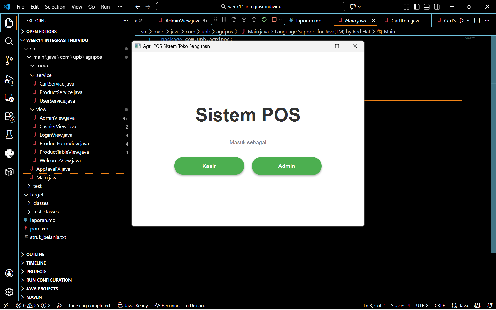
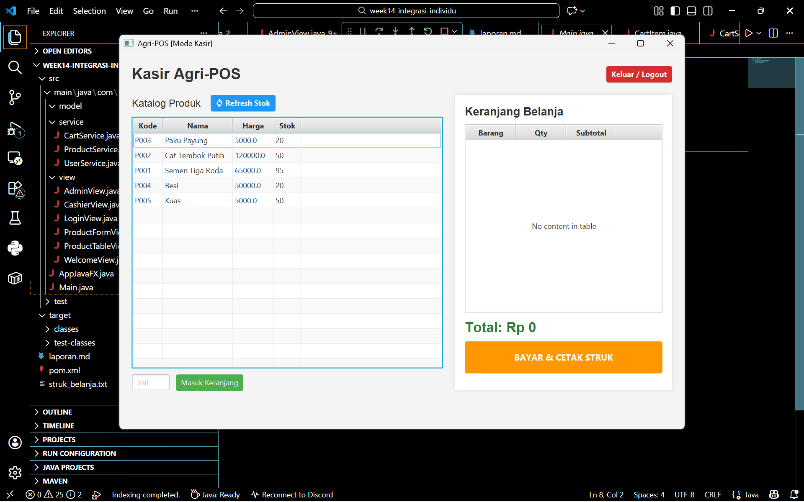
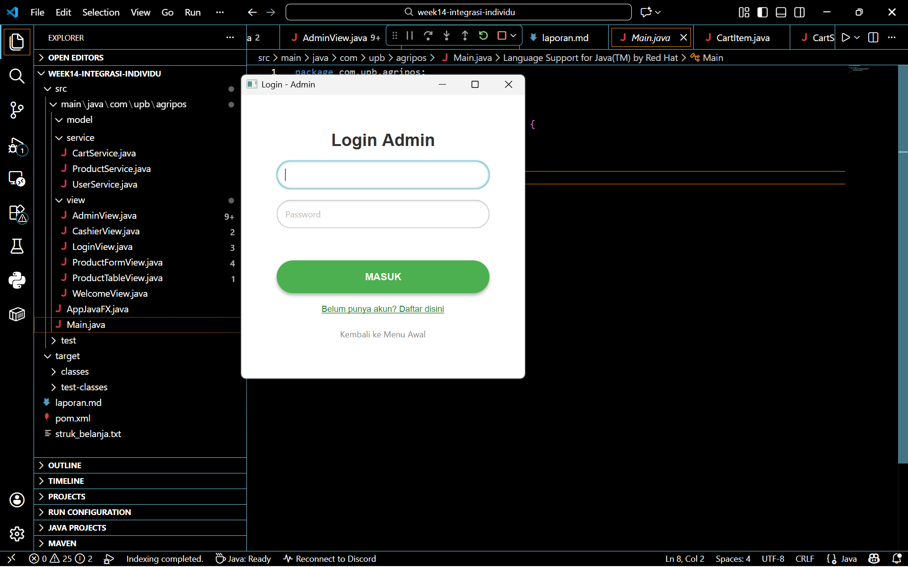
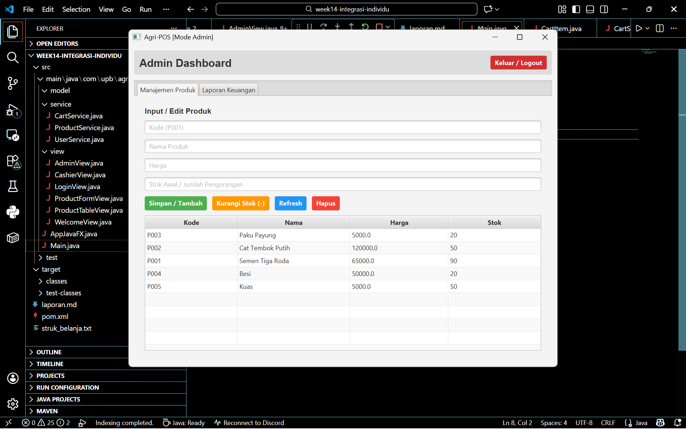
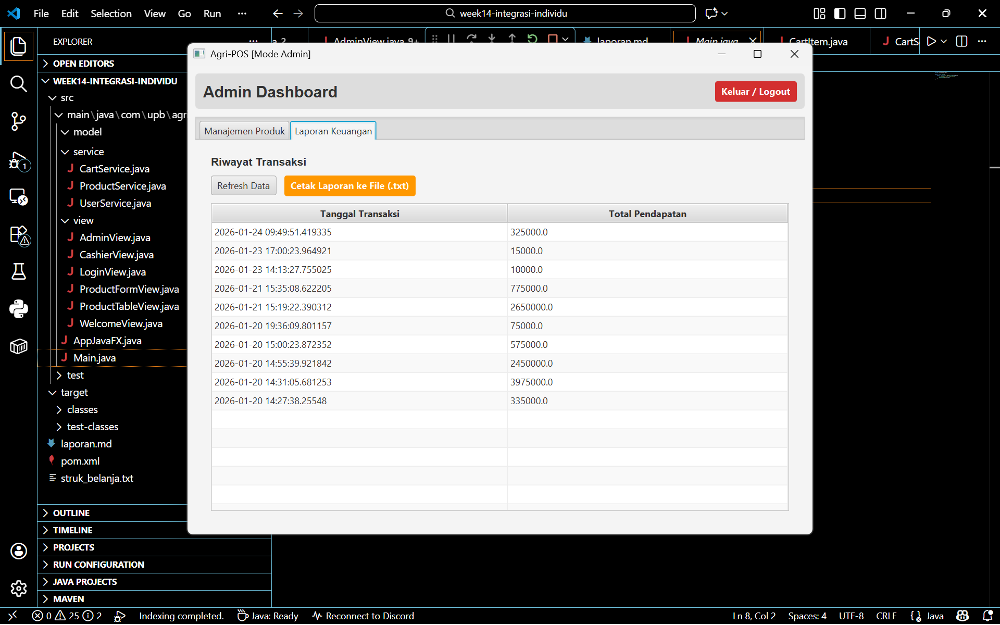
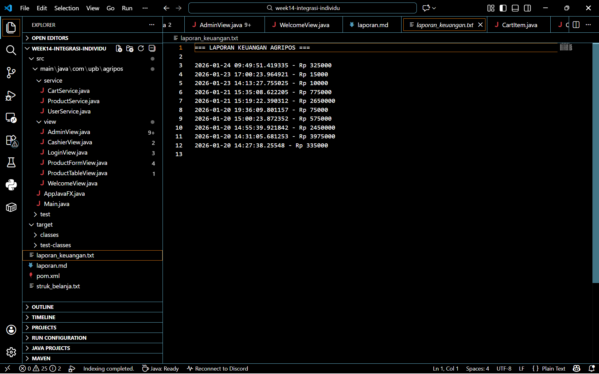
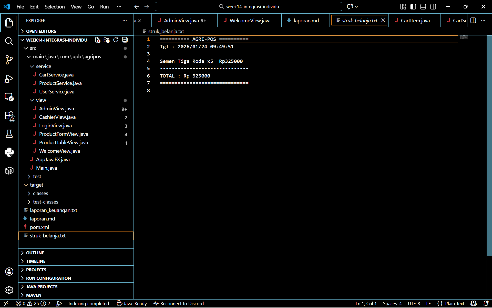

# Laporan Praktikum Minggu 14
Topik: Integrasi Individu (OOP + Database + GUI)

## Identitas
- Nama  : Efan Aryanto Adli
- NIM   : 240202860
- Kelas : 3IKRA

---

## Tujuan
1. Mengimplementasikan rancangan UML dan prinsip SOLID (dari Bab 6) menjadi kode program nyata.
2. Menerapkan struktur data Collections untuk fitur keranjang belanja.
3. Menerapkan penanganan kesalahan (Exception Handling) untuk validasi input dan alur error.
4. Mengimplementasikan Design Pattern dan Unit Testing (JUnit) pada logika bisnis.

---

## Dasar Teori 
1. Arsitektur MVC dan Layered Architecture: Aplikasi ini dibangun menggunakan variasi pola MVC (Model-View-Controller) yang diperluas dengan Service Layer dan DAO Layer.
2. Dependency Inversion Principle (DIP): Sesuai prinsip SOLID, modul tingkat tinggi (View/Controller) tidak boleh bergantung langsung pada modul tingkat rendah (Database/DAO). Ketergantungan diarahkan melalui abstraksi (Interface) atau melalui Service Layer sebagai perantara.
3. JDBC dan DAO Pattern: JDBC (Java Database Connectivity) adalah standar API untuk menghubungkan Java dengan database relasional. Pola DAO digunakan untuk mengabstraksi detail query SQL, sehingga kode logika bisnis tidak tercampur dengan kode SQL.
4. JUnit Testing: JUnit adalah kerangka kerja pengujian unit untuk Java. Pengujian dilakukan pada komponen terkecil (unit) dari aplikasi, biasanya pada level Service atau logika perhitungan, untuk memastikan kode berjalan sesuai harapan sebelum diintegrasikan ke UI.

---

## Langkah Praktikum
1. Persiapan Database:
    - Membuat database PostgreSQL.
    - Membuat tabel `products` dengan kolom `code`, `name` `price`, dan `stock`.
2. Struktur Proyek:
    - Menyiapkan struktur paket com.upb.agripos dengan sub-paket: model, dao, service, controller, dan view
3. Implementasi Model:
    - Membuat kelas Product (enkapsulasi data produk).
    - Membuat kelas CartItem dan Cart (menggunakan List atau Map untuk menyimpan item sementara).
4. Implementasi Data Access (DAO):
    - Membuat interface ProductDAO.
    - Mengimplementasikan JdbcProductDAO yang berisi query INSERT, UPDATE, DELETE, dan SELECT menggunakan PreparedStatement.
5. Implementasi Logika Bisnis (Service):
    - Membuat ProductService untuk memvalidasi input sebelum memanggil DAO.
    - Membuat CartService untuk logika penambahan item ke keranjang dan perhitungan total belanja.
6. Implementasi UI (JavaFX):
    - Membuat PosView menggunakan FXML atau kode JavaFX murni yang berisi TableView untuk produk dan form input.
    - Menghubungkan UI dengan PosController.
7. Testing:
    - Membuat unit test CartServiceTest untuk menguji perhitungan total belanja tanpa melibatkan UI atau Database.

---

## Kode Program  

### 1. DatabaseConnection.java
```java
package com.upb.agripos.config;

import java.sql.Connection;
import java.sql.DriverManager;
import java.sql.SQLException;

public class DatabaseConnection {
    private static DatabaseConnection instance;
    private Connection connection;

    private DatabaseConnection() {
        try {
            // Sesuaikan username & password PostgreSQL Anda di sini
            String url = "jdbc:postgresql://localhost:5432/agripos";
            String user = "postgres";
            String password = "271205"; // <--- Ganti Password Anda

            this.connection = DriverManager.getConnection(url, user, password);
        } catch (SQLException e) {
            e.printStackTrace();
        }
    }

    public static Connection getConnection() {
        try {
            if (instance == null || instance.connection.isClosed()) {
                instance = new DatabaseConnection();
            }
        } catch (SQLException e) {
            e.printStackTrace();
        }
        return instance.connection;
    }
}
```

### 2. ProductDAO.java
```java
package com.upb.agripos.dao;

import com.upb.agripos.model.Product;
import java.util.List;

public interface ProductDAO {
    void save(Product product);
    void update(Product product);
    void delete(String code);
    Product getProductByCode(String code);
    List<Product> getAllProducts();
}
```

### 3. ProductDAOImpl.java
```java
package com.upb.agripos.dao;

import com.upb.agripos.config.DatabaseConnection; // Import Singleton
import com.upb.agripos.model.Product;
import java.sql.*;
import java.util.ArrayList;
import java.util.List;

public class ProductDAOImpl implements ProductDAO {

    // Kita gunakan koneksi dari Singleton (Bab 10) agar lebih rapi
    private Connection getConnection() throws SQLException {
        return DatabaseConnection.getConnection();
    }

    @Override
    public void save(Product product) {
        String sql = "INSERT INTO products (code, name, price, stock) VALUES (?, ?, ?, ?)";
        try (Connection conn = getConnection();
             PreparedStatement pstmt = conn.prepareStatement(sql)) {
            pstmt.setString(1, product.getCode());
            pstmt.setString(2, product.getName());
            pstmt.setDouble(3, product.getPrice());
            pstmt.setInt(4, product.getStock());
            pstmt.executeUpdate();
        } catch (SQLException e) {
            e.printStackTrace();
        }
    }

    @Override
    public void update(Product product) {
        String sql = "UPDATE products SET name=?, price=?, stock=? WHERE code=?";
        try (Connection conn = getConnection();
             PreparedStatement pstmt = conn.prepareStatement(sql)) {
            pstmt.setString(1, product.getName());
            pstmt.setDouble(2, product.getPrice());
            pstmt.setInt(3, product.getStock());
            pstmt.setString(4, product.getCode());
            pstmt.executeUpdate();
        } catch (SQLException e) {
            e.printStackTrace();
        }
    }

    @Override
    public void delete(String code) {
        String sql = "DELETE FROM products WHERE code=?";
        try (Connection conn = getConnection();
             PreparedStatement pstmt = conn.prepareStatement(sql)) {
            pstmt.setString(1, code);
            pstmt.executeUpdate();
        } catch (SQLException e) {
            e.printStackTrace();
        }
    }

    @Override
    public Product getProductByCode(String code) {
        String sql = "SELECT * FROM products WHERE code=?";
        try (Connection conn = getConnection();
             PreparedStatement pstmt = conn.prepareStatement(sql)) {
            pstmt.setString(1, code);
            ResultSet rs = pstmt.executeQuery();
            if (rs.next()) {
                return new Product(
                    rs.getString("code"),
                    rs.getString("name"),
                    rs.getDouble("price"),
                    rs.getInt("stock")
                );
            }
        } catch (SQLException e) {
            e.printStackTrace();
        }
        return null;
    }

    @Override
    public List<Product> getAllProducts() {
        String sql = "SELECT * FROM products";
        List<Product> products = new ArrayList<>();
        try (Connection conn = getConnection();
             Statement stmt = conn.createStatement();
             ResultSet rs = stmt.executeQuery(sql)) {
            while (rs.next()) {
                products.add(new Product(
                    rs.getString("code"),
                    rs.getString("name"),
                    rs.getDouble("price"),
                    rs.getInt("stock")
                ));
            }
        } catch (SQLException e) {
            e.printStackTrace();
        }
        return products;
    }
}
```

### 4. SalesDAO.java
```java
package com.upb.agripos.dao;

// PERBAIKAN: Import DatabaseConnection dari package config
import java.sql.Connection;
import java.sql.PreparedStatement;
import java.sql.ResultSet;
import java.sql.SQLException;
import java.sql.Statement;
import java.util.ArrayList;
import java.util.List;

import com.upb.agripos.config.DatabaseConnection;
import com.upb.agripos.model.SaleRecord;

public class SalesDAO {

    // Simpan Transaksi (Dipakai Kasir saat Bayar)
    public void saveSale(double total) {
        String sql = "INSERT INTO sales (total_amount) VALUES (?)";
        try (Connection conn = DatabaseConnection.getConnection();
             PreparedStatement stmt = conn.prepareStatement(sql)) {
             
            stmt.setDouble(1, total);
            stmt.executeUpdate();
        } catch (SQLException e) {
            e.printStackTrace();
        }
    }

    // Ambil Data Laporan (Dipakai Admin)
    public List<SaleRecord> getAllSales() {
        List<SaleRecord> list = new ArrayList<>();
        String sql = "SELECT date, total_amount FROM sales ORDER BY date DESC";
        
        try (Connection conn = DatabaseConnection.getConnection();
             Statement stmt = conn.createStatement();
             ResultSet rs = stmt.executeQuery(sql)) {
             
            while(rs.next()) {
                // Ambil data dari database dan masukkan ke object SaleRecord
                String tgl = rs.getString("date"); // PostgreSQL timestamp -> String
                double tot = rs.getDouble("total_amount");
                
                list.add(new SaleRecord(tgl, tot));
            }
        } catch (SQLException e) {
            e.printStackTrace();
        }
        return list;
    }
}
```

### 5. UserDAO.java
```java
package com.upb.agripos.dao;

import java.sql.Connection;
import java.sql.PreparedStatement;
import java.sql.ResultSet;
import java.sql.SQLException;

import com.upb.agripos.config.DatabaseConnection;
import com.upb.agripos.model.User;

public class UserDAO {

    public User getUserByUsername(String username) {
        String sql = "SELECT * FROM users WHERE username = ?";
        
        try (Connection conn = DatabaseConnection.getConnection(); 
             PreparedStatement stmt = conn.prepareStatement(sql)) {
             
            stmt.setString(1, username);
            ResultSet rs = stmt.executeQuery();
            
            if (rs.next()) {
                // PERUBAHAN 1: Ambil kolom 'role' dari database
                // Dan masukkan ke Constructor User yang baru (3 parameter)
                return new User(
                    rs.getString("username"), 
                    rs.getString("password"),
                    rs.getString("role") 
                );
            }
        } catch (SQLException e) {
            e.printStackTrace();
        }
        return null;
    }

    public void saveUser(User user) throws Exception {
        // PERUBAHAN 2: Tambahkan kolom 'role' di SQL Insert
        String sql = "INSERT INTO users (username, password, role) VALUES (?, ?, ?)";
        
        try (Connection conn = DatabaseConnection.getConnection();
             PreparedStatement stmt = conn.prepareStatement(sql)) {
             
            stmt.setString(1, user.getUsername());
            stmt.setString(2, user.getPassword());
            
            // PERUBAHAN 3: Simpan role ke database
            stmt.setString(3, user.getRole()); 
            
            stmt.executeUpdate();
        }
    }
}
```

### 6. InvalidQuantityException.java
```java
package com.upb.agripos.exception; // Package diperbaiki

public class InvalidQuantityException extends Exception {
    public InvalidQuantityException(String msg) { 
        super(msg); 
    }
}
```

### 7. Cartltem.java
```java
package com.upb.agripos.model;

public class CartItem {
    private Product product;
    private int quantity;

    public CartItem(Product product, int quantity) {
        this.product = product;
        this.quantity = quantity;
    }

    // --- GETTER & SETTER ---

    public Product getProduct() {
        return product;
    }

    public int getQuantity() {
        return quantity;
    }

    public void setQuantity(int quantity) {
        this.quantity = quantity;
    }

    // --- METHOD KHUSUS UNTUK TABLEVIEW (PENTING!) ---
    // TableView JavaFX akan mencari method getProductName() untuk kolom "productName"
    public String getProductName() {
        return product.getName();
    }

    // TableView akan mencari getPrice() untuk harga satuan
    public double getPrice() {
        return product.getPrice();
    }

    // TableView akan mencari getSubtotal() untuk kolom "subtotal"
    // Logika: Harga x Jumlah
    public double getSubtotal() {
        return product.getPrice() * quantity;
    }
}
```

### 8. Product.java
```java
package com.upb.agripos.model;

public class Product {
    private String code;
    private String name;
    private double price;
    private int stock;

    public Product() {}

    public Product(String code, String name, double price, int stock) {
        this.code = code;
        this.name = name;
        this.price = price;
        this.stock = stock;
    }

    public String getCode() { return code; }
    public void setCode(String code) { this.code = code; }

    public String getName() { return name; }
    public void setName(String name) { this.name = name; }

    public double getPrice() { return price; }
    public void setPrice(double price) { this.price = price; }

    public int getStock() { return stock; }
    public void setStock(int stock) { this.stock = stock; }

    @Override
    public String toString() {
        // Update agar tampilan di List GUI rapi
        return code + " - " + name + " (Stok: " + stock + ")";
    }
}
```

### 9. SaleRecord.java
```java
package com.upb.agripos.model;

public class SaleRecord {
    private String date;
    private double total;

    public SaleRecord(String date, double total) {
        this.date = date;
        this.total = total;
    }

    public String getDate() { return date; }
    public double getTotal() { return total; }
    
    // Override toString agar saat diprint/debug hasilnya terbaca
    @Override
    public String toString() {
        return date + " - Rp " + (long)total;
    }
}
```
### 10. UserRecord.java
```java
package com.upb.agripos.model;

public class User {
    private String username;
    private String password;
    private String role; // <--- Tambahan Baru (Menyimpan 'admin' atau 'kasir')

    // Update Constructor agar menerima role
    public User(String username, String password, String role) {
        this.username = username;
        this.password = password;
        this.role = role;
    }

    public String getUsername() { return username; }
    public String getPassword() { return password; }
    
    // Getter Baru untuk mengambil role
    public String getRole() { return role; } 
}
```

### 11. CartService.java
```java
package com.upb.agripos.service;

import java.util.ArrayList;
import java.util.List;

import com.upb.agripos.model.CartItem;
import com.upb.agripos.model.Product;

public class CartService {
    // List untuk menampung barang belanjaan
    private List<CartItem> cartItems = new ArrayList<>();

    // LOGIKA 1: Tambah Barang
    // Jika barang sudah ada -> Update jumlahnya
    // Jika belum ada -> Masukkan baru
    public void addItem(Product product, int qty) {
        CartItem existingItem = null;
        
        // Cek apakah barang ini sudah ada di keranjang?
        for (CartItem item : cartItems) {
            if (item.getProduct().getCode().equals(product.getCode())) {
                existingItem = item;
                break;
            }
        }

        if (existingItem != null) {
            // Update qty lama + qty baru
            int newQty = existingItem.getQuantity() + qty;
            existingItem.setQuantity(newQty);
        } else {
            // Buat item baru
            cartItems.add(new CartItem(product, qty));
        }
    }

    // LOGIKA 2: Hapus Barang
    public void removeItem(CartItem item) {
        cartItems.remove(item);
    }

    // LOGIKA 3: Kosongkan Keranjang (Fitur Bayar)
    public void clearCart() {
        cartItems.clear();
    }

    // LOGIKA 4: Hitung Total Bayar (Grand Total)
    public double calculateGrandTotal() {
        double total = 0;
        for (CartItem item : cartItems) {
            total += item.getSubtotal();
        }
        return total;
    }

    // Getter List (Agar bisa ditampilkan di Tabel GUI)
    public List<CartItem> getCartItems() {
        return cartItems;
    }
}
```

### 12. ProductService.java
```java
package com.upb.agripos.service;

import java.util.List;

import com.upb.agripos.dao.ProductDAO;
import com.upb.agripos.dao.ProductDAOImpl;
import com.upb.agripos.exception.InvalidQuantityException;
import com.upb.agripos.model.Product;

public class ProductService {
    private ProductDAO dao;

    public ProductService() {
        this.dao = new ProductDAOImpl();
    }

    // === FITUR 1: TAMBAH PRODUK & UPDATE STOK OTOMATIS ===
    public void addProduct(String code, String name, String priceStr, String stockStr) throws Exception {
        // 1. Validasi Input
        if (code == null || code.trim().isEmpty() || name == null || name.trim().isEmpty()) {
            throw new InvalidQuantityException("Kode dan Nama tidak boleh kosong!");
        }
        
        double price;
        int stockInput;
        
        try {
            price = Double.parseDouble(priceStr);
            stockInput = Integer.parseInt(stockStr);
        } catch (NumberFormatException e) {
            throw new InvalidQuantityException("Harga dan Stok harus angka valid!");
        }

        if (price < 0 || stockInput < 0) {
            throw new InvalidQuantityException("Harga dan Stok tidak boleh negatif!");
        }

        // 2. Logika Pintar (Cek Database)
        Product existingProduct = dao.getProductByCode(code);

        if (existingProduct != null) {
            // Jika SUDAH ADA -> Tambah Stok (Update)
            int stokBaru = existingProduct.getStock() + stockInput;
            
            existingProduct.setName(name);
            existingProduct.setPrice(price);
            existingProduct.setStock(stokBaru);
            
            dao.update(existingProduct);
            System.out.println("Update Stok: " + code + " menjadi " + stokBaru);
            
        } else {
            // Jika BELUM ADA -> Buat Baru (Insert)
            Product newProduct = new Product(code, name, price, stockInput);
            dao.save(newProduct);
            System.out.println("Input Baru: " + code);
        }
    }

    // === FITUR 2: KURANGI STOK (INI YANG ANDA CARI) ===
    public void reduceStock(String code, String stockStr) throws Exception {
        if (code == null || code.trim().isEmpty()) {
            throw new InvalidQuantityException("Kode produk harus diisi!");
        }

        int quantityToReduce;
        try {
            quantityToReduce = Integer.parseInt(stockStr);
        } catch (NumberFormatException e) {
            throw new InvalidQuantityException("Jumlah pengurangan harus angka valid!");
        }

        if (quantityToReduce <= 0) {
            throw new InvalidQuantityException("Jumlah pengurangan harus lebih dari 0!");
        }

        Product existingProduct = dao.getProductByCode(code);

        if (existingProduct != null) {
            int currentStock = existingProduct.getStock();

            if (currentStock < quantityToReduce) {
                throw new InvalidQuantityException("Stok tidak cukup! Sisa stok: " + currentStock);
            }

            int newStock = currentStock - quantityToReduce;
            existingProduct.setStock(newStock);
            
            dao.update(existingProduct);
            System.out.println("Stok berkurang. Sisa: " + newStock);
        } else {
            throw new InvalidQuantityException("Produk tidak ditemukan!");
        }
    }

    // === FITUR 3: HAPUS PRODUK ===
    public void deleteProduct(String code) {
        if (code != null && !code.isEmpty()) {
            dao.delete(code);
            System.out.println("Service: Menghapus produk " + code);
        }
    }

    // === FITUR 4: AMBIL SEMUA DATA ===
    public List<Product> getAllProducts() {
        return dao.getAllProducts();
    }
}
```

### 13. UserService.java
```java
package com.upb.agripos.service;

import com.upb.agripos.dao.UserDAO;
import com.upb.agripos.model.User;

public class UserService {
    private UserDAO userDAO;

    public UserService() {
        this.userDAO = new UserDAO();
    }

    // PERUBAHAN 1: Ubah return type dari 'boolean' menjadi 'User'
    // Agar LoginView bisa mendapatkan data role (jabatan) user yang login
    public User login(String username, String password) {
        User user = userDAO.getUserByUsername(username);
        
        if (user != null) {
            // Cek Password
            if (user.getPassword().equals(password)) {
                return user; // Berhasil login, kembalikan data user lengkap
            }
        }
        return null; // Gagal login (User tak ditemukan atau password salah)
    }

    // PERUBAHAN 2: Tambahkan parameter 'role'
    public void register(String username, String password, String role) throws Exception {
        if (userDAO.getUserByUsername(username) != null) {
            throw new Exception("Username sudah dipakai!");
        }
        
        // Simpan User baru beserta Role-nya (Admin/Kasir)
        userDAO.saveUser(new User(username, password, role));
    }
}
```

### 14. AdminView.java
```java
package com.upb.agripos.view;

import java.io.FileWriter;

import com.upb.agripos.dao.SalesDAO;
import com.upb.agripos.model.Product;
import com.upb.agripos.service.ProductService;

import javafx.geometry.Insets;
import javafx.geometry.Pos;
import javafx.scene.Scene;
import javafx.scene.control.Alert;
import javafx.scene.control.Button;
import javafx.scene.control.ButtonType;
import javafx.scene.control.Label;
import javafx.scene.control.Tab;
import javafx.scene.control.TabPane;
import javafx.scene.control.TableColumn;
import javafx.scene.control.TableView;
import javafx.scene.control.TextField;
import javafx.scene.control.cell.PropertyValueFactory;
import javafx.scene.layout.HBox;
import javafx.scene.layout.Priority;
import javafx.scene.layout.Region;
import javafx.scene.layout.VBox;
import javafx.scene.text.Font;
import javafx.scene.text.FontWeight;
import javafx.stage.Stage;

public class AdminView extends VBox { 
    private ProductService productService = new ProductService();
    private SalesDAO salesDAO = new SalesDAO();

    public AdminView() {
        setPadding(new Insets(10));
        setSpacing(10);

        // --- 1. HEADER ---
        HBox header = new HBox();
        header.setAlignment(Pos.CENTER_LEFT);
        header.setPadding(new Insets(10));
        header.setStyle("-fx-background-color: #ddd; -fx-background-radius: 5;");
        
        Label lblTitle = new Label("Admin Dashboard");
        lblTitle.setFont(Font.font("Arial", FontWeight.BOLD, 20));
        
        Region spacer = new Region();
        HBox.setHgrow(spacer, Priority.ALWAYS);
        
        Button btnLogout = new Button("Keluar / Logout");
        btnLogout.setStyle("-fx-background-color: #d32f2f; -fx-text-fill: white; -fx-font-weight: bold;");
        btnLogout.setOnAction(e -> handleLogout());

        header.getChildren().addAll(lblTitle, spacer, btnLogout);

        // --- 2. TAB PANE ---
        TabPane tabPane = new TabPane();
        Tab tabStock = new Tab("Manajemen Produk", createStockView());
        tabStock.setClosable(false);
        Tab tabReport = new Tab("Laporan Keuangan", createReportView());
        tabReport.setClosable(false);
        tabPane.getTabs().addAll(tabStock, tabReport);

        this.getChildren().addAll(header, tabPane);
    }

    // --- UI STOK (UPDATE: Ada Tombol Kurangi Stok) ---
    private VBox createStockView() {
        VBox root = new VBox(10); 
        root.setPadding(new Insets(20));
        
        Label lblHeader = new Label("Input / Edit Produk");
        lblHeader.setFont(Font.font("Arial", FontWeight.BOLD, 14));

        TextField txtCode = new TextField(); txtCode.setPromptText("Kode (P001)");
        TextField txtName = new TextField(); txtName.setPromptText("Nama Produk");
        TextField txtPrice = new TextField(); txtPrice.setPromptText("Harga");
        
        // Ubah prompt text agar user paham fungsinya ganda
        TextField txtStock = new TextField(); txtStock.setPromptText("Stok Awal / Jumlah Pengurangan");
        
        // 1. Tombol Simpan / Tambah (Hijau)
        Button btnSave = new Button("Simpan / Tambah");
        btnSave.setStyle("-fx-background-color: #4CAF50; -fx-text-fill: white; -fx-font-weight: bold;");
        btnSave.setPrefHeight(35);

        // 2. Tombol Kurangi Stok (Oranye) - FITUR BARU
        Button btnReduce = new Button("Kurangi Stok (-)");
        btnReduce.setStyle("-fx-background-color: #FF9800; -fx-text-fill: white; -fx-font-weight: bold;");
        btnReduce.setPrefHeight(35);

        // 3. Tombol Refresh (Biru)
        Button btnRefresh = new Button("Refresh");
        btnRefresh.setStyle("-fx-background-color: #2196F3; -fx-text-fill: white; -fx-font-weight: bold;");
        btnRefresh.setPrefHeight(35);

        // 4. Tombol Hapus (Merah)
        Button btnDelete = new Button("Hapus");
        btnDelete.setStyle("-fx-background-color: #f44336; -fx-text-fill: white; -fx-font-weight: bold;");
        btnDelete.setPrefHeight(35);

        // Container Tombol
        HBox buttonBox = new HBox(10, btnSave, btnReduce, btnRefresh, btnDelete);

        TableView<Product> table = new TableView<>();
        table.getColumns().add(col("Kode","code")); 
        table.getColumns().add(col("Nama","name")); 
        table.getColumns().add(col("Harga","price"));
        table.getColumns().add(col("Stok","stock"));
        table.setColumnResizePolicy(TableView.CONSTRAINED_RESIZE_POLICY);
        
        // Load Data Awal
        table.getItems().setAll(productService.getAllProducts());

        // --- LOGIKA TOMBOL ---

        // Aksi Simpan / Tambah
        btnSave.setOnAction(e -> {
            try { 
                productService.addProduct(txtCode.getText(), txtName.getText(), txtPrice.getText(), txtStock.getText());
                table.getItems().setAll(productService.getAllProducts()); 
                clearFields(txtCode, txtName, txtPrice, txtStock);
                new Alert(Alert.AlertType.INFORMATION, "Data Tersimpan / Stok Bertambah").show();
            } catch(Exception ex){
                new Alert(Alert.AlertType.ERROR, "Error: " + ex.getMessage()).show();
            }
        });

        // Aksi Kurangi Stok (BARU)
        btnReduce.setOnAction(e -> {
            Product selected = table.getSelectionModel().getSelectedItem();
            String qtyStr = txtStock.getText();

            if (selected == null) {
                new Alert(Alert.AlertType.WARNING, "Pilih produk di tabel dulu!").show();
                return;
            }
            if (qtyStr.isEmpty()) {
                new Alert(Alert.AlertType.WARNING, "Isi jumlah yang ingin dikurangi di kolom Stok!").show();
                return;
            }

            try {
                // Konfirmasi Pengurangan
                Alert confirm = new Alert(Alert.AlertType.CONFIRMATION);
                confirm.setTitle("Kurangi Stok");
                confirm.setHeaderText("Konfirmasi Pengurangan");
                confirm.setContentText("Kurangi stok " + selected.getName() + " sebanyak " + qtyStr + "?");

                confirm.showAndWait().ifPresent(response -> {
                    if (response == ButtonType.OK) {
                        try {
                            // Menggunakan fungsi reduceStock yang sudah ada (sama kayak kasir)
                            productService.reduceStock(selected.getCode(), qtyStr);
                            
                            // Refresh
                            table.getItems().setAll(productService.getAllProducts());
                            clearFields(txtCode, txtName, txtPrice, txtStock);
                            new Alert(Alert.AlertType.INFORMATION, "Stok Berhasil Dikurangi").show();
                        } catch (Exception ex) {
                            new Alert(Alert.AlertType.ERROR, "Gagal Mengurangi: " + ex.getMessage()).show();
                        }
                    }
                });
            } catch (Exception ex) {
                ex.printStackTrace();
            }
        });

        // Aksi Refresh
        btnRefresh.setOnAction(e -> table.getItems().setAll(productService.getAllProducts()));

        // Aksi Hapus
        btnDelete.setOnAction(e -> {
            Product selected = table.getSelectionModel().getSelectedItem();
            if (selected != null) {
                Alert confirm = new Alert(Alert.AlertType.CONFIRMATION);
                confirm.setTitle("Hapus Produk");
                confirm.setHeaderText("Konfirmasi Hapus");
                confirm.setContentText("Yakin ingin menghapus produk: " + selected.getName() + "?");
                
                confirm.showAndWait().ifPresent(response -> {
                    if (response == ButtonType.OK) {
                        try {
                            productService.deleteProduct(selected.getCode());
                            table.getItems().setAll(productService.getAllProducts());
                            clearFields(txtCode, txtName, txtPrice, txtStock);
                            new Alert(Alert.AlertType.INFORMATION, "Produk Berhasil Dihapus").show();
                        } catch (Exception ex) {
                            new Alert(Alert.AlertType.ERROR, "Gagal Hapus: " + ex.getMessage()).show();
                        }
                    }
                });
            } else {
                new Alert(Alert.AlertType.WARNING, "Pilih produk di tabel yang ingin dihapus!").show();
            }
        });

        // Klik Tabel -> Isi Form
        table.setOnMouseClicked(e -> {
            Product p = table.getSelectionModel().getSelectedItem();
            if (p != null) {
                txtCode.setText(p.getCode());
                txtName.setText(p.getName());
                txtPrice.setText(String.valueOf((long)p.getPrice()));
                // Kosongkan kolom stok agar admin bisa input jumlah penambahan/pengurangan
                txtStock.setText(""); 
                txtStock.setPromptText("Isi jumlah (+/-)");
            }
        });
        
        root.getChildren().addAll(lblHeader, txtCode, txtName, txtPrice, txtStock, buttonBox, table);
        return root;
    }

    // --- UI LAPORAN ---
    private VBox createReportView() {
        VBox root = new VBox(10); 
        root.setPadding(new Insets(20));
        
        Label lblHeader = new Label("Riwayat Transaksi");
        lblHeader.setFont(Font.font("Arial", FontWeight.BOLD, 14));

        TableView tableReport = new TableView();
        tableReport.getColumns().add(col("Tanggal Transaksi", "date"));
        tableReport.getColumns().add(col("Total Pendapatan", "total"));
        tableReport.setColumnResizePolicy(TableView.CONSTRAINED_RESIZE_POLICY);
        
        Button btnRefresh = new Button("Refresh Data");
        Button btnPrint = new Button("Cetak Laporan ke File (.txt)");
        btnPrint.setStyle("-fx-background-color: #FF9800; -fx-text-fill: white; -fx-font-weight: bold;");
        
        btnRefresh.setOnAction(e -> tableReport.getItems().setAll(salesDAO.getAllSales()));
        
        btnPrint.setOnAction(e -> {
            try (FileWriter writer = new FileWriter("laporan_keuangan.txt")) {
                writer.write("=== LAPORAN KEUANGAN AGRIPOS ===\n\n");
                for(Object item : tableReport.getItems()) {
                    writer.write(item.toString() + "\n");
                }
                new Alert(Alert.AlertType.INFORMATION, "Laporan berhasil dicetak ke laporan_keuangan.txt").show();
            } catch (Exception ex) { ex.printStackTrace(); }
        });
        
        tableReport.getItems().setAll(salesDAO.getAllSales());
        root.getChildren().addAll(lblHeader, new HBox(10, btnRefresh, btnPrint), tableReport);
        return root;
    }

    private void handleLogout() {
        Stage stage = (Stage) this.getScene().getWindow();
        WelcomeView welcome = new WelcomeView(stage);
        stage.setScene(new Scene(welcome, 600, 450));
        stage.centerOnScreen();
    }

    private void clearFields(TextField... fields) {
        for(TextField f : fields) f.clear();
    }

    private <T> TableColumn<T, String> col(String t, String p) {
        TableColumn<T, String> c = new TableColumn<>(t); c.setCellValueFactory(new PropertyValueFactory<>(p)); return c;
    }
}
```

### 15. CashireView.java
```java
package com.upb.agripos.view;

import java.io.FileWriter;
import java.io.IOException;
import java.time.LocalDateTime;
import java.time.format.DateTimeFormatter;

import com.upb.agripos.dao.SalesDAO;
import com.upb.agripos.model.CartItem;
import com.upb.agripos.model.Product;
import com.upb.agripos.service.CartService;
import com.upb.agripos.service.ProductService;

import javafx.geometry.Insets;
import javafx.geometry.Pos;
import javafx.scene.Scene;
import javafx.scene.control.Alert;
import javafx.scene.control.Button;
import javafx.scene.control.Label;
import javafx.scene.control.TableColumn;
import javafx.scene.control.TableView;
import javafx.scene.control.TextArea;
import javafx.scene.control.TextField;
import javafx.scene.control.cell.PropertyValueFactory;
import javafx.scene.layout.HBox;
import javafx.scene.layout.Priority;
import javafx.scene.layout.Region;
import javafx.scene.layout.VBox;
import javafx.scene.text.Font;
import javafx.scene.text.FontWeight;
import javafx.stage.Stage;

public class CashierView extends VBox { 
    private ProductService productService = new ProductService();
    private CartService cartService = new CartService();
    private SalesDAO salesDAO = new SalesDAO();

    private TableView<Product> tableProduct;
    private TableView<CartItem> tableCart;
    private TextField txtQty;
    private Label lblTotal;

    public CashierView() {
        setPadding(new Insets(20));
        setSpacing(20);
        setStyle("-fx-background-color: #f4f4f4;");

        // --- 1. HEADER (JUDUL + LOGOUT) ---
        HBox header = new HBox();
        header.setAlignment(Pos.CENTER_LEFT);
        
        Label lblTitle = new Label("Kasir Agri-POS");
        lblTitle.setFont(Font.font("Arial", FontWeight.BOLD, 24));
        
        Region spacer = new Region();
        HBox.setHgrow(spacer, Priority.ALWAYS); // Dorong tombol logout ke kanan
        
        Button btnLogout = new Button("Keluar / Logout");
        btnLogout.setStyle("-fx-background-color: #d32f2f; -fx-text-fill: white; -fx-font-weight: bold;");
        btnLogout.setOnAction(e -> handleLogout());

        header.getChildren().addAll(lblTitle, spacer, btnLogout);

        // --- 2. KONTEN UTAMA (KIRI & KANAN) ---
        HBox content = new HBox(20);
        
        // --- BAGIAN KIRI: DAFTAR PRODUK ---
        VBox left = new VBox(10); 
        left.setPrefWidth(550);
        
        // Header Katalog (Judul + Tombol Refresh)
        Label lbl1 = new Label("Katalog Produk");
        lbl1.setFont(new Font("Arial", 16));
        
        // TOMBOL REFRESH BARU
        Button btnRefresh = new Button("🔄 Refresh Stok");
        btnRefresh.setStyle("-fx-background-color: #2196F3; -fx-text-fill: white; -fx-font-weight: bold; -fx-cursor: hand;");
        btnRefresh.setOnAction(e -> {
            loadData(); // Panggil ulang data dari database
            // Opsional: Kasih feedback suara atau animasi
        });

        HBox catalogHeader = new HBox(15, lbl1, btnRefresh);
        catalogHeader.setAlignment(Pos.CENTER_LEFT);

        // Tabel Produk
        tableProduct = new TableView<>();
        tableProduct.getColumns().add(col("Kode", "code"));
        tableProduct.getColumns().add(col("Nama", "name"));
        tableProduct.getColumns().add(col("Harga", "price"));
        tableProduct.getColumns().add(col("Stok", "stock"));
        
        // Input Jumlah Beli
        txtQty = new TextField(); 
        txtQty.setPromptText("Jml"); 
        txtQty.setMaxWidth(60);
        
        Button btnAdd = new Button("Masuk Keranjang");
        btnAdd.setStyle("-fx-background-color: #4CAF50; -fx-text-fill: white;");
        
        HBox actionBox = new HBox(10, txtQty, btnAdd);
        
        // Masukkan Header Katalog, Tabel, dan Input ke Layout Kiri
        left.getChildren().addAll(catalogHeader, tableProduct, actionBox);

        // --- BAGIAN KANAN: KERANJANG ---
        VBox right = new VBox(10); 
        right.setPrefWidth(400);
        right.setStyle("-fx-background-color: white; -fx-padding: 15; -fx-effect: dropshadow(three-pass-box, rgba(0,0,0,0.1), 10, 0, 0, 0);");
        
        Label lbl2 = new Label("Keranjang Belanja"); 
        lbl2.setFont(new Font("Arial Bold", 18));

        tableCart = new TableView<>();
        tableCart.setPrefHeight(300);
        tableCart.getColumns().add(col("Barang", "productName"));
        tableCart.getColumns().add(col("Qty", "quantity"));
        tableCart.getColumns().add(col("Subtotal", "subtotal"));

        lblTotal = new Label("Total: Rp 0");
        lblTotal.setFont(new Font("Arial Bold", 22));
        lblTotal.setTextFill(javafx.scene.paint.Color.web("#2e7d32"));

        Button btnPay = new Button("BAYAR & CETAK STRUK");
        btnPay.setStyle("-fx-background-color: #FF9800; -fx-text-fill: white; -fx-font-size: 14px; -fx-font-weight: bold;");
        btnPay.setMaxWidth(Double.MAX_VALUE); 
        btnPay.setPrefHeight(50);
        
        right.getChildren().addAll(lbl2, tableCart, lblTotal, btnPay);
        content.getChildren().addAll(left, right);
        
        // Gabungkan Header dan Konten
        this.getChildren().addAll(header, content);

        loadData();

        // --- LOGIKA ---
        
        // Klik Tabel -> Otomatis set qty jadi 1 biar cepat
        tableProduct.setOnMouseClicked(e -> {
            if(tableProduct.getSelectionModel().getSelectedItem() != null) {
                txtQty.setText("1");
                txtQty.requestFocus();
            }
        });

        btnAdd.setOnAction(e -> {
            Product p = tableProduct.getSelectionModel().getSelectedItem();
            if(p != null && !txtQty.getText().isEmpty()) {
                try {
                    int qty = Integer.parseInt(txtQty.getText());
                    if (qty > p.getStock()) {
                        alert(Alert.AlertType.WARNING, "Stok Kurang", "Stok tersisa: " + p.getStock());
                        return;
                    }
                    cartService.addItem(p, qty);
                    refreshCart();
                    txtQty.clear(); // Bersihkan input setelah masuk keranjang
                } catch(NumberFormatException ex) {
                    alert(Alert.AlertType.ERROR, "Error", "Jumlah harus angka!");
                }
            } else {
                alert(Alert.AlertType.WARNING, "Pilih Produk", "Silakan klik produk di tabel dulu!");
            }
        });

        btnPay.setOnAction(e -> {
            if(!cartService.getCartItems().isEmpty()) {
                double total = cartService.calculateGrandTotal();
                
                // 1. Potong Stok
                for(CartItem item : cartService.getCartItems()) {
                    try { productService.reduceStock(item.getProduct().getCode(), ""+item.getQuantity()); } catch(Exception ex){}
                }
                
                // 2. Simpan Laporan
                salesDAO.saveSale(total); 
                
                // 3. CETAK STRUK
                printReceipt();

                // 4. Bersihkan
                cartService.clearCart(); 
                refreshCart(); 
                loadData(); // Auto refresh stok setelah bayar
            } else {
                alert(Alert.AlertType.WARNING, "Kosong", "Keranjang belanja kosong!");
            }
        });
    }

    // --- LOGIKA CETAK STRUK ---
    private void printReceipt() {
        StringBuilder struk = new StringBuilder();
        double grandTotal = cartService.calculateGrandTotal();
        DateTimeFormatter dtf = DateTimeFormatter.ofPattern("yyyy/MM/dd HH:mm:ss");
        
        struk.append("========== AGRI-POS ==========\n");
        struk.append("Tgl : ").append(dtf.format(LocalDateTime.now())).append("\n");
        struk.append("------------------------------\n");
        
        for (CartItem item : cartService.getCartItems()) {
            struk.append(String.format("%-15s x%d  Rp%d\n", 
                item.getProductName().length() > 15 ? item.getProductName().substring(0,15) : item.getProductName(),
                item.getQuantity(), (long)item.getSubtotal()));
        }
        
        struk.append("------------------------------\n");
        struk.append("TOTAL : Rp ").append((long)grandTotal).append("\n");
        struk.append("==============================\n");

        // Simpan File
        try (FileWriter writer = new FileWriter("struk_belanja.txt")) {
            writer.write(struk.toString());
        } catch (IOException e) { e.printStackTrace(); }

        // Tampilkan Pop-up
        TextArea area = new TextArea(struk.toString());
        area.setEditable(false);
        Alert a = new Alert(Alert.AlertType.INFORMATION);
        a.setTitle("Struk Belanja");
        a.setHeaderText("Transaksi Berhasil");
        a.getDialogPane().setContent(area);
        a.showAndWait();
    }

    private void handleLogout() {
        Stage stage = (Stage) this.getScene().getWindow();
        WelcomeView welcome = new WelcomeView(stage); // Kembali ke Layar Depan
        stage.setScene(new Scene(welcome, 600, 450));
        stage.centerOnScreen();
    }
    
    // Method untuk load data produk dari database
    private void loadData() { 
        tableProduct.getItems().setAll(productService.getAllProducts()); 
    }
    
    private void refreshCart() { 
        tableCart.getItems().setAll(cartService.getCartItems());
        lblTotal.setText("Total: Rp " + (long)cartService.calculateGrandTotal());
    }
    
    private <T> TableColumn<T, String> col(String t, String p) {
        TableColumn<T, String> c = new TableColumn<>(t); c.setCellValueFactory(new PropertyValueFactory<>(p)); return c;
    }
    
    private void alert(Alert.AlertType type, String title, String msg) {
        new Alert(type, msg).show();
    }
}
```

### 16. LoginView.java
```java
package com.upb.agripos.view;

import com.upb.agripos.model.User;
import com.upb.agripos.service.UserService; 

import javafx.geometry.Insets;
import javafx.geometry.Pos;
import javafx.scene.Scene;
import javafx.scene.control.Alert;
import javafx.scene.control.Button;
import javafx.scene.control.Label;
import javafx.scene.control.PasswordField;
import javafx.scene.control.TextField;
import javafx.scene.effect.DropShadow;
import javafx.scene.layout.VBox;
import javafx.scene.paint.Color;
import javafx.scene.text.Font;
import javafx.scene.text.FontWeight;
import javafx.scene.text.Text;
import javafx.stage.Stage;

public class LoginView extends VBox {
    private Stage stage;
    private UserService userService; 
    
    // VARIABEL PENTING: Menyimpan kita sedang di pintu "admin" atau "kasir"
    private String currentMode; 

    // Komponen UI
    private TextField txtUser;
    private PasswordField txtPass, txtConfirmPass;
    private Button btnAction;
    private Label lblTitle, lblSwitch;
    private Text msgError;

    private boolean isRegisterMode = false;

    // UPDATE CONSTRUCTOR: Menerima parameter 'roleMode' dari WelcomeView
    public LoginView(Stage stage, String roleMode) {
        this.stage = stage;
        this.currentMode = roleMode; // Simpan mode (misal: "admin")
        this.userService = new UserService(); 
        initUI();
    }

    private void initUI() {
        this.setSpacing(15);
        this.setPadding(new Insets(40));
        this.setAlignment(Pos.CENTER);
        
        // 1. BACKGROUND PUTIH
        this.setStyle("-fx-background-color: #ffffff;");

        // 2. JUDUL MENYESUAIKAN MODE
        String judul = currentMode.equalsIgnoreCase("admin") ? "Login Admin" : "Login Kasir";
        lblTitle = new Label(judul);
        lblTitle.setFont(Font.font("Arial", FontWeight.BOLD, 24));
        lblTitle.setTextFill(Color.web("#333"));

        // Style Input Rounded
        String styleInput = "-fx-background-radius: 20; -fx-padding: 10; -fx-border-color: #ccc; -fx-border-radius: 20;";
        
        txtUser = new TextField();
        txtUser.setPromptText("Username");
        txtUser.setMaxWidth(300);
        txtUser.setStyle(styleInput);

        txtPass = new PasswordField();
        txtPass.setPromptText("Password");
        txtPass.setMaxWidth(300);
        txtPass.setStyle(styleInput);

        txtConfirmPass = new PasswordField();
        txtConfirmPass.setPromptText("Konfirmasi Password");
        txtConfirmPass.setMaxWidth(300);
        txtConfirmPass.setStyle(styleInput);
        txtConfirmPass.setVisible(false);
        txtConfirmPass.setManaged(false);

        msgError = new Text();
        msgError.setFill(Color.RED);
        msgError.setFont(Font.font("Arial", 12));

        // 3. TOMBOL AKSI (HIJAU)
        btnAction = new Button("MASUK");
        btnAction.setPrefWidth(300);
        btnAction.setPrefHeight(45);
        btnAction.setFont(Font.font("Arial", FontWeight.BOLD, 14));
        
        String styleBtnNormal = "-fx-background-color: #4CAF50; -fx-text-fill: white; -fx-background-radius: 30; -fx-cursor: hand;";
        String styleBtnHover = "-fx-background-color: #45a049; -fx-text-fill: white; -fx-background-radius: 30; -fx-cursor: hand;";
        
        btnAction.setStyle(styleBtnNormal);
        DropShadow shadow = new DropShadow();
        shadow.setColor(Color.rgb(0, 0, 0, 0.3));
        shadow.setRadius(5);
        shadow.setOffsetY(3);
        btnAction.setEffect(shadow);

        btnAction.setOnMouseEntered(e -> btnAction.setStyle(styleBtnHover));
        btnAction.setOnMouseExited(e -> btnAction.setStyle(styleBtnNormal));

        // 4. LINK GANTI MODE
        lblSwitch = new Label("Belum punya akun? Daftar disini");
        lblSwitch.setTextFill(Color.web("#2e7d32"));
        lblSwitch.setUnderline(true);
        lblSwitch.setCursor(javafx.scene.Cursor.HAND);
        lblSwitch.setFont(Font.font("Arial", 12));
        
        // 5. TOMBOL KEMBALI
        Button btnBack = new Button("Kembali ke Menu Awal");
        btnBack.setStyle("-fx-background-color: transparent; -fx-text-fill: gray; -fx-cursor: hand;");
        btnBack.setOnAction(e -> {
            WelcomeView welcome = new WelcomeView(stage);
            stage.setScene(new Scene(welcome, 600, 450));
            stage.centerOnScreen();
        });

        // Setup Events
        btnAction.setOnAction(e -> handleAction());
        lblSwitch.setOnMouseClicked(e -> toggleMode());

        this.getChildren().addAll(lblTitle, txtUser, txtPass, txtConfirmPass, msgError, btnAction, lblSwitch, btnBack);
    }

    private void toggleMode() {
        isRegisterMode = !isRegisterMode;
        msgError.setText("");

        if (isRegisterMode) {
            lblTitle.setText("Buat Akun " + (currentMode.equalsIgnoreCase("admin") ? "Admin" : "Kasir"));
            btnAction.setText("DAFTAR SEKARANG");
            lblSwitch.setText("Sudah punya akun? Login disini");
            txtConfirmPass.setVisible(true);
            txtConfirmPass.setManaged(true);
        } else {
            lblTitle.setText("Login " + (currentMode.equalsIgnoreCase("admin") ? "Admin" : "Kasir"));
            btnAction.setText("MASUK");
            lblSwitch.setText("Belum punya akun? Daftar disini");
            txtConfirmPass.setVisible(false);
            txtConfirmPass.setManaged(false);
        }
    }

    private void handleAction() {
        String user = txtUser.getText().trim();
        String pass = txtPass.getText();
        String confirm = txtConfirmPass.getText();

        if (user.isEmpty() || pass.isEmpty()) {
            msgError.setText("Username dan Password harus diisi!");
            return;
        }

        try {
            if (isRegisterMode) {
                // --- DAFTAR ---
                if (!pass.equals(confirm)) {
                    msgError.setText("Password konfirmasi tidak sama!");
                    return;
                }
                
                // Mendaftar otomatis sebagai role sesuai pintu (Admin/Kasir)
                userService.register(user, pass, currentMode.toLowerCase());
                
                showAlert("Sukses", "Akun " + currentMode + " berhasil dibuat! Silakan Login.");
                toggleMode();

            } else {
                // --- LOGIN ---
                User loggedInUser = userService.login(user, pass);
                
                if (loggedInUser != null) {
                    // CEK KEAMANAN: Apakah jabatan user SAMA dengan pintu yang dimasuki?
                    if (loggedInUser.getRole().equalsIgnoreCase(currentMode)) {
                        openMainApp(loggedInUser.getRole());
                    } else {
                        msgError.setText("Akun ini bukan " + currentMode + "! Silakan pindah menu.");
                    }
                } else {
                    msgError.setText("Username atau Password salah!");
                }
            }
        } catch (Exception e) {
            msgError.setText("Error: " + e.getMessage());
        }
    }

    private void openMainApp(String role) {
        if (role.equalsIgnoreCase("admin")) {
            AdminView adminRoot = new AdminView();
            stage.setScene(new Scene(adminRoot, 800, 600));
            stage.setTitle("Agri-POS [Mode Admin]");
        } else {
            CashierView cashierRoot = new CashierView();
            stage.setScene(new Scene(cashierRoot, 900, 600));
            stage.setTitle("Agri-POS [Mode Kasir]");
        }
        stage.centerOnScreen();
    }

    private void showAlert(String title, String content) {
        Alert alert = new Alert(Alert.AlertType.INFORMATION);
        alert.setTitle(title);
        alert.setContentText(content);
        alert.showAndWait();
    }
}
```

### 17. ProductFormView.java
```java
package com.upb.agripos.view;

import com.upb.agripos.exception.InvalidQuantityException;
import com.upb.agripos.model.Product;
import com.upb.agripos.service.ProductService;

import javafx.geometry.Insets;
import javafx.scene.control.Alert;
import javafx.scene.control.Button; // Import baru untuk tata letak tombol
import javafx.scene.control.Label;
import javafx.scene.control.ListView;
import javafx.scene.control.TextField;
import javafx.scene.layout.HBox;
import javafx.scene.layout.VBox;

public class ProductFormView extends VBox {
    private TextField txtCode, txtName, txtPrice, txtStock;
    private Button btnSave;   // Tombol Tambah/Simpan
    private Button btnReduce; // Tombol Kurangi (BARU)
    private Button btnDelete; // Tombol Hapus
    private ListView<Product> listView;
    private ProductService service;

    public ProductFormView() {
        this.service = new ProductService();
        initUI();
        initEventHandler();
        refreshData();
    }

    private void initUI() {
        this.setPadding(new Insets(20));
        this.setSpacing(10);

        Label lblTitle = new Label("Sistem Manajemen Stok");
        lblTitle.setStyle("-fx-font-weight: bold; -fx-font-size: 16px;");

        // Input Fields
        txtCode = new TextField(); txtCode.setPromptText("Kode Produk (Contoh: P001)");
        txtName = new TextField(); txtName.setPromptText("Nama Produk");
        txtPrice = new TextField(); txtPrice.setPromptText("Harga");
        txtStock = new TextField(); txtStock.setPromptText("Jumlah Stok (Input / Kurang)");

        // --- BUTTONS ---
        btnSave = new Button("Tambah Stok / Simpan");
        btnSave.setStyle("-fx-background-color: #4CAF50; -fx-text-fill: white;"); // Hijau
        btnSave.setMaxWidth(Double.MAX_VALUE);

        btnReduce = new Button("Kurangi Stok"); // Tombol Baru
        btnReduce.setStyle("-fx-background-color: #FF9800; -fx-text-fill: white;"); // Oranye
        btnReduce.setMaxWidth(Double.MAX_VALUE);

        btnDelete = new Button("Hapus Produk");
        btnDelete.setStyle("-fx-background-color: #F44336; -fx-text-fill: white;"); // Merah
        btnDelete.setMaxWidth(Double.MAX_VALUE);

        // HBox untuk menjejerkan tombol (Opsional, biar rapi)
        HBox buttonContainer = new HBox(10, btnSave, btnReduce, btnDelete);
        
        listView = new ListView<>();
        
        this.getChildren().addAll(
            lblTitle, 
            new Label("Input Data:"),
            txtCode, txtName, txtPrice, txtStock, 
            new Label("Aksi:"),
            btnSave, btnReduce, btnDelete, // Masukkan semua tombol
            new Label("Daftar Produk:"), 
            listView
        );
    }

    private void initEventHandler() {
        // 1. AKSI TAMBAH / SIMPAN
        btnSave.setOnAction(e -> {
            try {
                service.addProduct(
                    txtCode.getText(),
                    txtName.getText(),
                    txtPrice.getText(),
                    txtStock.getText()
                );
                showAlert(Alert.AlertType.INFORMATION, "Sukses", "Stok Bertambah / Produk Disimpan!");
                clearFields();
                refreshData();
            } catch (InvalidQuantityException ex) {
                showAlert(Alert.AlertType.WARNING, "Peringatan", ex.getMessage());
            } catch (Exception ex) {
                showAlert(Alert.AlertType.ERROR, "Error", ex.getMessage());
            }
        });

        // 2. AKSI KURANGI STOK (BARU)
        btnReduce.setOnAction(e -> {
            try {
                // Panggil method reduceStock yang baru kita buat
                service.reduceStock(txtCode.getText(), txtStock.getText());
                
                showAlert(Alert.AlertType.INFORMATION, "Sukses", "Stok Berhasil Dikurangi!");
                clearFields();
                refreshData();
            } catch (InvalidQuantityException ex) {
                showAlert(Alert.AlertType.WARNING, "Gagal Kurang", ex.getMessage());
            } catch (Exception ex) {
                showAlert(Alert.AlertType.ERROR, "Error", ex.getMessage());
            }
        });

        // 3. AKSI HAPUS
        btnDelete.setOnAction(e -> {
            Product selected = listView.getSelectionModel().getSelectedItem();
            if (selected != null) {
                service.deleteProduct(selected.getCode());
                refreshData();
                clearFields(); // Bersihkan form setelah hapus
                showAlert(Alert.AlertType.INFORMATION, "Terhapus", "Produk berhasil dihapus.");
            } else {
                showAlert(Alert.AlertType.WARNING, "Pilih Produk", "Klik salah satu produk di daftar dulu!");
            }
        });

        // Fitur Klik List -> Isi Form Otomatis
        listView.setOnMouseClicked(e -> {
            Product selected = listView.getSelectionModel().getSelectedItem();
            if (selected != null) {
                txtCode.setText(selected.getCode());
                txtName.setText(selected.getName());
                txtPrice.setText(String.valueOf((long)selected.getPrice()));
                txtStock.setText("1"); // Default angka 1 agar siap ditambah/dikurang
            }
        });
    }

    private void refreshData() {
        try {
            listView.getItems().setAll(service.getAllProducts());
        } catch (Exception e) { e.printStackTrace(); }
    }

    private void clearFields() {
        txtCode.clear(); txtName.clear(); txtPrice.clear(); txtStock.clear();
    }

    private void showAlert(Alert.AlertType type, String title, String msg) {
        Alert alert = new Alert(type);
        alert.setTitle(title);
        alert.setContentText(msg);
        alert.showAndWait();
    }
}
```

### 18. ProductTableView.java
```java
package com.upb.agripos.view;

import com.upb.agripos.exception.InvalidQuantityException;
import com.upb.agripos.model.Product;
import com.upb.agripos.service.ProductService;

import javafx.geometry.Insets;
import javafx.scene.control.Alert;
import javafx.scene.control.Button;
import javafx.scene.control.Label;
import javafx.scene.control.TableColumn;
import javafx.scene.control.TableView;
import javafx.scene.control.TextField;
import javafx.scene.control.cell.PropertyValueFactory;
import javafx.scene.layout.HBox;
import javafx.scene.layout.VBox;

public class ProductTableView extends VBox {
    // Komponen GUI
    private TableView<Product> table; 
    private TextField txtCode, txtName, txtPrice, txtStock;
    private Button btnSave, btnReduce, btnDelete; // <--- btnReduce ditambahkan lagi
    
    private ProductService service;

    public ProductTableView() {
        this.service = new ProductService();
        initUI();
        initEventHandler();
        loadData(); // Load data saat aplikasi dibuka
    }

    private void initUI() {
        this.setPadding(new Insets(20));
        this.setSpacing(10);

        Label lblTitle = new Label("Manajemen Produk (Week 13 - TableView)");
        lblTitle.setStyle("-fx-font-weight: bold; -fx-font-size: 16px;");

        // --- 1. MEMBUAT TABEL DAN KOLOM ---
        table = new TableView<>();
        
        TableColumn<Product, String> colCode = new TableColumn<>("Kode Produk");
        colCode.setCellValueFactory(new PropertyValueFactory<>("code")); 

        TableColumn<Product, String> colName = new TableColumn<>("Nama Produk");
        colName.setCellValueFactory(new PropertyValueFactory<>("name"));
        colName.setMinWidth(200);

        TableColumn<Product, Double> colPrice = new TableColumn<>("Harga");
        colPrice.setCellValueFactory(new PropertyValueFactory<>("price"));

        TableColumn<Product, Integer> colStock = new TableColumn<>("Stok");
        colStock.setCellValueFactory(new PropertyValueFactory<>("stock"));

        table.getColumns().addAll(colCode, colName, colPrice, colStock);

        // --- 2. FORM INPUT ---
        txtCode = new TextField(); txtCode.setPromptText("Kode");
        txtName = new TextField(); txtName.setPromptText("Nama Produk");
        txtPrice = new TextField(); txtPrice.setPromptText("Harga");
        txtStock = new TextField(); txtStock.setPromptText("Stok (Input / Kurang)");

        // --- 3. TOMBOL (Sekarang ada 3) ---
        btnSave = new Button("Simpan / Tambah");
        btnSave.setStyle("-fx-background-color: #4CAF50; -fx-text-fill: white;"); // Hijau
        btnSave.setPrefWidth(130);
        
        btnReduce = new Button("Kurangi Stok"); // <--- INI DIA TOMBOLNYA
        btnReduce.setStyle("-fx-background-color: #FF9800; -fx-text-fill: white;"); // Oranye
        btnReduce.setPrefWidth(130);

        btnDelete = new Button("Hapus");
        btnDelete.setStyle("-fx-background-color: #F44336; -fx-text-fill: white;"); // Merah
        btnDelete.setPrefWidth(100);

        // Masukkan ketiga tombol ke dalam kotak baris (HBox)
        HBox buttonBox = new HBox(10, btnSave, btnReduce, btnDelete);

        // Masukkan semua ke layar
        this.getChildren().addAll(lblTitle, 
            new Label("Input Data:"),
            txtCode, txtName, txtPrice, txtStock, 
            new Label("Aksi:"),
            buttonBox,
            new Label("Daftar Produk (Tabel):"), 
            table);
    }

    private void initEventHandler() {
        // --- 1. Event Simpan / Tambah ---
        btnSave.setOnAction(e -> {
            try {
                service.addProduct(
                    txtCode.getText(),
                    txtName.getText(),
                    txtPrice.getText(),
                    txtStock.getText()
                );
                loadData(); // Refresh tabel
                clearFields();
                showAlert(Alert.AlertType.INFORMATION, "Sukses", "Data berhasil disimpan!");
            } catch (InvalidQuantityException ex) {
                showAlert(Alert.AlertType.WARNING, "Validasi Error", ex.getMessage());
            } catch (Exception ex) {
                showAlert(Alert.AlertType.ERROR, "System Error", ex.getMessage());
            }
        });

        // --- 2. Event Kurangi Stok (Fitur Week 12 dikembalikan) ---
        btnReduce.setOnAction(e -> {
            try {
                service.reduceStock(txtCode.getText(), txtStock.getText());
                loadData(); // Refresh tabel
                clearFields();
                showAlert(Alert.AlertType.INFORMATION, "Sukses", "Stok berhasil dikurangi!");
            } catch (InvalidQuantityException ex) {
                showAlert(Alert.AlertType.WARNING, "Gagal Kurang", ex.getMessage());
            } catch (Exception ex) {
                showAlert(Alert.AlertType.ERROR, "System Error", ex.getMessage());
            }
        });

        // --- 3. Event Hapus ---
        btnDelete.setOnAction(e -> {
            Product selected = table.getSelectionModel().getSelectedItem();
            if (selected != null) {
                service.deleteProduct(selected.getCode());
                loadData(); // Refresh tabel
                clearFields(); 
                showAlert(Alert.AlertType.INFORMATION, "Terhapus", "Produk berhasil dihapus.");
            } else {
                showAlert(Alert.AlertType.WARNING, "Peringatan", "Klik salah satu baris di tabel dulu!");
            }
        });

        // Klik Tabel -> Isi Form Otomatis
        table.setOnMouseClicked(e -> {
            Product selected = table.getSelectionModel().getSelectedItem();
            if (selected != null) {
                txtCode.setText(selected.getCode());
                txtName.setText(selected.getName());
                txtPrice.setText(String.valueOf((long)selected.getPrice()));
                txtStock.setText("1"); // Default angka 1 agar siap dikurangi
            }
        });
    }

    private void loadData() {
        try {
            table.getItems().setAll(service.getAllProducts());
        } catch (Exception e) { e.printStackTrace(); }
    }

    private void clearFields() {
        txtCode.clear(); txtName.clear(); txtPrice.clear(); txtStock.clear();
    }

    private void showAlert(Alert.AlertType type, String title, String msg) {
        Alert alert = new Alert(type);
        alert.setTitle(title);
        alert.setContentText(msg);
        alert.showAndWait();
    }
}
```

### 19. WelcomeView.java
```java
package com.upb.agripos.view;

import javafx.geometry.Pos;
import javafx.scene.Scene;
import javafx.scene.control.Button;
import javafx.scene.control.Label;
import javafx.scene.effect.DropShadow;
import javafx.scene.layout.HBox;
import javafx.scene.layout.VBox;
import javafx.scene.paint.Color;
import javafx.scene.text.Font;
import javafx.scene.text.FontWeight;
import javafx.stage.Stage;

public class WelcomeView extends VBox {
    
    public WelcomeView(Stage stage) {
        // 1. Setup Layout Utama
        this.setSpacing(25); // Spasi antar elemen
        this.setAlignment(Pos.CENTER);
        this.setStyle("-fx-background-color: #ffffff;"); 

        // 2. Judul (Hanya "Sistem POS")
        Label lblTitle = new Label("Sistem POS");
        // Saya perbesar sedikit font-nya (48) agar tetap gagah tanpa logo
        lblTitle.setFont(Font.font("Arial", FontWeight.BOLD, 48)); 
        lblTitle.setTextFill(Color.web("#333")); 

        // (Bagian Logo & Tulisan "Toko Bangunan" SUDAH DIHAPUS)

        // 3. Teks "Masuk sebagai"
        Label lblAsk = new Label("Masuk sebagai");
        lblAsk.setFont(new Font("Arial", 14));
        lblAsk.setTextFill(Color.GRAY);
        lblAsk.setPadding(new javafx.geometry.Insets(10, 0, 5, 0));

        // 4. Dua Tombol Berdampingan
        Button btnKasir = createButton("Kasir");
        Button btnOwner = createButton("Admin");

        // Aksi Tombol
        btnKasir.setOnAction(e -> openLogin(stage, "Kasir"));
        btnOwner.setOnAction(e -> openLogin(stage, "Admin"));

        HBox buttonBox = new HBox(20, btnKasir, btnOwner);
        buttonBox.setAlignment(Pos.CENTER);

        // 5. Gabungkan Semua
        this.getChildren().addAll(lblTitle, lblAsk, buttonBox);
    }

    // --- Method Helper untuk Desain Tombol HIJAU ---
    private Button createButton(String text) {
        Button btn = new Button(text);
        btn.setPrefWidth(180);
        btn.setPrefHeight(45);
        btn.setFont(Font.font("Arial", FontWeight.BOLD, 14));
        
        // CSS Style: WARNA HIJAU (#4CAF50)
        String styleNormal = "-fx-background-color: #4CAF50; -fx-text-fill: white; -fx-background-radius: 30; -fx-cursor: hand;";
        String styleHover = "-fx-background-color: #45a049; -fx-text-fill: white; -fx-background-radius: 30; -fx-cursor: hand;";
        
        btn.setStyle(styleNormal);
        
        // Efek Bayangan
        DropShadow shadow = new DropShadow();
        shadow.setColor(Color.rgb(0, 0, 0, 0.3));
        shadow.setRadius(5);
        shadow.setOffsetY(3);
        btn.setEffect(shadow);
        
        // Efek Hover
        btn.setOnMouseEntered(e -> btn.setStyle(styleHover));
        btn.setOnMouseExited(e -> btn.setStyle(styleNormal));
        
        return btn;
    }

    private void openLogin(Stage stage, String role) {
        LoginView login = new LoginView(stage, role); 
        Scene scene = new Scene(login, 400, 400); 
        stage.setScene(scene);
        stage.setTitle("Login - " + role);
    }
}
```

### 20. AppJavaFX.java
```java
package com.upb.agripos;

// 1. Ubah Import dari LoginView ke WelcomeView
import com.upb.agripos.view.WelcomeView;

import javafx.application.Application;
import javafx.scene.Scene;
import javafx.stage.Stage;

public class AppJavaFX extends Application {

    @Override
    public void start(Stage stage) {
        // 2. Panggil WelcomeView sebagai tampilan awal
        WelcomeView root = new WelcomeView(stage);
        
        // 3. Ubah Ukuran Layar agar pas dengan desain WelcomeView
        // (Agak lebih lebar dari Login biasa)
        Scene scene = new Scene(root, 600, 450);
        
        // 4. Ubah Judul Aplikasi
        stage.setTitle("Agri-POS Sistem Toko Bangunan");
        stage.setScene(scene);
        
        // Agar posisi window ada di tengah layar monitor
        stage.centerOnScreen();
        
        stage.show();
    }

    public static void main(String[] args) {
        launch(args);
    }
}
```

### 21. Main.java
```java
package com.upb.agripos;

public class Main {
    public static void main(String[] args) {
        // Memanggil class utama JavaFX
        AppJavaFX.main(args);
    }
}
```

### 22. pom.xml
```xml
<?xml version="1.0" encoding="UTF-8"?>
<project xmlns="http://maven.apache.org/POM/4.0.0"
         xmlns:xsi="http://www.w3.org/2001/XMLSchema-instance"
         xsi:schemaLocation="http://maven.apache.org/POM/4.0.0 http://maven.apache.org/xsd/maven-4.0.0.xsd">
    <modelVersion>4.0.0</modelVersion>

    <groupId>com.upb</groupId>
    <artifactId>agripos-week10</artifactId> 
    <version>1.0-SNAPSHOT</version>

    <properties>
        <maven.compiler.source>17</maven.compiler.source>
        <maven.compiler.target>17</maven.compiler.target>
        <project.build.sourceEncoding>UTF-8</project.build.sourceEncoding>
        <javafx.version>21</javafx.version> </properties>

    <dependencies>
        <dependency>
            <groupId>org.junit.jupiter</groupId>
            <artifactId>junit-jupiter-api</artifactId>
            <version>5.10.0</version>
            <scope>test</scope>
        </dependency>
        <dependency>
            <groupId>org.junit.jupiter</groupId>
            <artifactId>junit-jupiter-engine</artifactId>
            <version>5.10.0</version>
            <scope>test</scope>
        </dependency>

        <dependency>
            <groupId>org.postgresql</groupId>
            <artifactId>postgresql</artifactId>
            <version>42.7.2</version>
        </dependency>

        <dependency>
            <groupId>org.openjfx</groupId>
            <artifactId>javafx-controls</artifactId>
            <version>${javafx.version}</version>
        </dependency>
        <dependency>
            <groupId>org.openjfx</groupId>
            <artifactId>javafx-fxml</artifactId>
            <version>${javafx.version}</version>
        </dependency>
    </dependencies>

    <build>
        <plugins>
            <plugin>
                <groupId>org.openjfx</groupId>
                <artifactId>javafx-maven-plugin</artifactId>
                <version>0.0.8</version>
                <configuration>
                    <mainClass>com.upb.agripos.AppJavaFX</mainClass>
                </configuration>
            </plugin>
        </plugins>
    </build>

</project>
```
---

## Hasil Eksekusi 









---

## Kesimpulan
Melalui pembuatan aplikasi Agri-POS, praktikum ini membuktikan bahwa konsep OOP, desain pattern, database, dan GUI dapat diintegrasikan menjadi perangkat lunak yang fungsional. Aplikasi berhasil menerapkan arsitektur Layered (View-Controller-Service-DAO) yang konsisten dengan rancangan UML dan prinsip SOLID. Selain itu, penggunaan Collections untuk manajemen memori sementara dan JUnit untuk pengujian logika memastikan aplikasi tidak hanya dapat menyimpan data ke database PostgreSQL, tetapi juga memiliki alur kode yang bersih, valid, dan teruji.

---

## Quiz
(1. [Tuliskan kembali pertanyaan 1 dari panduan]  
   **Jawaban:** …  

2. [Tuliskan kembali pertanyaan 2 dari panduan]  
   **Jawaban:** …  

3. [Tuliskan kembali pertanyaan 3 dari panduan]  
   **Jawaban:** …  )
