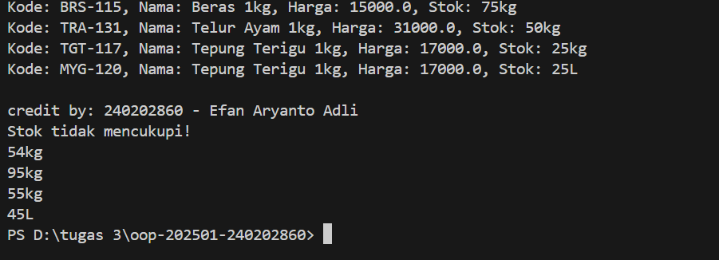

# Laporan Praktikum Minggu 2
Topik: Class dan Object

## Identitas
- Nama  : Efan Aryantro Adli
- NIM   : 240202860
- Kelas : 3IKRA

---

## Tujuan
1. Mahasiswa mampu menjelaskan konsep class, object, atribut, dan method dalam pemrograman berorientasi objek (OOP).
2. Mahasiswa mampu menerapkan access modifier dan prinsip enkapsulasi dalam pembuatan kelas.
3. Mahasiswa mampu membuat dan mengimplementasikan class Produk pertanian dengan atribut serta method yang relevan.
4. Mahasiswa mampu melakukan instansiasi object dan menampilkan data produk pertanian melalui console output.
5. Mahasiswa mampu menyusun laporan praktikum dengan bukti kode, hasil eksekusi, dan analisis sederhana.

---

## Dasar Teori 
1. Class adalah cetak biru (blueprint) atau template dari objek.
2. Object adalah instansiasi dari class yang berisi data (atribut) dan perilaku (method).  
3. Enkapsulasi berarti menyembunyikan data internal suatu objek dengan menjadikan atribut bersifat `private`, dan memberikan akses melalui getter dan setter.
4. Access modifier seperti `public`, `private`, dan `protected` digunakan untuk mengatur tingkat akses antar kelas.

---

## Langkah Praktikum
1. Buat class `Prodak`
   - Buat file `Produk.java` di dalam package `model`
   - Tambahkan atribut `kode`, `nama`, `harga`, dan `stok`
   - Terapkan enkapsulasi dengan menjadikan atribut `private` serta membuat getter dan setter
   - Tambahkan method `tambahStok(int jumlah` dan `kurangiStok(int jumlah)` untuk mengelola stok
2. Membuat Class `CreditBy`
   - Buat file `CreditBy.java` di dalam package `util`
   - Tambahkan method static untuk menampilkan identitas mahasiswa
3. Membuat `class MainProduk`
   - Buat file `MainProduk.java`
   - buat empat objek produk seperti “Beras”, “Telur Ayamg”, "Minyak Goreng", dan “Tepung Terigu”
   - Tampilkan data tiap produk menggunakan getter
4. Menjalankan dan Menguji Program
   - Jalankan program dan pastikan output sesuai

---

## Kode Program
### 1. Produk.Java  

```java
package main.java.com.upb.agripos.model;

public class Produk {
    private String kode;
    private String nama;
    private double harga;
    private int stok;

    public Produk(String kode, String nama, double harga, int stok) {
        this.kode = kode;
        this.nama = nama;
        this.harga = harga;
        this.stok = stok;
    }

    public String getKode() { return kode; }
    public void setKode(String kode) { this.kode = kode; }

    public String getNama() { return nama; }
    public void setNama(String nama) { this.nama = nama; }

    public double getHarga() { return harga; }
    public void setHarga(double harga) { this.harga = harga; }

    public int getStok() { return stok; }
    public void setStok(int stok) { this.stok = stok; }

    public void tambahStok(int jumlah) {
        this.stok += jumlah;
    }

    public void kurangiStok(int jumlah) {
        if (this.stok >= jumlah) {
            this.stok -= jumlah;
        } else {
            System.out.println("Stok tidak mencukupi!");
        }
    }
}
```
### 2. CreditBy.Java  

```java
package main.java.com.upb.agripos.util;

public class CreditBy {
    public static void print(String nim, String nama) {
        System.out.println("\ncredit by: " + nim + " - " + nama);
    }
}
```
### 3. MainProduk.Java  

```java
package main.java.com.upb.agripos;

import main.java.com.upb.agripos.model.*;
import main.java.com.upb.agripos.util.CreditBy;

public class MainProduk {
    public static void main(String[] args) {
        Produk p1 = new Produk("BRS-115", "Beras 1kg", 15000, 75);
        Produk p2 = new Produk("TRA-131", "Telur Ayam 1kg", 31000, 50);
        Produk p3 = new Produk("TGT-117", "Tepung Terigu 1kg", 17000, 25);
        Produk p4 = new Produk("TGT-117", "Minyak Goreng 1L", 20000, 35);

        System.out.println("Kode: " + p1.getKode() + ", Nama: " + p1.getNama() + ", Harga: " + p1.getHarga() + ", Stok: " + p1.getStok() + "kg");
        System.out.println("Kode: " + p2.getKode() + ", Nama: " + p2.getNama() + ", Harga: " + p2.getHarga() + ", Stok: " + p2.getStok() + "kg");
        System.out.println("Kode: " + p3.getKode() + ", Nama: " + p3.getNama() + ", Harga: " + p3.getHarga() + ", Stok: " + p3.getStok() + "kg");
        System.out.println("Kode: " + p4.getKode() + ", Nama: " + p3.getNama() + ", Harga: " + p3.getHarga() + ", Stok: " + p3.getStok() + "L");

        // Tampilkan identitas mahasiswa
        CreditBy.print("240202860","Efan Aryanto Adli");

        
        p1.tambahStok(30);
        p2.tambahStok(45);
        p3.tambahStok(50);
        p4.tambahStok(15);

        p1.kurangiStok(51);
        p2.kurangiStok(100);
        p3.kurangiStok(20);
        p4.kurangiStok(5);

        System.out.println(p1.getStok() + "kg");
        System.out.println(p2.getStok() + "kg");
        System.out.println(p3.getStok() + "kg");
        System.out.println(p4.getStok() + "L");

        
    }

}
```
---

## Hasil Eksekusi
  


---

## Analisis

- Jelaskan bagaimana kode berjalan.  
- Apa perbedaan pendekatan minggu ini dibanding minggu sebelumnya.  
- Kendala yang dihadapi dan cara mengatasinya.  

---

## Kesimpulan
Praktikum ini menunjukkan bahwa dengan menggunakan konsep class dan object, kita bisa membuat program yang lebih rapi dan mudah dikelola. Setiap produk pertanian bisa dibuat sebagai objek dengan data dan perilaku sendiri. Penggunaan getter dan setter membantu menjaga keamanan data, dan program ini berhasil menerapkan dasar-dasar OOP dengan baik.

---

## Quiz
1. Mengapa atribut sebaiknya dideklarasikan sebagai private dalam class?
 **Jawaban:**   Karena dengan menjadikan atribut private, data di dalam objek tidak bisa diubah secara langsung dari luar class. Hal ini menjaga keamanan dan konsistensi data agar hanya bisa diakses melalui method khusus seperti getter dan setter.

2. Apa fungsi getter dan setter dalam enkapsulasi?
 **Jawaban:**   Getter digunakan untuk mengambil nilai dari atribut, sedangkan setter digunakan untuk mengubah nilainya. Keduanya berfungsi sebagai pengontrol akses agar data dalam objek tetap aman dan hanya dapat diubah dengan cara yang benar.

3. Bagaimana cara class Produk mendukung pengembangan aplikasi POS yang lebih kompleks?
 **Jawaban:**   Class Produk menjadi dasar untuk mengelola data produk di sistem POS. Dengan struktur yang rapi dan atribut lengkap, class ini bisa dikembangkan lebih lanjut untuk menambahkan fitur seperti pengelolaan stok otomatis, perhitungan total harga, atau integrasi dengan database dan transaksi penjualan.
