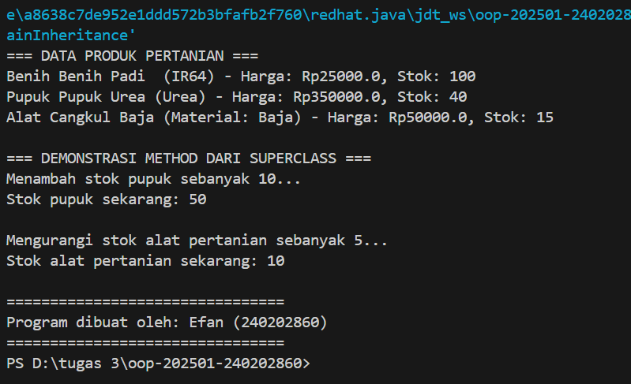

# Laporan Praktikum Minggu 1 (sesuaikan minggu ke berapa?)
Topik: Inheritance (Kategori Produk)

## Identitas
- Nama  : Efan Aryanto Adli
- NIM   : 240202860
- Kelas : 3IKRA

---

## Tujuan
1. Mahasiswa dapat menjelaskan konsep inheritance (pewarisan class) dalam OOP
2. Mahasiswa dapat membuat superclass dan subclass untuk produk pertanian.
3. Mahasiswa dapat menunjukkan hierarki class melalui contoh kode.

---

## Dasar Teori
1. Superclass adalah Class induk yang mendefinisikan atribut dan method umum.  
2. Subclass adalah Class turunan yang mewarisi Superclass dan dapat menambahkan atribut/method baru.  
3. Keyword adalah digunakan di dalam subclass untuk memanggil konstruktor atau method yang ada di superclass.

---

## Langkah Praktikum
1. Membuat Superclass `Produk`: Menggunakan kembali class `Produk` Bab 2 sebagai superclass yang memiliki atribut dasar produk.
2. Membuat Subclass:
   - Membuat `Benih.java` dengan atribut tambahan ``varietas`.
   - Membuat `Pupuk.java` dengan atribut tambahan `jenis`.
   - Membuat `AlatPertanian.java` dengan atribut tambahan `material`.
   - Setiap subclass wajib menggunakan `super()` di dalam konstruktor untuk menginisialisasi atribut yang diwarisi dari `Produk`.
3. Membuat Main Class (`MainInheritance.java`):
   - Melakukan instansiasi minimal satu objek dari tiap subclass (`Benih, Pupuk, AlatPertanian`).
   - Memanggil method yang diwarisi (`getNama()`) dan method khusus subclass (`getVarietas(), getJenis()`.) untuk menampilkan data.
4. Menambahkan `CreditBy`: Memanggil `CreditBy.print("<NIM>", "<Nama Mahasiswa>")` di akhir program.
5. Lakukan run
6. Commit dan Push: Melakukan commit 

---

## Kode Program
### 1. Produk.Java
```java
package com.upb.agripos.model;

public class Produk {
    private String kode;
    private String nama;
    private double harga;
    private int stok;

    public Produk(String kode, String nama, double harga, int stok) {
        this.kode = kode;
        this.nama = nama;
        this.harga = harga;
        this.stok = stok;
    }

    public String getKode() { return kode; }
    public void setKode(String kode) { this.kode = kode; }

    public String getNama() { return nama; }
    public void setNama(String nama) { this.nama = nama; }

    public double getHarga() { return harga; }
    public void setHarga(double harga) { this.harga = harga; }

    public int getStok() { return stok; }
    public void setStok(int stok) { this.stok = stok; }

    public void tambahStok(int jumlah) {
        this.stok += jumlah;
    }

    public void kurangiStok(int jumlah) {
        if (this.stok >= jumlah) {
            this.stok -= jumlah;
        } else {
            System.out.println("Stok tidak mencukupi!");
        }
    }
}

```
### 2. AlatPertanian.java
```java
package com.upb.agripos.model;

public class AlatPertanian extends Produk {
    private String material;

    public AlatPertanian(String kode, String nama, double harga, int stok, String material) {
        super(kode, nama, harga, stok);
        this.material = material;
    }

    public String getMaterial() { return material; }
    public void setMaterial(String material) { this.material = material; }

    public void deskripsi() {
        System.out.println("Alat " + getNama() + " (Material: " + material + ") - Harga: Rp" + getHarga() + ", Stok: " + getStok());
    }
}

```
### 3. Benih.java
```java
// Contoh
package com.upb.agripos.model;

public class Benih extends Produk {
    private String varietas;

    public Benih(String kode, String nama, double harga, int stok, String varietas) {
        super(kode, nama, harga, stok);
        this.varietas = varietas;
    }

    public String getVarietas() { return varietas; }
    public void setVarietas(String varietas) { this.varietas = varietas; }

    public void deskripsi() {
        System.out.println("Benih " + getNama() + " (" + varietas + ") - Harga: Rp" + getHarga() + ", Stok: " + getStok());
    }
}
```
### 4. Pupuk.java
```java
package com.upb.agripos.model;

public class Pupuk extends Produk {
    private String jenis;

    public Pupuk(String kode, String nama, double harga, int stok, String jenis) {
        super(kode, nama, harga, stok);
        this.jenis = jenis;
    }

    public String getJenis() { return jenis; }
    public void setJenis(String jenis) { this.jenis = jenis; }

    public void deskripsi() {
        System.out.println("Pupuk " + getNama() + " (" + jenis + ") - Harga: Rp" + getHarga() + ", Stok: " + getStok());
    }
}
```
### 5. CreditBy.java
```java
package com.upb.agripos.util;

public class CreditBy {
    public static void print(String nim, String nama) {
        System.out.println("\n================================");
        System.out.println("Program dibuat oleh: " + nama + " (" + nim + ")");
        System.out.println("================================");
    }
}
```
### 6. MainInheritance.java
```java
package com.upb.agripos;

import com.upb.agripos.model.*;
import com.upb.agripos.util.CreditBy;

public class MainInheritance {
    public static void main(String[] args) {
        // Membuat objek dari masing-masing subclass
        Benih benih = new Benih("BP-125", "Benih Padi ", 25000, 100, "IR64");
        Pupuk pupuk = new Pupuk("PU-135", "Pupuk Urea", 350000, 40, "Urea");
        AlatPertanian alat = new AlatPertanian("CB-150", "Cangkul Baja", 50000, 15, "Baja");

        System.out.println("=== DATA PRODUK PERTANIAN ===");
        benih.deskripsi();
        pupuk.deskripsi();
        alat.deskripsi();

        // Demonstrasi method inheritance
        System.out.println("\n=== DEMONSTRASI METHOD DARI SUPERCLASS ===");
        System.out.println("Menambah stok pupuk sebanyak 10...");
        pupuk.tambahStok(10);
        System.out.println("Stok pupuk sekarang: " + pupuk.getStok());

        System.out.println("\nMengurangi stok alat pertanian sebanyak 5...");
        alat.kurangiStok(5);
        System.out.println("Stok alat pertanian sekarang: " + alat.getStok());

        // Menampilkan identitas mahasiswa
        CreditBy.print("240202860", "Efan");
    }
}
```
---

## Hasil Eksekusi 


---

## Analisis
- Kode praktikum ini berjalan dengan prinsip Inheritance (Pewarisan) untuk memodelkan berbagai jenis produk di Agri-POS secara efisien.  
- Perbedaan antara minggu 2 dan minggu 3 terletak pada bagaimana class dan objek dimodelkan dan diorganisir, khususnya dalam hal hubungan antar class dan efisiensi kode.    
- Error pada packagenya solusinya bertanya dengan AI dan teman 
---

## Kesimpulan
Praktikum Inheritance berhasil diimplementasikan pada sistem Agri-POS. Konsep inheritance terbukti efektif dalam membangun hierarki class (Produk sebagai superclass dari Benih, Pupuk, dan AlatPertanian), yang menghasilkan kode yang lebih terstruktur, mudah dikelola, dan menghindari redundansi data. Penggunaan keyword super memastikan inisialisasi objek berjalan sesuai urutan pewarisan.

---

## Quiz
1. Apa keuntungan menggunakan inheritance dibanding membuat class terpisah tanpa hubungan?
   **Jawaban:** Dengan inheritance, kita dapat mengurangi penulisan kode yang berulang karena subclass dapat mewarisi atribut dan method dari superclass. Hal ini memungkinkan penggunaan ulang kode yang sudah ada, sehingga subclass cukup menambahkan atau menyesuaikan bagian yang dibutuhkan saja. Pendekatan ini membuat program menjadi lebih efisien, rapi, serta mudah dikembangkan dan dirawat di kemudian hari.

2. Bagaimana cara subclass memanggil konstruktor superclass? 
   **Jawaban:** Subclass dapat memanggil konstruktor dari superclass dengan menggunakan kata kunci super() di dalam konstruktornya. Pemanggilan ini wajib ditempatkan pada baris pertama dalam tubuh konstruktor subclass.  

3. Berikan contoh kasus di POS pertanian selain Benih, Pupuk, dan Alat Pertanian yang bisa dijadikan subclass. 
   **Jawaban:** Contohnya “ObatHama” yang merupakan subclass dari `Produk`. ObatHama memiliki atribut tambahan seperti `jenisHama` atau `dosisPemak`aian, dan bisa mengoverride method `getInfo()` untuk menampilkan informasi spesifik.  
