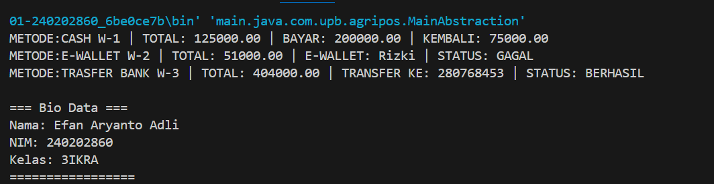

# Laporan Praktikum Minggu 5
Topik: Abstract Class & Interface

## Identitas
- Nama  : Efan Aryanto Adli
- NIM   : 240202860
- Kelas : 3IKRA

---

## Tujuan
1. Mahasiswa mampu menjelaskan perbedaan antara abstract class dan interface.
2. Mahasiswa mampu membuat interface dan mengimplementasikannya ke dalam sebuah class.
3. Mahasiswa mampu menerapkan konsep multiple inheritance menggunakan interface pada rancangan kelas.

---

## Dasar Teori 
1. Abstraksi Teknik pemrograman berorientasi objek untuk menyederhanakan sistem kompleks dengan menyembunyikan detail implementasi dan hanya menampilkan fungsionalitas utama.
2. Abstract Class Kelas yang tidak dapat diinstansiasi dan berfungsi sebagai kerangka dasar. Kelas ini dapat menyimpan state (field) serta memiliki kombinasi method abstrak (tanpa implementasi) dan method konkrit. Digunakan ketika antar-class memiliki kemiripan atribut (shared state) dan logika dasar.  
3. Interface Kumpulan kontrak (method tanpa implementasi) yang mendefinisikan kemampuan (behavior) spesifik tanpa terikat hierarki. Interface mendukung multiple inheritance, yang memungkinkan satu kelas memiliki banyak peran atau kemampuan sekaligus.

---

## Langkah Praktikum
1. Pembuatan Abstract Class `Pembayaran` Membuat kelas abstrak `Pembayaran` yang berfungsi sebagai parent class. Kelas ini memiliki atribut `invoiceNo` dan `total`, serta mendefinisikan method abstrak `biaya()` dan `prosesPembayaran()` yang wajib diimplementasikan oleh subclass, serta method konkrit `totalBayar()`. 
2. Pembuatan Subclass Konkret
Membuat dua kelas turunan dari `Pembayaran`:
- `Cash`: Mengimplementasikan logika pembayaran tunai dengan biaya layanan 0% dan validasi saldo sederhana.
- `EWallet`: Mengimplementasikan pembayaran digital dengan biaya layanan 1.5% dan membutuhkan parameter akun serta OTP. 
3. Pembuatan Interface Membuat dua interface terpisah untuk mendefinisikan kontrak kemampuan:
- `Validatable`: Berisi method `validasi()` untuk verifikasi keamanan (misal: OTP).
- `Receiptable`: Berisi method `cetakStruk()` untuk menampilkan bukti transaksi.
4. Implementasi Multiple Inheritance Menerapkan interface pada kelas konkret untuk simulasi multiple inheritance:
- Kelas `EWallet` mengimplementasikan dua interface sekaligus: `Validatable` dan `Receiptable`.
- Kelas `Cash` mengimplementasikan satu interface: `Receiptable`.
5. Uji Coba pada Main Class Membuat kelas `MainAbstraction` untuk mendemonstrasikan polimorfisme. Objek `Cash` dan `EWallet` diinstansiasi, kemudian diproses untuk mencetak struk pembayaran menggunakan method dari interface `Receiptable`. Identitas praktikan ditampilkan menggunakan class utilitas `CreditBy`.

---

## Kode Program 
### 1. Receiptable.java
```java
package main.java.com.upb.agripos.model.kontrak;

public interface Receiptable {
    String cetakStruk();
}
```
### 2. Validatable.java
```java
package main.java.com.upb.agripos.model.kontrak;

public interface Validatable {
    boolean validasi(); 
}
```
### 3. Pembayaran.java
```java
package main.java.com.upb.agripos.model.pembayaran;

public abstract class Pembayaran {
    protected String invoiceNo;
    protected double total;

    public Pembayaran(String invoiceNo, double total) {
        this.invoiceNo = invoiceNo;
        this.total = total;
    }

    public abstract double biaya();
    public abstract boolean prosesPembayaran();

    public double totalBayar() {
        return total + biaya();
    }

    public String getInvoiceNo() { return invoiceNo; }
    public double getTotal() { return total; }
}
```
### 4. Cash.java
```java
package main.java.com.upb.agripos.model.pembayaran;

import main.java.com.upb.agripos.model.kontrak.Receiptable;

public class Cash extends Pembayaran implements Receiptable {

    private final double tunai;

    public Cash(String invoiceNo, double total, double tunai) {
        super(invoiceNo, total);
        this.tunai = tunai;
    }

    @Override
    public double biaya() {
        return 0.0;
    }

    @Override
    public boolean prosesPembayaran() {
        return tunai >= totalBayar();
    }

    @Override
    public String cetakStruk() {
        return String.format(
            "METODE:CASH %s | TOTAL: %.2f | BAYAR: %.2f | KEMBALI: %.2f",
            invoiceNo,
            totalBayar(),
            tunai,
            Math.max(0, tunai - totalBayar())
        );
    }
}
```
### 5. EWallet.java
```java
package main.java.com.upb.agripos.model.pembayaran;

import main.java.com.upb.agripos.model.kontrak.Validatable;
import main.java.com.upb.agripos.model.kontrak.Receiptable;

public class EWallet extends Pembayaran implements Validatable, Receiptable {

    private String akun;
    private String otp;

    public EWallet(String invoiceNo, double total, String akun, String otp) {
        super(invoiceNo, total);
        this.akun = akun;
        this.otp = otp;
    }

    @Override
    public double biaya() {
        return total * 0.020;  
    }

    @Override
    public boolean validasi() {
        return otp != null && otp.length() == 6;
    }

    @Override
    public boolean prosesPembayaran() {
        return validasi();
    }

    @Override
    public String cetakStruk() {
        return String.format(
            "METODE:E-WALLET %s | TOTAL: %.2f | E-WALLET: %s | STATUS: %s",
            invoiceNo,
            totalBayar(),
            akun,
            prosesPembayaran() ? "BERHASIL" : "GAGAL"
        );
    }
}
```
### 6. TransferBank.java
```java
package main.java.com.upb.agripos.model.pembayaran;

import main.java.com.upb.agripos.model.kontrak.Validatable;
import main.java.com.upb.agripos.model.kontrak.Receiptable;

public class TransferBank extends Pembayaran implements Validatable, Receiptable {

    private String norek;
    private String kodeVerifikasi;

    public TransferBank(String invoiceNo, double total, String norek, String kodeVerifikasi) {
        super(invoiceNo, total);
        this.norek = norek;
        this.kodeVerifikasi = kodeVerifikasi;
    }

    @Override
    public double biaya() {
        return 4000; 
    }

    @Override
    public boolean validasi() {
        return kodeVerifikasi != null && kodeVerifikasi.length() == 6;
    }

    @Override
    public boolean prosesPembayaran() {
        return validasi();
    }

    @Override
    public String cetakStruk() {
        return String.format(
            "METODE:TRASFER BANK %s | TOTAL: %.2f | TRANSFER KE: %s | STATUS: %s",
            invoiceNo,
            totalBayar(),
            norek,
            prosesPembayaran() ? "BERHASIL" : "GAGAL"
        );
    }
}
```
### 7. CreditBy.java
```java
package main.java.com.upb.agripos.util;

public class CreditBy {
   
     public static void print(String nama, String nim, String kelas) {
        System.out.println("\n=== Bio Data ===");
        System.out.println("Nama: " + nama);
        System.out.println("NIM: " + nim);
        System.out.println("Kelas: " + kelas);
        System.out.println("=================\n");
    }
}
```
### 8. MainAbstraction.java
```java
package main.java.com.upb.agripos;

import main.java.com.upb.agripos.model.pembayaran.*;
import main.java.com.upb.agripos.model.kontrak.*;
import main.java.com.upb.agripos.util.CreditBy;

public class MainAbstraction {

    public static void main(String[] args) {

        Pembayaran cash = new Cash("W-1", 125000, 200000);
        Pembayaran ewallet = new EWallet("W-2", 50000, "Rizki", "10108");
        Pembayaran transfer = new TransferBank("W-3", 400000, "280768453", "498071");

        System.out.println(((Receiptable) cash).cetakStruk());
        System.out.println(((Receiptable) ewallet).cetakStruk());
        System.out.println(((Receiptable) transfer).cetakStruk());

        CreditBy.print("Efan Aryanto Adli", "240202860", "3IKRA");
    }
}
```
---

## Hasil Eksekusi  

---

## Analisis
- Program dimulai di `MainAbstraction` dengan menginstansiasi objek `Cash` dan `EWallet` menggunakan referensi kelas induk `Pembayaran` (Polimorfisme). Saat metode `totalBayar()` dipanggil, program otomatis menjalankan logika biaya yang sesuai dengan tipe objeknya (Dynamic Binding). Terakhir, metode `cetakStruk()` dipanggil untuk memvalidasi transaksi dan menampilkan output.  
- Minggu ini menggunakan Abstract Class yang mencegah instansiasi objek abstrak dan memaksa subclass mengimplementasikan method tertentu. Selain itu, penggunaan Interface memungkinkan penerapan multiple inheritance (satu kelas memiliki banyak peran)   
---

## Kesimpulan
Dapat disimpulkan bahwa Abstract Class berfungsi sebagai kerangka dasar untuk menstandarisasi logika umum yang tidak dapat diinstansiasi, sedangkan Interface berperan sebagai kontrak perilaku yang memungkinkan penerapan multiple inheritance dengan aman. Penggunaan kombinasi keduanya menghasilkan kode yang modular dan scalable, sehingga penambahan fitur baru dapat dilakukan dengan mudah tanpa mengganggu struktur program yang sudah ada.

---

## Quiz
1. Jelaskan perbedaan konsep dan penggunaan abstract class dan interface.  
   **Jawaban:** Abstract Class adalah kelas yang tidak dapat diinstansiasi dan digunakan ketika ada shared state (field/atribut yang sama) serta perilaku dasar yang ingin diwariskan ke subclass. Abstract class dapat memiliki method abstrak (tanpa implementasi) maupun method konkrit (dengan implementasi). Sebaliknya, Interface adalah kumpulan kontrak yang mendefinisikan kemampuan (capabilities) tanpa detail implementasi konkret (sebelum Java 8). Interface digunakan untuk mendefinisikan standar perilaku lintas hierarki kelas dan mendukung multiple inheritance.

2. Mengapa multiple inheritance lebih aman dilakukan dengan interface pada Java?  
   **Jawaban:** Multiple inheritance lebih aman dengan interface karena interface hanya berisi definisi kontrak (apa yang harus dilakukan) tanpa implementasi logika atau penyimpanan state/data yang kompleks. Hal ini menghindari konflik ambiguitas (seperti Diamond Problem) yang terjadi jika sebuah kelas mewarisi dua method dengan nama sama tetapi implementasi berbeda dari dua parent class. Dengan interface, kelas pengimplementasi-lah yang bertanggung jawab menentukan logika method tersebut.

3. Pada contoh Agri-POS, bagian mana yang paling tepat menjadi abstract class dan mana yang menjadi interface? Jelaskan alasannya  
   **Jawaban:** 
   - Abstract Class: Pembayaran. Alasannya karena Cash dan EWallet memiliki atribut yang sama (shared state) yaitu invoiceNo dan total, serta memiliki hubungan "is-a" (Cash adalah Pembayaran).
   - Interface: Validatable dan Receiptable. Alasannya karena ini adalah kemampuan tambahan (behavior) yang tidak dimiliki semua jenis pembayaran (misalnya Cash tidak butuh validasi OTP), atau kemampuan yang mungkin dimiliki oleh objek lain di luar pembayaran. Interface memungkinkan EWallet memiliki peran ganda (bisa divalidasi dan bisa dicetak) melalui mekanisme multiple inheritance.
