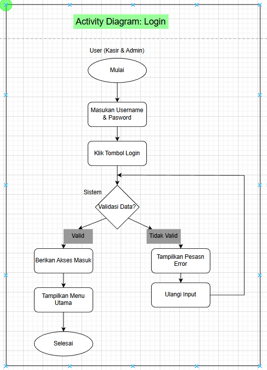
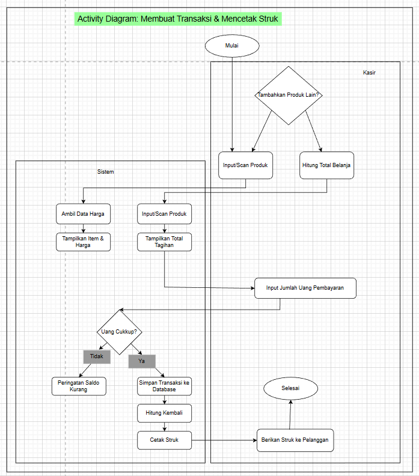
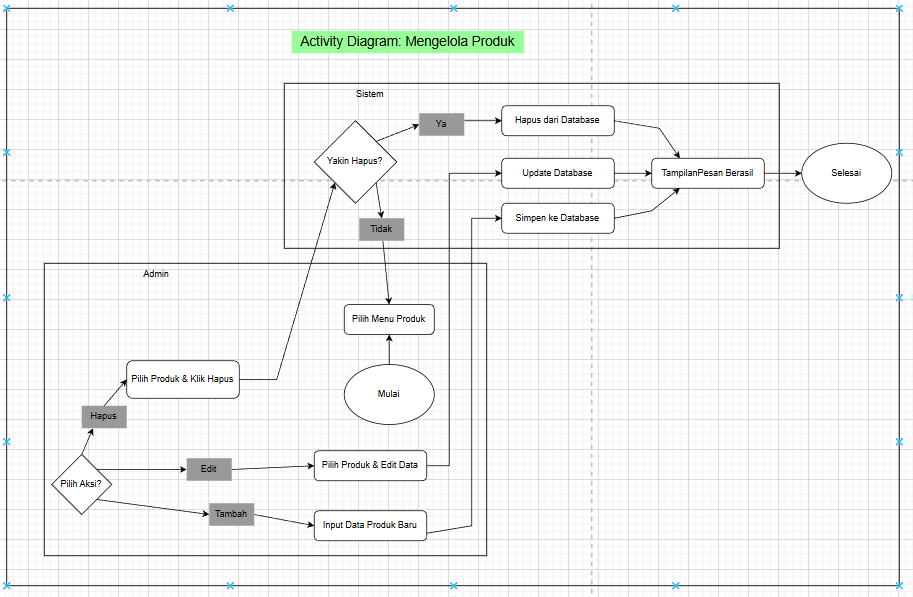
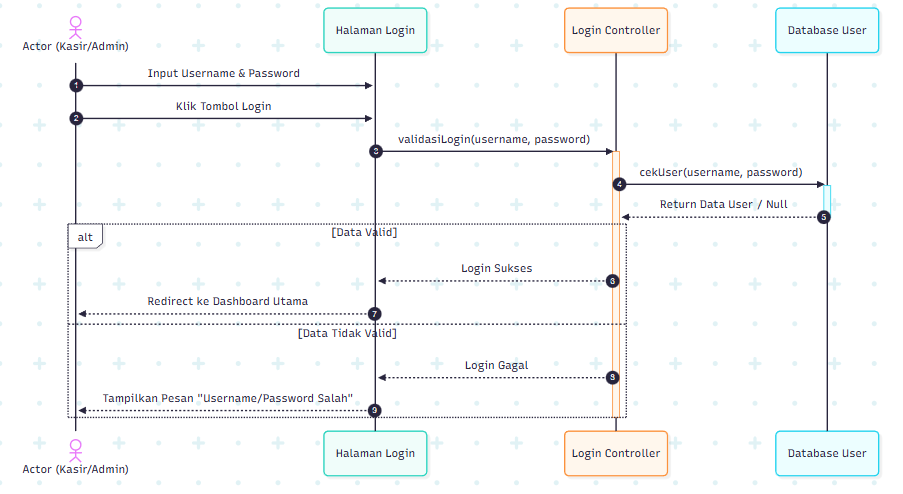
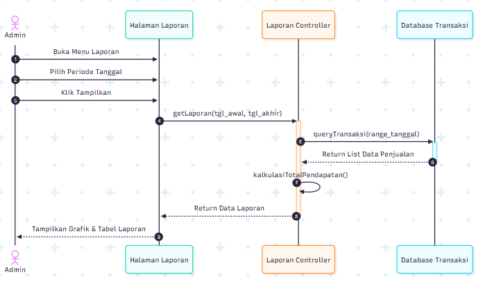
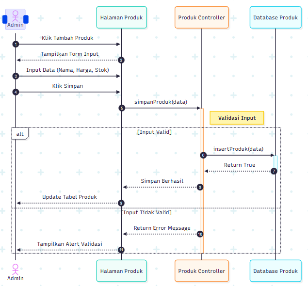
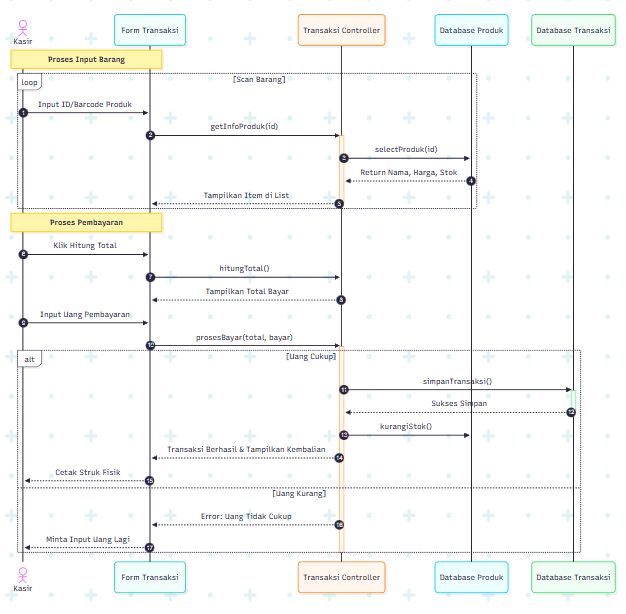
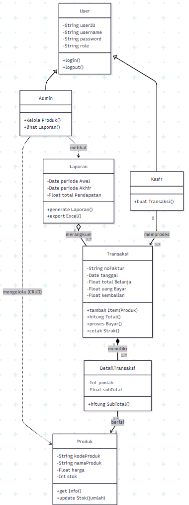

# Laporan Praktikum Minggu 6 
Topik: Desain Arsitektur Sistem dengan UML dan Prinsip SOLID

## Identitas
- Nama  : Efan Aryanto Adli
- NIM   : 240202860
- Kelas : 3IKRA

---

## Deskripsi Singkat Sistem
Sistem yang dirancang adalah aplikasi Point of Sales (POS) atau sistem kasir yang ditujukan untuk memfasilitasi operasional bisnis ritel. Sistem ini memiliki dua aktor utama, yaitu Admin dan Kasir.
Fungsi utama sistem mencakup:
- Otentikasi: Keamanan akses melalui login.
- Manajemen Inventaris: Admin dapat mengelola data produk (CRUD).
- Transaksi Penjualan: Kasir dapat memproses pembelian pelanggan, menghitung total, dan mencetak struk.
- Pelaporan: Admin dapat melihat dan mengekspor laporan pendapatan berdasarkan periode waktu.

---

## Penjelasan Diagram 
1. Use Case Diagram

   1. Alur Kerja Kasir
      - Mulai: Kasir membuka aplikasi.
      - Login: Kasir memasukkan username dan password. Jika valid, menu kasir terbuka.
      - Melayani Pelanggan:
         1. Pelanggan datang membawa barang.
         2. Kasir memilih menu Membuat Transaksi Penjualan.
         3. Kasir memindai (scan) atau input produk.
         4. Sistem menghitung total harga.
      - Selesai Transaksi: Setelah pembayaran diterima, Kasir memilih opsi Mencetak Struk.
      - Output: Pelanggan menerima struk belanja.
   2. Alur Kerja Admin
      - Mulai: Admin membuka aplikasi.
      - Login: Admin login dengan akun administrator.
      - Manajemen Stok :
         1. Jika ada barang baru datang, Admin memilih menu Mengelola Produk.
         2. Admin memasukkan nama barang, stok, dan harga.
      - Analisis :
         1. Di akhir hari, Admin ingin tahu omzet toko.
         2. Admin memilih menu Melihat Laporan Penjualan.
         3. Sistem menampilkan data pendapatan.
      - Bantuan Operasional:
         1. Jika toko sangat ramai dan antrian panjang, Admin juga bisa langsung masuk ke menu Membuat Transaksi Penjualan untuk membantu Kasir melayani pelanggan.
---

2. Activity Diagram 
   - Login
   
      1. Tahap Inisiasi (Awal):
         1. Mulai: Proses dimulai (biasanya saat pengguna membuka aplikasi).
         2. Masukan Username & Password: Pengguna (baik Kasir maupun Admin) mengisi kolom identitas (username) dan kata sandi (password).
         3. Klik Tombol Login: Setelah data terisi, pengguna menekan tombol untuk mengirim data tersebut ke sistem.
      2. Tahap Validasi (Proses Sistem):
         1. Validasi Data? (Decision Node): Ini adalah titik penentuan (digambarkan dengan belah ketupat). Sistem akan mengecek ke database: Apakah username terdaftar? Apakah password cocok?
         
   - Membuat Transaksi & Mencetak Struk
   
   1. Struktur Pengguna dan Data (Class Diagram)
      - User: Merupakan basis data untuk userID, username, password, dan role.
      - Admin: Mewarisi atribut User dengan fungsi tambahan mengelola produk dan melihat laporan.
      - Kasir: Mewarisi atribut User dengan fungsi utama membuat transaksi belanja.
      - Koneksi Data: Setiap Transaksi memiliki DetailTransaksi yang berisi informasi Produk (nama, harga, stok). Hasil akhir dari transaksi akan dirangkum ke dalam sebuah Laporan oleh Admin.
   2. Alur Keamanan (Sequence Diagram Login)
      - Aktor (Kasir/Admin) memasukkan kredensial di Halaman Login.
      - Login Controller memvalidasi data tersebut ke Database User.
      - Kondisi (Alt):
         1. Data Valid: Sistem memberikan akses dan mengarahkan pengguna ke Dashboard Utama.
         2. Data Tidak Valid: Sistem menampilkan pesan kesalahan "Username/Password Salah".
   3. Alur Manajemen (Admin)
      - Melihat Laporan: Admin memilih periode tanggal, kemudian sistem mengambil data dari Database Transaksi. Sebelum ditampilkan, sistem melakukan fungsi internal kalkulasiTotalPendapatan() untuk menghasilkan grafik dan tabel laporan.
      - Mengelola Produk: Admin memasukkan data produk baru. Sistem melakukan Validasi Input di tingkat Controller. Jika valid, data disimpan ke Database Produk; jika tidak, sistem memberikan peringatan alert kepada Admin.
   4. Alur Transaksi Penjualan (Sequence & Activity Diagram)
   - Proses Input Barang:
      1. Kasir melakukan scanning atau input ID produk secara berulang dalam sebuah loop.
      2. Sistem secara otomatis mengambil data harga dari database dan memperbarui daftar belanja serta total tagihan di layar.
   - Proses Pembayaran:
      1. Kasir memasukkan jumlah uang pembayaran dari pelanggan.
      2. Pengecekan Saldo (Kondisi):
         - Uang Cukup: Sistem menyimpan transaksi ke database, mengurangi stok barang secara otomatis, menghitung kembalian, dan mencetak struk fisik untuk diberikan ke pelanggan.
         - Uang Kurang: Sistem memberikan peringatan "Saldo Kurang" dan meminta input uang kembali.
   - Mengelola Produk
   
   1. Struktur Organisasi Data (Class Diagram)
      - Hierarki Pengguna: Terdapat kelas dasar User yang memiliki hak akses login dan logout. Pengguna ini kemudian terspesialisasi menjadi Admin (pengelola data) dan Kasir (pelaksana transaksi).
      - Hubungan Transaksi: Kelas Kasir memproses Transaksi. Setiap transaksi memiliki satu atau lebih DetailTransaksi yang berisi informasi jumlah dan sub-total.
      - Kaitan Produk: DetailTransaksi merujuk pada kelas Produk untuk mengambil data harga dan mengurangi stok.
      - Pelaporan: Semua data transaksi dirangkum ke dalam kelas Laporan yang dikelola oleh Admin.
   2. Alur Keamanan (Sequence Diagram Login)
      - Actor memasukkan username/password dan klik login.
      - Login Controller meminta validasi ke Database User.
      - Kondisi (alt):
         1. Data Valid: Pengguna dialihkan ke Dashboard Utama.
         2. Data Tidak Valid: Sistem menampilkan pesan kesalahan dan tetap di halaman login.
   3. Alur Manajemen Inventaris (Admin)
      - Tambah/Edit Produk: Admin memasukkan data produk baru atau mengubah yang sudah ada melalui Produk Controller. Sistem melakukan Validasi Input untuk memastikan data harga dan stok benar sebelum disimpan ke database.
      - Hapus Produk: Pada Activity Diagram, terdapat proses pengambilan keputusan "Yakin Hapus?". Jika ya, sistem akan menghapus data dari database dan menampilkan pesan berhasil.
   4. Alur Transaksi & Penjualan (Kasir)
      - Proses Input Barang:
         1. Kasir melakukan scanning atau memasukkan ID produk.
         2. Sistem secara otomatis mengambil data harga dari database dan menampilkannya dalam daftar belanja di layar.
         3. Proses ini berlangsung dalam looping selama masih ada produk yang ingin ditambahkan.
      - Proses Pembayaran:
         1. Kasir menghitung total tagihan.
         2. Pelanggan memberikan uang pembayaran yang kemudian diinput oleh Kasir.
         3. Logika Keputusan (Uang Cukup?):
            - Jika Ya: Transaksi disimpan ke database, sistem secara otomatis mengurangi stok produk, menghitung uang kembali, dan mencetak struk fisik untuk pelanggan.
            - Jika Tidak: Sistem memberikan peringatan "Saldo Kurang" dan meminta input ulang uang pembayaran.
   5. Alur Pemantauan Bisnis (Admin)
      - Admin memilih rentang tanggal tertentu.
      - Laporan Controller mengambil data dari Database Transaksi.
      - Sistem melakukan fungsi internal kalkulasiTotalPendapatan() untuk menjumlahkan semua penjualan dalam periode tersebut.
      - Data disajikan dalam bentuk grafik dan tabel laporan yang bisa diekspor (seperti ke Excel sesuai Class Diagram).

---

3. Sequence Diagram
   - Login
   
   1. Struktur Organisasi Sistem (Class Diagram)
      - Aktor: Terdapat kelas dasar User yang memiliki fungsi login() dan logout(). User ini terbagi menjadi dua peran: Admin (mengelola produk & laporan) dan Kasir (memproses transaksi).
      - Data Utama: Transaksi memiliki keterkaitan erat dengan DetailTransaksi yang mencatat rincian jumlah barang, yang kemudian merujuk pada data Produk (nama, harga, stok).
      - Output: Semua transaksi yang diproses akan dirangkum menjadi Laporan pendapatan yang dapat diekspor ke format Excel.
   2. Alur Keamanan (Sequence Diagram Login)
      - Input: Aktor memasukkan username dan password di halaman login.
      - Validasi: Login Controller meminta pengecekan ke Database User.
      - Kondisi (alt):
         1. Data Valid: Muncul status "Login Sukses" dan sistem mengalihkan aktor ke Dashboard Utama.
         2. Data Tidak Valid: Sistem memberikan pesan kesalahan "Username/Password Salah".
   3. Manajemen Operasional (Admin)
      - Mengelola Produk (Sequence & Activity): Admin bisa memilih aksi Tambah, Edit, atau Hapus. Pada proses hapus, sistem memberikan konfirmasi "Yakin Hapus?" sebelum benar-benar menghapus data dari database. Setiap perubahan akan memberikan pesan notifikasi berhasil.
      - Melihat Laporan (Sequence): Admin memilih periode tanggal, sistem mengambil data dari database transaksi, melakukan kalkulasi total pendapatan secara internal, lalu menyajikannya dalam bentuk grafik dan tabel.
   4. Proses Transaksi Penjualan (Kasir)
      - Fase Input Barang:
         1. Kasir melakukan pemindaian atau input ID produk secara berulang dalam sebuah loop.
         2. Sistem secara otomatis mengambil data harga dari database dan memperbarui total tagihan di layar.
      - Fase Pembayaran:
         1. Kasir menginput jumlah uang yang diberikan pelanggan.
         2. Kondisi Pengecekan:
            - Uang Cukup: Sistem menyimpan transaksi ke database, secara otomatis mengurangi stok barang, menghitung uang kembali, dan mencetak struk fisik.
            - Uang Kurang: Sistem menampilkan peringatan "Saldo Kurang" dan meminta input uang kembali.

   - Melihat Laporan Penjualan
   
   1. Struktur Pengguna dan Data (Class Diagram)
      - Aktor: Terdapat kelas dasar User yang diwarisi oleh Admin dan Kasir.
      - Tanggung Jawab: Admin memiliki akses untuk mengelola produk dan melihat laporan, sementara Kasir berfokus pada pembuatan transaksi.
      - Relasi Data: Sebuah Transaksi terdiri dari satu atau lebih DetailTransaksi yang merujuk pada data Produk (untuk harga dan stok). Kumpulan transaksi ini nantinya dirangkum dalam sebuah Laporan.
   2. Alur Keamanan (Sequence Diagram Login)
      - Actor memasukkan username dan password di Halaman Login.
      - Login Controller memvalidasi kredensial tersebut ke Database User.
      - Percabangan (Alt):
         1. Data Valid: Pengguna mendapatkan akses "Login Sukses" dan diarahkan ke Dashboard Utama.
         2. Data Tidak Valid: Sistem menampilkan pesan kesalahan "Username/Password Salah".
   3. Operasional Manajemen Produk (Admin)
      - Aksi (Activity): Admin dapat memilih aksi Tambah, Edit, atau Hapus pada menu produk.
      - Validasi (Sequence): Saat menambah produk, sistem melakukan Validasi Input. Jika valid, data disimpan ke Database Produk; jika tidak, muncul peringatan alert.
      - Konfirmasi Hapus: Khusus untuk penghapusan, sistem meminta konfirmasi "Yakin Hapus?" sebelum data benar-benar dihapus dari database.
   4. Alur Transaksi Penjualan (Kasir)
      - Input Barang (Loop): Kasir melakukan scan atau input ID produk secara berulang. Sistem secara otomatis mengambil data harga dari database dan memperbarui daftar belanja serta total tagihan di layar.
      - Pembayaran (Alt):
         1. Kasir memasukkan jumlah uang pembayaran dari pelanggan.
         2. Uang Cukup: Sistem menyimpan transaksi ke database, mengurangi stok produk, menghitung kembalian, dan mencetak struk fisik.
         3. Uang Kurang: Sistem memberikan peringatan "Saldo Kurang" dan meminta input ulang uang.
   5. Pemantauan Bisnis (Sequence Diagram Laporan)
      - Admin menentukan periode tanggal di Halaman Laporan.
      - Laporan Controller mengambil list data penjualan dari Database Transaksi.
      - Sistem menjalankan fungsi internal kalkulasiTotalPendapatan() untuk menjumlahkan semua transaksi.
      - Data disajikan kembali kepada Admin dalam bentuk grafik dan tabel laporan.

   - Mengelola Produk
   
   1. Struktur Sistem (Class Diagram)
      - Hierarki Pengguna: Terdapat kelas dasar User yang memiliki fungsi login() dan logout(). Kelas ini diwarisi oleh dua peran: Admin (pengelola produk & laporan) dan Kasir (pelaksana transaksi).
      - Hubungan Transaksi: Sebuah Transaksi terdiri dari rincian yang dicatat dalam DetailTransaksi, yang kemudian terhubung ke data Produk untuk mengambil informasi harga dan mengelola stok.
      - Pelaporan: Semua transaksi dirangkum ke dalam sebuah Laporan pendapatan yang dapat diekspor ke format Excel oleh Admin.
   2. Alur Keamanan (Sequence Diagram Login)
      - Actor memasukkan username dan password di Halaman Login lalu menekan tombol login.
      - Login Controller memvalidasi data tersebut ke Database User.
      - Kondisi (Alt):
         1. Data Valid: Muncul status "Login Sukses" dan sistem mengalihkan pengguna ke Dashboard Utama.
         2. Data Tidak Valid: Sistem memberikan pesan kesalahan "Username/Password Salah".
   3. Alur Operasional Produk & Laporan (Admin)
      - Mengelola Produk: Admin dapat memilih aksi Tambah, Edit, atau Hapus. Sistem akan melakukan Validasi Input melalui Produk Controller sebelum menyimpan perubahan ke Database Produk. Jika penghapusan dipilih, sistem meminta konfirmasi "Yakin Hapus?" sebelum mengeksekusi perintah.
      - Melihat Laporan: Admin menentukan periode tanggal di halaman laporan. Sistem mengambil data dari Database Transaksi dan melakukan fungsi internal kalkulasiTotalPendapatan() sebelum menyajikannya kembali dalam bentuk grafik dan tabel.
   4. Alur Transaksi Penjualan (Kasir)
      - Proses Input Barang:
         1. Kasir melakukan pemindaian atau input ID produk secara berulang (Loop).
         2. Sistem mengambil data harga dari database dan memperbarui daftar belanja serta total tagihan di layar secara real-time.
      - Proses Pembayaran:
         1. Kasir menginput jumlah uang pembayaran dari pelanggan.
         2. Validasi Pembayaran (Alt):
            - Uang Cukup: Sistem menyimpan transaksi ke database, secara otomatis mengurangi stok barang, menghitung kembalian, dan mencetak struk fisik.
            - Uang Kurang: Sistem menampilkan peringatan "Saldo Kurang" dan meminta Kasir menginput ulang jumlah uang.

   - Transaksi Penjualan & Cetak Struk
   
   1. Struktur Organisasi Sistem (Class Diagram)
      - Hierarki Pengguna: Terdapat kelas dasar User yang diwarisi oleh peran Admin dan Kasir. Keduanya memiliki fungsi dasar login() dan logout().
      - Relasi Transaksi: Kelas Kasir memproses Transaksi. Setiap transaksi memiliki satu atau lebih DetailTransaksi yang mencatat rincian jumlah barang.
      - Kaitan Produk: DetailTransaksi merujuk pada kelas Produk untuk mengambil data harga dan mengelola stok.
      - Output Laporan: Seluruh data transaksi dirangkum ke dalam kelas Laporan yang dikelola oleh Admin.
   2. Alur Keamanan (Sequence Diagram Login)
      - Actor memasukkan username dan password di Halaman Login.
      - Login Controller memvalidasi kredensial tersebut ke Database User.
      - Logika Percabangan (Alt):
         1. Data Valid: Sistem memberikan status "Login Sukses" dan mengarahkan pengguna ke Dashboard Utama.
         2. Data Tidak Valid: Sistem menampilkan pesan kesalahan "Username/Password Salah".
   3. Manajemen Inventaris dan Pelaporan (Admin)
      - Mengelola Produk:
         1. Admin dapat memilih aksi Tambah, Edit, atau Hapus.
         2. Saat menambah produk, sistem melakukan Validasi Input. Jika valid, data disimpan ke Database Produk.
         3. Pada proses hapus, sistem meminta konfirmasi "Yakin Hapus?" sebelum benar-benar menghapus data dari database.
      - Melihat Laporan:
         1. Admin menentukan periode tanggal di Halaman Laporan.
         2. Laporan Controller mengambil data transaksi dari database dan menjalankan fungsi internal kalkulasiTotalPendapatan().
         3. Data disajikan kembali kepada Admin dalam bentuk grafik dan tabel.
   4. Alur Transaksi Penjualan (Kasir)
      - Proses Input Barang:
         1. Kasir memasukkan ID atau Barcode produk secara berulang (Loop).
         2. Sistem mengambil data harga dari database dan memperbarui total tagihan di layar secara real-time.
      - Proses Pembayaran:
         1. Kasir menghitung total belanja dan memasukkan jumlah uang pembayaran dari pelanggan.
         2. Validasi Pembayaran (Uang Cukup?):
            - Jika Ya: Sistem menyimpan transaksi ke database, mengurangi stok produk, menghitung kembalian, dan mencetak struk fisik.
            - Jika Tidak: Sistem menampilkan peringatan "Saldo Kurang" dan meminta input uang kembali.

---

4. Class Diagram
   
   1. Struktur Sistem (Class Diagram)
      - Admin: Bertugas mengelola data Produk (stok dan harga) serta memantau Laporan pendapatan.
      - Kasir: Bertugas memproses Transaksi.
      - Data Produk: Disimpan secara mendetail dan akan berkurang stoknya setiap kali terjadi penjualan melalui DetailTransaksi.
   2. Alur Keamanan (Sequence Diagram Login)
      - Actor memasukkan username dan password di Halaman Login.
      - Login Controller akan memeriksa kredensial tersebut ke Database User.
      -Percabangan (Alt):
         1. Data Valid: Pengguna diarahkan ke Dashboard Utama.
         2. Data Tidak Valid: Muncul pesan kesalahan "Username/Password Salah".
   3. Alur Operasional Produk & Laporan (Admin)
      - Mengelola Produk: Admin menginput data produk baru (nama, harga, stok). Sistem melakukan Validasi Input sebelum menyimpannya ke Database Produk. Jika tidak valid, Admin akan menerima pesan peringatan.
      - Melihat Laporan: Admin memilih periode tanggal tertentu. Laporan Controller mengambil data dari Database Transaksi, menghitung total pendapatan secara otomatis (kalkulasi internal), lalu menampilkan grafik serta tabel laporan kepada Admin.
   4. Alur Penjualan (Sequence Diagram Transaksi)
      - Proses Input Barang (Looping)
         1. Kasir memindai barcode atau memasukkan ID produk secara berulang (loop).
         2. Sistem mengambil informasi nama dan harga dari Database Produk dan menampilkannya dalam daftar belanja di layar.
      - Proses Pembayaran & Cetak Struk
         1. Setelah semua barang diinput, Kasir menghitung total belanja.
         2. Kasir memasukkan jumlah uang pembayaran dari pelanggan.
         3. Percabangan Pembayaran (Alt):
            - Uang Cukup: Sistem menyimpan data ke Database Transaksi, memotong stok di Database Produk, menampilkan jumlah kembalian, dan mencetak struk fisik.
            - Uang Kurang: Sistem menampilkan pesan error dan meminta Kasir memasukkan jumlah uang kembali.

---

## Penjelasan penerapan prinsip SOLID.
- Single Responsibility (SRP): Setiap kelas hanya punya satu tugas. Contoh: LoginController khusus untuk autentikasi, TransaksiController khusus untuk penjualan.  
- Open/Closed (OCP): Sistem mudah ditambah fitur tanpa mengubah kode lama. Contoh: Menambah peran baru cukup dengan mewarisi kelas User. 
- Liskov Substitution (LSP): Subkelas bisa menggantikan induknya. Contoh: Objek Admin atau Kasir dapat diperlakukan sebagai User saat proses login.  

---

## Kesimpulan dan refleksi singkat (keunggulan serta potensi pengembangan sistem).
Secara keseluruhan, perancangan sistem Point of Sales (POS) ini telah memenuhi standar pengembangan perangkat lunak yang terstruktur dan matang. Penggunaan diagram UML yang lengkap—mulai dari Use Case untuk definisi fitur, Activity untuk alur kerja, Class untuk struktur data, hingga Sequence untuk interaksi teknis—memastikan bahwa logika bisnis telah terpetakan dengan jelas sebelum tahap implementasi kode (coding) dimulai.

Sistem ini dirancang dengan pola arsitektur yang memisahkan antara tampilan (View), logika (Controller), dan data (Model). Hal ini menunjukkan kesiapan sistem untuk dikembangkan menjadi aplikasi nyata yang stabil dan mudah dipelihara.

Keunggulan Sistem:
1. Validasi & Error Handling yang Kuat: Terlihat pada Sequence Diagram dan Activity Diagram (blok alt dan decision), sistem selalu memeriksa validitas data sebelum diproses. Contoh: Validasi login, konfirmasi "Yakin Hapus?" pada produk, dan pengecekan "Uang Cukup" saat transaksi. Ini meminimalisir bug dan kesalahan manusia (human error).

2. Otomatisasi Inventaris: Pada Sequence Diagram Transaksi, sistem secara otomatis memanggil fungsi kurangiStok() segera setelah pembayaran sukses. Ini menjamin data stok di database selalu akurat dan sinkron dengan penjualan nyata.

3. Keamanan Berbasis Peran (Role-Based Security): Penerapan prinsip pewarisan (inheritance) pada Class Diagram (Admin dan Kasir extends User) serta pemisahan menu pada Use Case memastikan bahwa Kasir tidak memiliki akses ke fitur sensitif seperti mengedit harga atau menghapus data produk.

Potensi Pengembangan:
1. Metode Pembayaran Non-Tunai: Saat ini sistem hanya mendeteksi input uang tunai. Pengembangan selanjutnya dapat menambahkan opsi pembayaran digital (QRIS, E-Wallet, Kartu Debit) pada TransaksiController.

2. Sistem Notifikasi Stok: Menambahkan fitur peringatan dini (alert) pada dashboard Admin jika stok produk tertentu sudah menipis (di bawah batas minimum), sehingga Admin bisa segera melakukan restock.

3. Manajemen Diskon & Member: Menambahkan kelas Member dan logika diskon pada sistem transaksi untuk meningkatkan loyalitas pelanggan.

4. Detail Laporan Lanjutan: Mengembangkan fitur laporan agar tidak hanya menampilkan total pendapatan, tetapi juga analisis "Produk Terlaris" atau "Kinerja Kasir" untuk membantu strategi bisnis.

---

## Quiz
1. Jelaskan perbedaan aggregation dan composition serta berikan contoh penerapannya pada desain Anda.  
   **Jawaban:** …  
   1. Composition adalah hubungan "part-of" yang sangat kuat di mana bagian tersebut tidak dapat berdiri sendiri tanpa induknya. Jika objek induk dihapus, maka objek bagian di dalamnya juga akan terhapus secara otomatis.
   2. Aggregation adalah hubungan yang lebih lemah di mana objek bagian dapat tetap ada meskipun induknya dihancurkan. Objek-objek ini memiliki siklus hidup yang mandiri.

2. Bagaimana prinsip Open/Closed dapat memastikan sistem mudah dikembangkan?  
   **Jawaban:** …  
   1. Pengembangan Tanpa Merusak: Anda bisa menambah peran baru seperti "Manager" cukup dengan mewarisi kelas User tanpa perlu mengedit kode User yang sudah stabil.
   2. Mencegah Bug Regresi: Karena kode lama yang sudah teruji tidak diubah, risiko munculnya error pada fitur yang sudah berjalan menjadi sangat kecil.
   3. Fokus pada Fitur Baru: Pengembang tidak perlu melakukan pengujian ulang (re-testing) menyeluruh pada modul lama, sehingga proses pengerjaan fitur baru lebih cepat.
   4. Fleksibilitas Logika Bisnis: Memudahkan penambahan aturan baru (misalnya metode pembayaran tambahan) tanpa harus merombak struktur utama pada Controller.

3. Mengapa Dependency Inversion Principle (DIP) meningkatkan testability? Berikan contoh penerapannya.  
   **Jawaban:** … 
   1. Penggunaan Mock/Stub: Karena Controller bergantung pada abstraksi (antarmuka), Anda dapat mengganti database asli dengan objek tiruan (Mock) saat pengujian. Anda tidak perlu melakukan koneksi database sungguhan untuk mengetes logika bisnis.
   2. Isolasi Kode: Anda bisa menguji logika transaksi tanpa takut merusak atau terpengaruh oleh data di database produksi.
   3. Pengujian Cepat: Unit test berjalan jauh lebih cepat karena tidak ada proses I/O ke penyimpanan fisik.
   contohnya:
   1. Buatlah sebuah antarmuka (Interface) bernama IUserStorage.
   2. LoginController hanya memanggil IUserStorage.cekUser().
   3. Saat Produksi: Masukkan DatabaseUser (implementasi asli) ke dalam Controller.
   4. Saat Testing: Masukkan MockUserStorage (data palsu di memori) ke dalam Controller.
