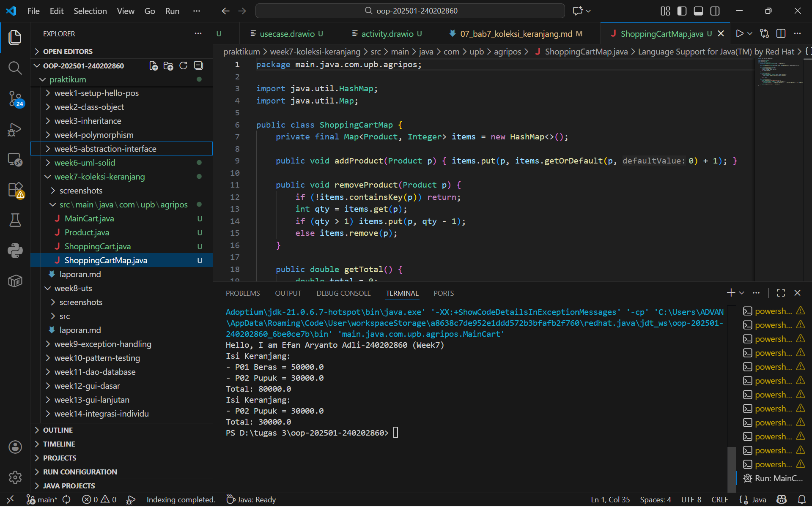

# Laporan Praktikum Minggu 7
Topik: Collections dan Implementasi Keranjang Belanja

## Identitas
- Nama  : Efan Aryanto Adli
- NIM   : 240202860
- Kelas : 3IKRA

---

## Tujuan
1. Mahasiswa mampu memahami konsep dasar Java Collections Framework, khususnya perbedaan antara List, Map, dan Set.
2. Mahasiswa mampu mengimplementasikan ArrayList untuk menyimpan dan mengelola daftar objek secara dinamis.
3. Mahasiswa mampu mengimplementasikan HashMap untuk menangani data yang memerlukan pasangan key-value, seperti menghitung jumlah (quantity) per produk.
4. Mahasiswa mampu melakukan operasi dasar pada collection seperti menambah, menghapus, menampilkan isi, dan menghitung total nilai transaksi dalam konteks sistem Agri-POS.

---

## Dasar Teori  
1. Java Collections Framework: Sebuah arsitektur terpadu untuk menyimpan dan memanipulasi sekelompok objek secara efisien.  
2. List (ArrayList): Struktur data yang menyimpan elemen secara terurut dan memperbolehkan adanya duplikasi data. Sangat cocok digunakan ketika urutan penambahan data penting untuk dipertahankan.  
3. Map (HashMap): Struktur data yang menyimpan elemen dalam pasangan kunci (key) dan nilai (value). Akses data dilakukan dengan cepat berdasarkan kunci uniknya.
4. Set (HashSet): Struktur data yang tidak memperbolehkan elemen duplikat dan tidak menjamin urutan elemen.

---

## Langkah Praktikum
1. Pembuatan Class Product 
   Langkah pertama adalah mendefinisikan objek `Product` yang memiliki atribut `code`, `name`, dan `price` sebagai representasi barang dalam sistem Agri-POS.
   - Atribut dideklarasikan sebagai `final` untuk memastikan data produk bersifat immutable setelah diinisialisasi.
   - Dibuat metode getter untuk mengakses informasi produk tersebut.
2. Implementasi Keranjang dengan ArrayList 
   Implementasi ini dilakukan pada kelas `ShoppingCart` untuk mengelola daftar belanja secara dinamis.
   - Menggunakan `ArrayList<Product>` untuk menampung koleksi produk.
   - Implementasi metode `addProduct` untuk menambah barang dan `removeProduct` untuk menghapus barang dari daftar.
   - Metode `getTotal` digunakan untuk menjumlahkan seluruh harga produk yang ada di dalam list.
3. Implementasi Alternatif dengan Map
   Untuk menangani jumlah barang (quantity), dilakukan implementasi pada kelas `ShoppingCartMap`.
   - Menggunakan `HashMap<Product, Integer>` di mana objek produk bertindak sebagai key dan jumlahnya sebagai value.
   - Metode `addProduct` dikembangkan untuk mengecek apakah produk sudah ada; jika sudah, maka jumlahnya akan ditambah (+1).
   - Hal ini mencegah terjadinya duplikasi objek produk yang sama di dalam memori.
4. Pengujian melalui Main Program
   Tahap akhir adalah menjalankan simulasi pada kelas `MainCart`.
   - Melakukan instansiasi beberapa objek produk (contoh: Beras, Pupuk).
   - Menjalankan skenario penambahan, penghapusan, dan pencetakan isi keranjang untuk memvalidasi apakah perhitungan total harga sudah benar.
   - Mencetak identitas diri (Nama dan NIM) sebagai bukti otentikasi pengerjaan tugas.

---

## Kode Program
### 1. MainCart.java
```java
package main.java.com.upb.agripos;

public class MainCart {
    public static void main(String[] args) {
        System.out.println("Hello, I am Efan Aryanto Adli-240202860 (Week7)");

        Product p1 = new Product("P01", "Beras", 50000);
        Product p2 = new Product("P02", "Pupuk", 30000);

        ShoppingCart cart = new ShoppingCart();
        cart.addProduct(p1);
        cart.addProduct(p2);
        cart.printCart();

        cart.removeProduct(p1);
        cart.printCart();
    }
}
```
### 2. Product.java
```java
package main.java.com.upb.agripos;

public class Product {
    private final String code;
    private final String name;
    private final double price;

    public Product(String code, String name, double price) {
        this.code = code;
        this.name = name;
        this.price = price;
    }

    public String getCode() { return code; }
    public String getName() { return name; }
    public double getPrice() { return price; }
}
```
### 3. ShoppingCart.java
```java
package main.java.com.upb.agripos;

import java.util.ArrayList;

public class ShoppingCart {
    private final ArrayList<Product> items = new ArrayList<>();

    public void addProduct(Product p) { items.add(p); }
    public void removeProduct(Product p) { items.remove(p); }

    public double getTotal() {
        double sum = 0;
        for (Product p : items) {
            sum += p.getPrice();
        }
        return sum;
    }

    public void printCart() {
        System.out.println("Isi Keranjang:");
        for (Product p : items) {
            System.out.println("- " + p.getCode() + " " + p.getName() + " = " + p.getPrice());
        }
        System.out.println("Total: " + getTotal());
    }
}
```
### 4. ShoppingCartMap.java
```java
package main.java.com.upb.agripos;

import java.util.HashMap;
import java.util.Map;

public class ShoppingCartMap {
    private final Map<Product, Integer> items = new HashMap<>();

    public void addProduct(Product p) { items.put(p, items.getOrDefault(p, 0) + 1); }

    public void removeProduct(Product p) {
        if (!items.containsKey(p)) return;
        int qty = items.get(p);
        if (qty > 1) items.put(p, qty - 1);
        else items.remove(p);
    }

    public double getTotal() {
        double total = 0;
        for (Map.Entry<Product, Integer> entry : items.entrySet()) {
            total += entry.getKey().getPrice() * entry.getValue();
        }
        return total;
    }

    public void printCart() {
        System.out.println("Isi Keranjang (Map):");
        for (Map.Entry<Product, Integer> e : items.entrySet()) {
            System.out.println("- " + e.getKey().getCode() + " " + e.getKey().getName() + " x" + e.getValue());
        }
        System.out.println("Total: " + getTotal());
    }
}
```
---

## Hasil Eksekusi  

---

## Analisis
- Implementasi ArrayList: Digunakan pada kelas ShoppingCart untuk menampung objek Product. Metode addProduct dan removeProduct memanfaatkan fleksibilitas ArrayList yang ukurannya dapat berubah secara otomatis. Perhitungan total harga dilakukan dengan melakukan iterasi (perulangan) pada seluruh elemen dalam list tersebut.  
- Implementasi Map: Digunakan pada kelas ShoppingCartMap untuk menangani kuantitas barang. Dengan menggunakan Product sebagai key dan Integer sebagai value, sistem dapat menyimpan berapa banyak jumlah barang tertentu yang dibeli tanpa harus menduplikasi objek produk di dalam list.  
- Struktur Proyek: Penggunaan paket com.upb.agripos memastikan kode terorganisir dengan baik dan mengikuti standar konvensi penamaan Java. Pemisahan logika antara model (Product), layanan (ShoppingCart), dan eksekusi (MainCart) mencerminkan prinsip pemrograman berorientasi objek yang baik.  
---

## Kesimpulan
1. Penggunaan Java Collections sangat memudahkan pengelolaan data dinamis dibandingkan menggunakan array statis.
2. ArrayList adalah pilihan yang efisien untuk keranjang belanja sederhana di mana setiap entri barang dicatat satu per satu.
3. HashMap memberikan solusi yang lebih baik jika sistem membutuhkan fitur pengelolaan jumlah barang (quantity) secara ringkas.
4. Keberhasilan praktikum ini ditunjukkan dengan kemampuan program dalam menambah, menghapus, serta menghitung total transaksi secara akurat sesuai dengan simulasi yang dijalankan pada MainCart.
---

## Quiz
1. Jelaskan perbedaan mendasar antara List, Map, dan Set.  
   **Jawaban:** …  
   1. List (Implementasi: ArrayList) Ibarat sebuah daftar belanja di mana Anda bisa menulis "Beras" dua kali di baris yang berbeda. Urutannya tetap terjaga dari atas ke bawah. Inilah mengapa ArrayList sangat cocok untuk keranjang belanja sederhana.
   2. Map (Implementasi: HashMap) Ibarat sebuah kamus atau label harga. Setiap barang (kunci) memiliki jumlah atau harga (nilai) tertentu. Dalam praktikum ini, Map digunakan untuk menyimpan produk beserta kuantitasnya (misal: Beras x2). Akses datanya sangat cepat karena langsung merujuk pada kuncinya.
   3. Set (Implementasi: HashSet) Ibarat sebuah kantong yang hanya bisa menampung barang-barang unik. Jika Anda mencoba memasukkan "Beras" dua kali, Set hanya akan menyimpan satu saja. Struktur ini menggunakan mekanisme hashing untuk memastikan tidak ada data yang kembar.

2. Mengapa ArrayList cocok digunakan untuk keranjang belanja sederhana?  
   **Jawaban:** …  
   1. Penyimpanan Dinamis: ArrayList dapat menambah atau mengurangi ukurannya secara otomatis saat produk ditambahkan atau dihapus, sehingga kita tidak perlu menentukan kapasitas maksimal keranjang sejak awal.
   2. Mempertahankan Urutan (Ordered): Elemen dalam ArrayList disimpan sesuai dengan urutan waktu saat barang tersebut dimasukkan ke dalam keranjang, yang memudahkan pelanggan melihat daftar belanjaan secara kronologis.
   3. Mendukung Duplikasi: Dalam keranjang belanja sederhana, pengguna mungkin ingin memasukkan produk yang sama berkali-kali sebagai entri terpisah, dan ArrayList memperbolehkan elemen duplikat tersebut.Mendukung Duplikasi: Dalam keranjang belanja sederhana, pengguna mungkin ingin memasukkan produk yang sama berkali-kali sebagai entri terpisah, dan ArrayList memperbolehkan elemen duplikat tersebut.
   4. Kemudahan Iterasi: Proses menghitung total harga (metode getTotal()) menjadi sangat mudah karena kita hanya perlu melakukan perulangan (looping) sederhana pada seluruh elemen list tersebut.

3. Bagaimana struktur Set mencegah duplikasi data?  
   **Jawaban:** …  
   1. Penggunaan Hash Code: Saat sebuah objek dimasukkan ke dalam Set, Java akan memanggil metode hashCode() untuk menghasilkan angka unik (sidik jari digital) bagi objek tersebut.
   2. Pengecekan Ember (Bucket): Angka hash tersebut menentukan lokasi penyimpanan atau "ember" tertentu di dalam memori. Jika lokasi tersebut sudah terisi, Set akan melakukan pengecekan lebih lanjut.
   3. Metode equals(): Jika ada objek lain dengan hash yang sama, Set akan membandingkan isinya menggunakan metode equals(). Jika hasilnya true (isinya sama), maka objek baru tersebut akan ditolak dan tidak dimasukkan ke dalam koleksi.
   4. Keunikan Elemen: Berbeda dengan List yang memperbolehkan duplikat, Set menjamin bahwa setiap elemen di dalamnya adalah unik secara nilai.

4. Kapan sebaiknya menggunakan Map dibandingkan List? Jelaskan dengan contoh.  
   **Jawaban:** … 
   1. Ketika Membutuhkan Akses Cepat Berdasarkan Kunci (Key)
      Jika Anda ingin mencari data tanpa harus melakukan perulangan (looping) dari awal sampai akhir, Map adalah pilihan terbaik karena menggunakan sistem key-value.
      Contoh: Mencari informasi stok barang berdasarkan Kode Produk.
   2. Ketika Membutuhkan Pengelompokan Data (Mapping)
      Map digunakan ketika satu data memiliki keterkaitan langsung dengan data lainnya.
      Contoh: Menyimpan Produk beserta Jumlah/Quantity yang dibeli.